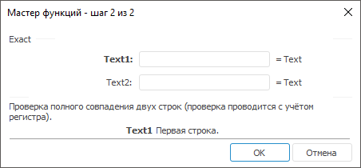

# Exact: Регламентный отчёт, настольное приложение

Exact: Регламентный отчёт, настольное приложение
-

# Exact

[Мастер функций](../../UiReport_Organizational_master_function.htm)
 для функции Exact выглядит следующим
 образом:

## Синтаксис

Exact(Text1, Text2)

## Параметры

Text1. Первая строка;

Text2. Вторая строка.

Примечание.
 В качестве параметра можно указывать как непосредственно значение параметра,
 так и адрес ячейки, в которой оно располагается.

## Описание

Возвращает результат проверки полного совпадения двух строк текста.

## Комментарии

Проверка ведется с учетом регистра. Возвращает значение TRUE,
 если строки в точности совпадают и FALSE
 - в противном случае.

## Пример

		 Формула
		 Результат
		 Описание

		 =Exact("Ac", "aс")
		 FALSE
		 Проверяет с учетом регистра, совпадает ли строки «Ac» и «ac».

		 =Exact(B6, C6)
		 TRUE
		 Проверяет с учетом регистра, совпадает ли строки в ячейках
		 B6 и C6. Ячейка B6 содержит значение bc, C6 - bc.

См. также:

[Мастер функций](../../UiReport_Organizational_master_function.htm)
 │ [Текстовые
 функции](UiReport_Func_Text.htm) │ [Find](UiReport_Func_Text_Find.htm)

		Справочная
		 система на версию 10.9
		 от 18/08/2025,
		 © ООО «ФОРСАЙТ»,
