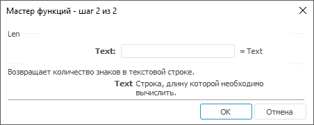

# Len: Регламентный отчёт, настольное приложение

Len: Регламентный отчёт, настольное приложение
-

# Len

[Мастер функций](../../UiReport_Organizational_master_function.htm)
 для функции Len выглядит следующим
 образом:

## Синтаксис

Len(Text)

## Параметры

Text. Строка, длину которой
 необходимо вычислить.

Примечание.
 В качестве параметра можно указывать как непосредственно значение параметра,
 так и адрес ячейки, в которой оно располагается.

## Описание

Возвращает длину строки.

## Пример

		 Формула
		 Результат
		 Описание

		 =Len("12345")
		 5
		 Длина строки 12345 в символах.

		 =Len(B6)
		 3
		 Длина строки, расположенной в ячейке B6. Ячейка B6 содержит
		 значение zxc.

См. также:

[Мастер функций](../../UiReport_Organizational_master_function.htm)
 │ [Текстовые
 функции](UiReport_Func_Text.htm)

		Справочная
		 система на версию 10.9
		 от 18/08/2025,
		 © ООО «ФОРСАЙТ»,
