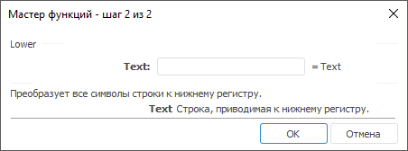

# Lower: Регламентный отчёт, настольное приложение

Lower: Регламентный отчёт, настольное приложение
-

# Lower

[Мастер функций](../../UiReport_Organizational_master_function.htm)
 для функции Lower выглядит следующим
 образом:

## Синтаксис

Lower(Text)

## Параметры

Text. Строка, приводимая к
 нижнему регистру.

Примечание.
 В качестве параметра можно указывать как непосредственно значение параметра,
 так и адрес ячейки, в которой оно располагается.

## Описание

Преобразует все символы строки к нижнему регистру.

## Пример

		 Формула
		 Результат
		 Описание

		 =Lower("AsDfGh")
		 asdfgh
		 Строка AsDfGh, преобразованная к нижнему регистру.

		 =Lower("B6")
		 qwerty
		 Строка в ячейке B6, преобразованная к нижнему регистру. Ячейка
		 B6 содержит значение QwertY.

См. также:

[Мастер функций](../../UiReport_Organizational_master_function.htm)
 │ [Текстовые
 функции](UiReport_Func_Text.htm) │ [Upper](UiReport_Func_Text_Upper.htm)

		Справочная
		 система на версию 10.9
		 от 18/08/2025,
		 © ООО «ФОРСАЙТ»,
