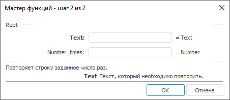

# Rept: Регламентный отчёт, настольное приложение

Rept: Регламентный отчёт, настольное приложение
-

# Rept

[Мастер функций](../../UiReport_Organizational_master_function.htm)
 для функции Rept выглядит следующим
 образом:

## Синтаксис

Rept(Text, Number_times)

## Параметры

Text. Строка, которую необходимо
 повторить;

Number_times. Число раз, которое
 необходимо повторить заданную строку.

Примечание.
 В качестве параметра можно указывать как непосредственно значение параметра,
 так и адрес ячейки, в которой оно располагается.

## Описание

Возвращает строку, повторенную заданное число раз.

## Пример

		 Формула
		 Результат
		 Описание

		 =Rept("Za", 2)
		 ZaZa
		 Строка Za, повторенная два раза.

		 =Rept(B6, C6)
		 XXX
		 Строка в ячейке B6, повторенная число раз, указанное в ячейке
		 C6. Ячейка B6 содержит значение X, C6 содержит значение 3.

См. также:

[Мастер функций](../../UiReport_Organizational_master_function.htm)
 │ [Текстовые
 функции](UiReport_Func_Text.htm) │ [Mid](UiReport_Func_Text_Mid.htm)
 │ [Replace](UiReport_Func_Text_Replace.htm)

		Справочная
		 система на версию 10.9
		 от 18/08/2025,
		 © ООО «ФОРСАЙТ»,
