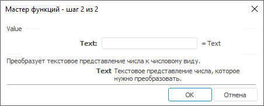

# Value: Регламентный отчёт, настольное приложение

Value: Регламентный отчёт, настольное приложение
-

# Value

[Мастер функций](../../UiReport_Organizational_master_function.htm)
 для функции Value выглядит следующим
 образом:

## Синтаксис

Value(Text)

## Параметры

Text. Текстовое представление
 числа, которое нужно преобразовать.

Примечание.
 В качестве параметра можно указывать как непосредственно значение параметра,
 так и адрес ячейки, в которой оно располагается.

## Описание

Возвращает результат преобразования текстового представления числа к
 числовому виду.

## Пример

		 Формула
		 Результат
		 Описание

		 =Value("12.5")
		 12,5
		 Числовой эквивалент строки 12.5.

		 =Value(B6)
		 -124,3
		 Числовой эквивалент строки, расположенной в ячейке B6. Ячейка
		 B6 содержит значение -124.3.

См. также:

[Мастер функций](../../UiReport_Organizational_master_function.htm)
 │ [Текстовые
 функции](UiReport_Func_Text.htm) │ [Fixed](UiReport_Func_Text_Fixed.htm)

		Справочная
		 система на версию 10.9
		 от 18/08/2025,
		 © ООО «ФОРСАЙТ»,
