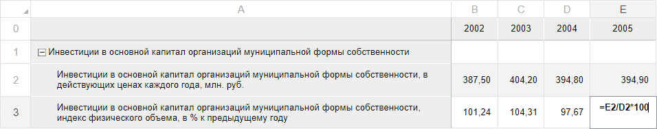

# Использование формул: Регламентный отчёт, настольное приложение

Использование формул: Регламентный отчёт, настольное приложение
-

# Использование формул

Формулы представляют собой выражения,
 по которым выполняются преобразования одних данных в другие.

## Структура формулы

Любая формула начинается со знака равенства (=):

	- Функция из числа [встроенных](UiReport_Function.htm#built-in_functions).

	- Ссылки на ячейки: A1 и B2 возвращают значения, содержащиеся
	 в соответствующих ячейках.

	- Константы: числовые или текстовые значения, вводимые непосредственно
	 в формулу, например «2» и «20».

	- Операторы: «+» – знак сложения и «*» – знак умножения.

В формуле можно использовать:

[Константы](javascript:TextPopup(this))

	Константа представляет собой
	 готовое (невычисляемое) значение. Например, константами являются:
	 дата «10.10.2015», число «210» и текст «Прибыль за квартал». Выражение,
	 или его значение, константами не являются.

	Если в формуле не содержится ссылок на другие ячейки (например,
	 формула имеет вид =30+70+110), то значение в такой ячейке изменяется
	 только после изменения формулы вручную.

[Операторы](javascript:TextPopup(this))

	Операторами обозначаются
	 операции, которые следует выполнить над операндами формулы. Существует
	 стандартный порядок выполнения вычислений, однако его можно изменить
	 с помощью скобок.

	При составлении формул в регламентных отчетах можно использовать
	 различные виды операторов: арифметические, операторы сравнения.

### Арифметические операторы

	Используются для выполнения арифметических операций, таких как сложение,
	 вычитание, умножение. Операции выполняются над числами. Используются
	 следующие арифметические операторы:

			 Знак операции
			 Описание

			 +
			 Сложение.

			 -
			 Вычитание.

			 *
			 Умножение.

			 /
			 Деление.

			 DIV
			 Целочисленное деление.

			 MOD
			 Остаток от целочисленного деления.

### Операторы сравнения

	Используются для сравнения двух значений. Результатом сравнения
	 является логическое значение: True
	 или False.

			 Знак операции
			 Описание

			 =
			 Равно.

			 <
			 Меньше.

			 >
			 Больше.

			 <=
			 Меньше или равно.

			 >=
			 Больше или равно.

			 <>
			 Больше или меньше (не равно).

[Ссылки
 на ячейки](javascript:TextPopup(this))

	Особенности использования в формуле ссылок на ячейки листов отчета:

		- Единичная ячейка.
		 Указывается адрес ячейки листа, например: B8;

		- Столбец. Для использования
		 в формуле всех ячеек одного столбца укажите через двоеточие его
		 наименование, например: B:B.
		 Для использования в формуле всех ячеек нескольких столбцов укажите
		 через двоеточие их наименования, например: A:C;

		- Строка. Для использования
		 в формуле всех ячеек одной строки укажите через двоеточие ее номер,
		 например: 5:5. Для использования
		 в формуле всех ячеек нескольких строк укажите через двоеточие
		 их номера, например: 1:5;

		- Диапазон ячеек.
		 Для использования в формуле диапазона ячеек укажите через двоеточие
		 сначала адрес верхней левой ячейки, с которой начинается диапазон,
		 а затем адрес нижней правой ячейки, на которой заканчивается диапазон,
		 например:

	C7:D15

	Где:

			- C7. Адрес верхней
			 левой ячейки;

			- D15. Адрес нижней
			 правой ячейки;

		- Комбинированный диапазон
		 ячеек. Для описания области, состоящей из нескольких непересекающихся
		 диапазонов (включая единичные ячейки), укажите через точку с запятой
		 (;) адреса прямоугольных областей и отдельных ячеек. Например:

	C7:D15;A1:B4;B8

	Где:

			- C7:D15 и A1:B4.
			 Диапазоны ячеек;

			- B8. Единичная
			 ячейка;

		- Ссылка на ячейки другого
		 листа. Для использования в формуле ячейки (диапазона ячеек)
		 с другого листа укажите перед диапазоном название листа в кавычках
		 с восклицательным знаком.

	Ссылка на лист вставляется по следующему
	 алгоритму:

		-

			- при переходе на другой лист в позицию курсора вставляется
			 наименование листа. Если был выделен терм, то наименование
			 листа вставляется на место выделенного терма. Выделение на
			 активном листе отсутствует;

			- производится выбор диапазона на листе - в позицию курсора
			 ввода вставляются ссылки на диапазон. Диапазон выделяется
			 пунктирной рамкой;

			- смена активного листа приводит к корректировке наименования
			 листа в полученном терме, ссылка на диапазон при этом не корректируется,
			 ей соответствует выделение на каждом активируемом листе. Изменение
			 границ выделенного диапазона на активном листе приводит к
			 корректировке ссылки на диапазон в полученном терме;

			- при смене активного листа курсор ввода остается в редакторе
			 ячейки либо в строке формул, в зависимости от того, где он
			 находился до этого;

			- если ввод формулы осуществляется с помощью редактора
			 ячейки, и при вводе формулы активирован другой лист либо вставлен
			 терм, то при переходе обратно на текущий лист редактор восстанавливается,
			 курсор ввода располагается после добавленного терма;

			- после окончания ввода формулы активным становится лист,
			 на котором осуществлялся ввод формулы.

	Редактирование формулы при активации
	 другого листа прекращается, если:

			- курсор ввода располагается после любого терма;

			- находится внутри терма;

			- выделено несколько символов, не являющихся термом: адрес
			 ячейки (A0) и наименование листа со знаком восклицания (“Лист1”!).

	При активации других листов во время
	 ввода формулы подсвечивается текущий лист. Ссылки на другие листы
	 в формуле и на листе не подсвечиваются цветом. Примеры ссылок:

	="Лист1"!A3

	Значение ячейки A3
	 с листа 1.

	=Sum("Лист2"!A:A)

	Сумма значений столбца A
	 c листа 2.

	=Sum("Лист3"!C31;A31;E31)

	Сумма комбинированного диапазона: значение
	 для ячейки С31 берется с листа
	 3, значения для ячеек A31
	 и E31 берутся с текущего листа.

	=Sum("Лист2"!B31:D31)

	Сумма диапазона значений с листа 2.

	Ссылки на отдельные ячейки или диапазоны
	 указываются с помощью мыши или с помощью набора адреса с клавиатуры
	 при условии, что первым символом в ячейке был знак равенства. Для
	 указания комбинированного диапазона ячеек с помощью мыши зажмите клавишу
	 CTRL.

	Для указания адресов с помощью курсорных
	 клавиш соблюдайте порядок:

			- Включите режим ввода:

				- начните набирать текст для выделенной ячейки со
				 знака равенства;

				- дважды щелкните по пустой ячейке;

				- нажмите клавишу F2.

			- Введите знак равенства (только в случае его отсутствия).

			- С помощью курсорных клавиш выберите нужную ячейку (ее
			 адрес будет меняться в формуле в момент выбора), после чего
			 продолжите ввод формулы. Зажатая клавиша SHIFT позволяет выбрать
			 непрерывный диапазон значений.

	Примечание.
	 Выбор ячеек таким способом возможен также после ввода символов: умножение
	 «*», деление «/»,
	 открывающаяся скобка «(»,
	 запятая «,».

	Выбранная ячейка (или диапазон) будет
	 подсвечена пунктирной цветной рамкой. При вводе операторов, либо знаков,
	 разделяющих параметры функции, ячейка «фиксируется» и будет подсвечена
	 сплошной цветной рамкой, следующий щелчок мыши (или курсорной клавиши)
	 приведет к указанию адреса еще одной ячейки. Подсвеченные ячейки (или
	 диапазон) можно с помощью мыши перемещать, увеличивать и уменьшать,
	 при этом адрес в формуле будет автоматически изменен. Для увеличения/уменьшения
	 диапазона наведите курсор мыши на угол ячейки и, после того как он
	 примет вид двунаправленной стрелки, осуществите перемещение границы
	 диапазона в нужную сторону.

	Вводимый/редактируемый адрес ячейки (диапазона)
	 и границы соответствующей ячейки (диапазона) будут обозначаться одним
	 цветом.

	Примечание.
	 Если в формулах необходимо использовать циклические ссылки, то необходимо
	 в параметрах отчета включить [итеративные
	 вычисления](../../Reports/UiReport_Reports_Param3.htm). По умолчанию такие формулы не вычисляются и в ячейках
	 будет отображена ошибка «Обнаружены
	 циклические ссылки». Примеры циклических ссылок: для ячейки
	 A0 задана формула «=С11+
	 B9 + A0»; для трех ячеек A0
	 (=A1 + 1), A1
	 (=A2 + 1), A2
	 (=A0 + 1).

[Стили ссылок A1 и R1C1](javascript:TextPopup(this))

	При создании ссылок в регламентных отчетах доступно использование
	 двух стилей ссылок:

		- А1. При использовании
		 стиля A1 столбцы обозначаются
		 буквами, а строки - цифрами;

		- R1C1. При использовании
		 стиля R1C1 строки (row)
		 и столбцы (column) обозначаются цифрами и ссылки на ячейки
		 в формулах задаются при помощи смещения от текущей ячейки. Например,
		 ссылка R[-1]C[2] ссылается на ячейку, которая находится на одну
		 строку выше и на два столбца правее текущей ячейки.

	В формулах можно использовать смешанные стили, это не влияет на
	 результат расчета.

	Пример:

	=$A$0+R[0]C[-1]

	При копировании данной ссылки к значению ячейки А0 будет прибавляться
	 значение ячейки, расположенной в той строке, куда скопирована ссылка,
	 и столбце, расположенном слева от ячейки, в которую скопирована ссылка.

	Стиль ссылок, используемый при визуальном конструировании формул,
	 определяется в [настройках](../../Reports/UiReport_Reports_Param4.htm)
	 регламентного отчета.

	Примечание.
	 Ссылки на строки/столбцы всегда формируются в стиле A1. При экспорте
	 ссылки, представленные в формате R1C1, будут преобразованы в формат
	 A1.

[Абсолютные
 и относительные ссылки](javascript:TextPopup(this))

	При создании формул можно использовать виды ссылки:

		- относительная ссылка
		 в формуле, например A1, основывается на позиции ячейки, содержащей
		 формулу, и ячейки, на которую указывает ссылка. При изменении
		 позиции ячейки, содержащей формулу, изменяется и ссылка. При копировании
		 или заполнении формулы вдоль строк и вдоль столбцов ссылка автоматически
		 корректируется;

		- абсолютная ссылка
		 ячейки в формуле, например, $A$1, всегда ссылается на ячейку,
		 расположенную в определенном месте. При изменении позиции ячейки,
		 содержащей формулу, абсолютная ссылка не изменяется. При копировании
		 или заполнении формулы вдоль строк и вдоль столбцов абсолютная
		 ссылка не корректируется;

		- смешанная ссылка
		 содержит либо абсолютный столбец и относительную строку, либо
		 абсолютную строку и относительный столбец. При изменении позиции
		 ячейки, содержащей формулу, относительная ссылка изменяется, а
		 абсолютная ссылка не изменяется. При копировании или заполнении
		 формулы вдоль строк и вдоль столбцов относительная ссылка автоматически
		 корректируется, а абсолютная ссылка не корректируется.

	В зависимости от используемого стиля ссылок различается способ указания
	 абсолютных и относительных ссылок:

		- стиль А1. При использовании
		 стиля А1 для указания
		 абсолютных ссылок используется специальный символ «$».
		 «$» ставится перед той
		 частью ссылки, которую необходимо зафиксировать:

	=$A1

	При копировании данной ссылки столбец
	 «A» всегда будет зафиксирован.
	 Относительная часть ссылки, т.е. номер строки, будет меняться, в соответствии
	 с той строкой, в которую будет скопирована ссылка (=$A2,
	 =$A3 и т.д);

		- стиль R1C1. При
		 использовании стиля R1C1
		 для указания абсолютных ссылок необходимо указать номер строки/столбца
		 после букв «R» или «C». Относительные номера строк/столбцов
		 указываются в квадратных скобках и соответствуют смещению относительно
		 текущей ячейки. При копировании относительный номер не изменяется,
		 но фактически он будет соответствовать уже другой строке/столбцу.

	=R[-3]C0

	При копировании данная ссылка будет иметь
	 такой же вид, но при вычислении ссылка будет соответствовать ячейке,
	 расположенной в первом столбце на три строки выше ячейки с формулой.

#### Особенности использования ссылок

		- Абсолютная ссылка =$A$0,
		 составленная с использованием стиля А1,
		 аналогична ссылке =R0C0,
		 составленной с использованием стиля R1C1.

		- Ссылка =RC1, составленная
		 с использованием стиля R1C1,
		 аналогична ссылке на ячейку, расположенной в столбце RC
		 и первой строке, составленной с использованием стиля А1.

[Встроенные
 функции](javascript:TextPopup(this))

	Функции - заранее определенные
	 формулы, которые выполняют вычисления по заданным величинам, называемым
	 аргументами, и в указанном порядке. Функции позволяют выполнять как
	 простые, так и сложные вычисления.

	Для добавления в формулу встроенной функции вызовите [мастер
	 функций](../UiReport_Organizational_master_function.htm) или впишите наименование и параметры функции непосредственно
	 в ячейку.

	Доступны следующие категории функций:

		- [Математические](Math/UiReport_Func_math.htm);

		- [Ссылки
		 и массивы](Link_Array/UiReport_Func_LinkArray.htm);

		- Поиск;

		- [Дата и время](Date_Time/UiReport_Func_DateTime.htm);

		- [Текстовые](Text/UiReport_Func_Text.htm);

		- [Работа с отчетом](Report/UiReport_Func_Report.htm);

		- [Финансовые](Finance/UiReport_Func_Finance.htm);

		- [Статистические](Statistic/UiReport_Func_Statistic.htm);

		- [Логические](Logical/UiReport_Func_Logical.htm);

		- [Python](Python/Python.htm);

		- [Java](Java/Java.htm).

	Некоторые функции возвращают массив значений (например, [MInverse](Math/UiReport_Func_Math_MInverse.htm),
	 [MMult](Math/UiReport_Func_Math_MMult.htm)), поэтому должны
	 быть введены как формулы массива. Для ввода формулы массива:

		- Используя [мастер
		 функций](../UiReport_Organizational_master_function.htm) или клавиатуру, введите функцию в ячейку.

		- Выделите диапазон ячеек (массив), в который будет размещен
		 результат вычисления, начиная с ячейки, содержащей формулу.

		- Нажмите клавишу F2, а затем — клавиши CTRL+SHIFT+ENTER.

	После выполнения действий в области будет отображен массив значений,
	 возвращаемый функцией.

	Если при указании диапазона ячеек (шаг 2) была выделена область
	 больше, чем возвращаемый массив, то в лишних ячейках будет отображено
	 значение «#Н/Д»; если была выделена область меньше, то будет отображена
	 только часть массива.

	Примечание.
	 Для удаления формулы массива выделите диапазон ячеек, содержащий формулу.
	 При попытке отредактировать или удалить формулу в части массива будет
	 выдано сообщение об ошибке.

[Подключенные
 к отчёту Fore](javascript:TextPopup(this))

	Подключите [объект
	 среды разработки](../../Reports/Event/UiReport_Reports_Event_Module.htm), содержащий реализацию требуемой функций. Для
	 функции должен быть использован модификатор доступа Public.

	Для использования в формуле функции Fore введите в ячейку после
	 знака равенства: <Идентификатор
	 модуля>.<Наименование
	 функции>[(<Значения
	 параметров функции>)].

	Например, пользовательская функция в модуле с идентификатором «MODULE»
	 имеет вид:

				Public Function My(Value: Integer): Integer;

	Begin

	    Value := Value + 50;

	    Return Value;

	End Function My;

	Для использования пользовательской функции введите в выбранную ячейку
	 выражение:

	=MODULE.My(50)

	В результате вычисления в выбранной ячейке отобразится значение
	 «100».

[Пользовательские
 функции](javascript:TextPopup(this))

	[Пользовательские функции](UserFunc.htm) позволяют расширить
	 возможности регламентного отчёта за счёт использования пользовательских
	 методик расчёта.

[Функции,
 использующие классы PrxReport и MetabaseClass](javascript:TextPopup(this))

	Используя свойства классов [PrxReport](KeReport.chm::/Class/PrxReport/PrxReport.htm)
	 и [MetabaseClass](KeSom.chm::/Class/MetabaseClass/MetabaseClass.htm),
	 можно осуществить вывод в ячейки какой-либо информации. Например:

		- для вывода в ячейку отчета наименования первого источника
		 данных используйте функцию:

	=PrxReport.ActiveReport.DataSources.Item(0).Name

		- для вывода в ячейку отчета наименования текущего репозитория
		 используйте функцию:

	=MetabaseClass.Active.Name

Примеры формул:

=12*B2+C3/2

=Abs(A0)

=Sum(K10:K15)+20

=B0+"Лист2"!A1

Примечание.
 При экспорте в формат *.xls необходимо учитывать, что не все функции поддерживаются
 Microsoft Excel. Существуют [ограничения](../../Reports/OperationReport/UiReport_Reports_Operation_Export.htm#export_to_excel)
 для экспорта функций.

## Операции с формулами

При работе с формулами возможны следующие операции:

[Создание
 формулы](javascript:TextPopup(this))

	Формула может быть создана несколькими способами:

		- непосредственно в ячейке.
		 Для этого в редактируемой ячейке выполните действия:

			- Введите знак равенства. Если данный знак уже есть в
			 ячейке, пропустите данный шаг.

			- Сформируйте формулу, используя числа, операторы, ссылки
			 на ячейки и функции.

			- Для сохранения и расчета формулы нажмите клавишу ENTER.

		- в
		 [строке
		 формул](../UiReport_Organizational_FormulaLine.htm);

		- при
		 помощи [мастера функций](../UiReport_Organizational_master_function.htm).
		 Для этого выполните одно из действий:

			- нажмите кнопку ,
			 расположенную в строке формул;

			- нажмите кнопку 
			 «Вставить функцию»,
			 расположенную на вкладке «Формулы»
			 ленты инструментов;

		- с
		 помощью копирования ячейки с уже созданной формулой. Для
		 этого выполните действия:

			- Скопируйте ячейку с формулой.

			- Выполните команду «[Специальная
			 вставка](../../Table/Work/UiReport_Table_Work_Insert_spec.htm)» в контекстном меню ячейки, в которую необходимо
			 добавить формулу. Поставьте флажок «Формулы
			 ячеек».

			- Нажмите кнопку «OK».

	Для отмены ввода формулы нажмите:

		- клавишу ESC;

		- кнопку .

	Для настройки параметров расчёта формул в отчёте перейдите на вкладку
	 «[Формулы](../../Reports/UiReport_Reports_Param4.htm)»
	 окна «Параметры отчета».

[Редактирование
 формулы](javascript:TextPopup(this))

	Формула может быть отредактирована несколькими способами:

		- непосредственно в ячейке.
		 Для этого в редактируемой ячейке:

			- Отредактируйте формулу, используя числа, операторы,
			 ссылки на ячейки и функции.

			- Для сохранения и расчета формулы нажмите клавишу ENTER.

		- в [строке
		 формул](../UiReport_Organizational_FormulaLine.htm);

		- при помощи [мастера функций](../UiReport_Organizational_master_function.htm). Для этого
		 выполните одно из действий:

			- нажмите кнопку ,
			 расположенную в строке формул;

			- нажмите кнопку 
			 «Вставить функцию»,
			 расположенную на вкладке «Формулы»
			 ленты инструментов.

	Для отмены ввода формулы нажмите:

		- клавишу ESC;

		- кнопку .

[Настройка
 индикации ячеек](javascript:TextPopup(this))

	Для настройки индикации ячеек, содержащих ошибки, выполните команду
	 главного меню «Сервис > Параметры».
	 В открывшемся окне «Параметры отчета»
	 перейдите на вкладку «[Формулы](../../Reports/UiReport_Reports_Param4.htm)»
	 и установите флажок «[Индикация
	 ошибок](../../Reports/UiReport_Reports_Param4.htm#error_checking)».

	Примечание.
	 Если выделено несколько ячеек с ошибками, идентификатор ошибки отображается
	 для верхней левой ячейки диапазона. Для нескольких ячеек доступна
	 только команда «Пропустить ошибку».

## Особенности использования формул в веб-приложении

В веб-приложении доступно только [создание](UiReport_Function.htm#creating_formula)
 и [редактирование](UiReport_Function.htm#editing_formula) формулы
 непосредственно в ячейках [области
 данных](../../AreaData/UiReport_AreaData.htm) отчёта. В формуле можно использовать [константы](UiReport_Function.htm#constants),
 [операторы](UiReport_Function.htm#operators) и [ссылки
 на ячейки](UiReport_Function.htm#cell_references) с помощью ручного ввода адреса ячеек.

Для создания, редактирования или просмотра формулы дважды щёлкните по
 ячейке с формулой:

См. также:

[Начало
 работы с инструментом «Отчёты» в веб-приложении](../../../Web/organizational_management/Starting.htm) | [Работа с листом отчета](../../Table/UiReport_Table.htm) |
 [Строка
 формул](../UiReport_Organizational_FormulaLine.htm) | [Мастер
 функций](../UiReport_Organizational_master_function.htm) | [Корректировка
 ссылок в формулах](../../../FAQ/References_in_Formulas.htm)

		Справочная
		 система на версию 10.9
		 от 18/08/2025,
		 © ООО «ФОРСАЙТ»,
