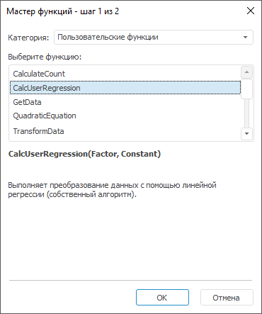
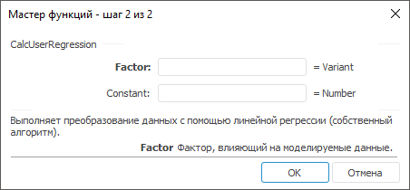

# Пользовательские функции: Регламентный отчёт, настольное приложение

Пользовательские функции: Регламентный отчёт, настольное приложение
-

# Пользовательские функции

Пользовательские функции и методы позволяют расширить возможности регламентного
 отчёта за счёт использования пользовательских методик расчёта.

По умолчанию пользовательские функции не подключены к инструменту «Отчёты». Для подключения пользовательских
 функций используйте вкладку «Методы»
 в разделе «Пользовательские метаданные»
 диалога «Параметры». Для получения
 подробной информации обратитесь к статье «[Подключение пользовательских
 функций](UiNav.chm::/GUI/ExpressionEditor_UserFunc.htm)».

Примечание.
 Подключение пользовательских функций доступно только в настольном приложении.

Подключенные пользовательские функции будут отображаться мастере функций
 в категории «Пользовательские функции»,
 например:

Если пользовательская функция параметрическая, то на следующем шаге
 мастера функций задайте значения параметров функции, например:

В результате будет рассчитана пользовательская функция. Результаты расчёта
 будут выведены на лист отчёта. Если в процессе расчёта возникли ошибки,
 то они также будут выведены на лист отчёта.

См. также:

[Начало
 работы с инструментом «Отчёты» в веб-приложении](../../../Web/organizational_management/Starting.htm) | [Мастер функций](../UiReport_Organizational_master_function.htm)

		Справочная
		 система на версию 10.9
		 от 18/08/2025,
		 © ООО «ФОРСАЙТ»,
