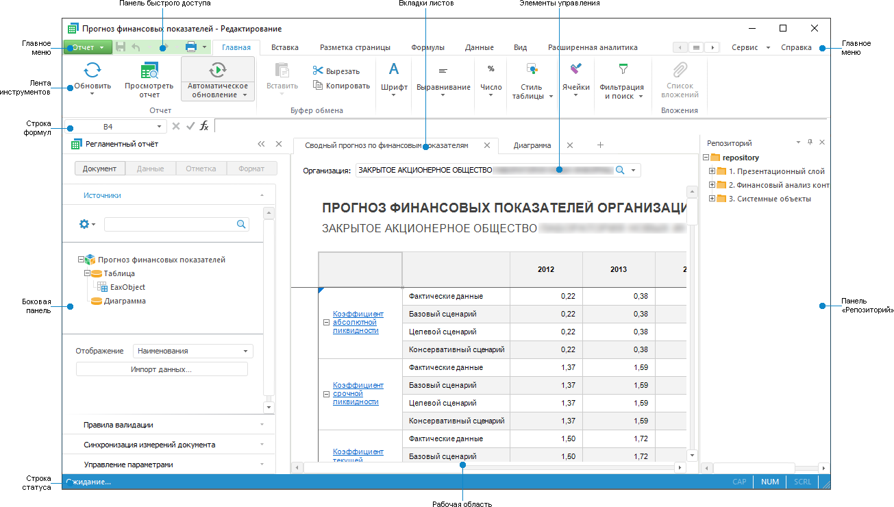
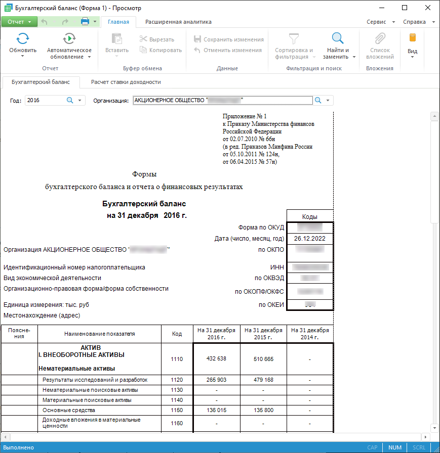

# Начало работы с инструментом «Отчёты» в настольном приложении

Начало работы с инструментом «Отчёты» в настольном приложении
-

# Начало работы с инструментом «Отчёты»
 в настольном приложении

Для начала работы с инструментом создайте новый или откройте готовый
 отчёт.

[Создание
 нового отчёта](javascript:TextPopup(this))

	Для создания нового отчёта:

		- в [навигаторе
		 объектов](GetStarted.chm::/Interface/Interface_Navigator.htm):

			- нажмите кнопку «Новый
			 объект > Регламентный отчет» в группе «Создать» на вкладке «Главная» ленты инструментов;

			- выполните команду «Создать
			 > Регламентный отчет» в контекстном меню навигатора
			 объектов;

			- выберите куб, базу данных временных рядов или реляционный
			 объект (таблица, запрос, представление, присоединенная таблица,
			 источник данных ODBC) и:

				- нажмите кнопку «Открыть
				 > В отчетах» в группе «Открыть»
				 на вкладке «Главная»
				 ленты инструментов;

				- выполните команду «Открыть
				 с помощью > Отчеты» в контекстном меню
				 выбранного объекта.

	При таком способе создания в отчет будет
	 добавлена [таблица](../AreaData/Table_Types.htm), построенная
	 на срезе выбранного объекта;

		- в инструменте «Отчёты»
		 выполните команду «Создать»
		 в главном меню «Отчет».

	Создание нового отчёта доступно только в настольном приложении.
	 При создании отчёта для просмотра в веб-приложении учтите особенности
	 и ограничения.

[Открытие
 готового отчёта](javascript:TextPopup(this))

	Для открытия на редактирование готового отчёта:

		- в [навигаторе
		 объектов](GetStarted.chm::/Interface/Interface_Navigator.htm) выделите отчёт и выполните одно из
		 действий:

			- нажмите кнопку  «Редактировать»
			 в группе «Открыть»
			 на вкладке «Главная»
			 ленты инструментов;

			- выполните команду «Редактировать»
			 в контекстном меню отчёта;

			- выделите отчёт и нажмите клавишу F4;

		- в инструменте «Отчёты»
		 откройте главное меню «Отчет»
		 и выберите вариант открытия отчёта:

			- Открыть. В открывшемся диалоге выберите
			 отчёт из навигатора объектов;

			- Открыть > Шаблон
			 отчета. В открывшемся диалоге выберите шаблон
			 отчета. Подробное описание приведено в разделе «[Работа с шаблонами отчета](../Reports/OperationReport/Report_Template.htm)»;

			- Открыть > Отчет
			 из файла. При выполнении команды будет открыт стандартный
			 диалог выбора файла. Укажите файл с расширением *.ppreport или *.p4r.

	Для открытия на просмотр готового отчёта:

		- в [навигаторе
		 объектов](GetStarted.chm::/Interface/Interface_Navigator.htm) выделите отчёт и выполните одно из
		 действий:

			- нажмите кнопку 
			 «Просмотр»
			 в группе «Открыть»
			 на вкладке «Главная»
			 ленты инструментов;

			- выполните команду «Просмотр»
			 в контекстном меню отчёта;

			- дважды щёлкните по отчёту;

		- в инструменте «Отчёты»:

			- Выполните команду «Регламентный отчет > Открыть»
			 в главном меню. Команда доступна только в веб-приложении.

			- Нажмите кнопку  «Просмотреть отчет» на вкладке
			 «Главная» ленты инструментов.

	Для получения подробной информации об особенностях и ограничениях
	 работы отчёта в веб-приложении обратитесь к статье «Различия
	 в функциональности регламентного отчёта в настольном, веб и мобильном
	 приложениях».

Для построения отчётов смотрите
 статью «[Построение
 отчёта](../CreateReport.htm)».

Для работы с готовым отчётом смотрите
 статью «[Работа
 с готовым отчётом](../Reports/OperationReport/Work_witn_report.htm)».

Если остались вопросы, смотрите
 статью «[Вопросы
 и ответы](../../FAQ/UiReport_FAQ.htm)».

Основное окно инструмента «Отчёты»:

[Отчёт в режиме
 просмотра](javascript:TextPopup(this))

	

[Элементы
 окна отчёта](javascript:TextPopup(this))

		- [Главное
		 меню](GetStarted.chm::/Interface/Interface_Description.htm#main_menu). Содержит список команд, предназначенных
		 для выполнения различных операций над отчётом.

		- [Лента
		 инструментов](GetStarted.chm::/Interface/Interface_Description.htm#customize_ribbon).
		 Содержит кнопки для построения и настройки отчёта.

		- [Боковая
		 панель](GetStarted.chm::/Interface/Interface_Description.htm#side_panel). Служит для настройки параметров
		 объектов отчёта и управления измерениями источников данных.

		- Панель быстрого доступа.
		 Содержит набор часто используемых команд.

		- [Строка статуса](GetStarted.chm::/Interface/Interface_Description.htm#status_line).
		 Содержит результаты расчета базовых агрегатов выделенного диапазона
		 ячеек таблицы.

		- Рабочая область.
		 Предназначена для построения отчёта.

		- [Строка формул](UiReport_Organizational_FormulaLine.htm).
		 Предназначена для ввода данных и формул в ячейки таблицы и отображения
		 адресов выделенных ячеек.

		- Вкладки листов.
		 Предназначены для управления [листами
		 отчета](../Sheets/UiReport_Sheets.htm).

		- Панель «Репозиторий».
		 Содержит список объектов, которые могут использоваться в качестве
		 источников данных для отчётов.

		- Панель «[Элементы
		 управления](../Source/Controls.htm)». Предназначена для формирования элементов
		 управления, с помощью которых будет осуществляться оперирование
		 данными при [работе
		 с готовым отчётом](../Reports/OperationReport/Work_witn_report.htm).

См. также:

[Начало
 работы с инструментом «Отчёты» в веб-приложении](../../Web/organizational_management/Starting.htm) | [Построение
 отчётов для печати](../../UiReport_purpose.htm) | [Работа
 с готовым отчётом](../Reports/OperationReport/Work_witn_report.htm) | [Вопросы
 и ответы](../../FAQ/UiReport_FAQ.htm)

		Справочная
		 система на версию 10.9
		 от 18/08/2025,
		 © ООО «ФОРСАЙТ»,
