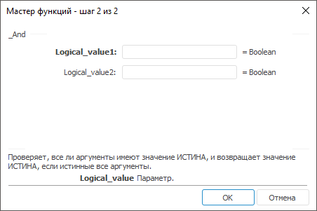

# Мастер функций: Регламентный отчёт, настольное приложение

Мастер функций: Регламентный отчёт, настольное приложение
-

# Мастер функций

Для работы с функциями:

	- нажмите кнопку 
	 в [строке формул](UiReport_Organizational_FormulaLine.htm);

	- нажмите кнопку 
	 «Вставить функцию», расположенную
	 на вкладке «Формулы» ленты
	 инструментов.

После выполнения одного из действий будет открыто окно «Мастер
 функций»:

Для работы с мастером функций:

	- Выберите категорию функций в раскрывающемся списке «Категория»:

		- Полный алфавитный перечень.
		 Все существующие функции;

		- [Математические](Function/Math/UiReport_Func_math.htm).
		 Математические функции;

		- [Ссылки
		 и массивы](Function/Link_Array/UiReport_Func_LinkArray.htm). Функции для работы со ссылками и массивами;

		- [Поиск](Function/Find/Find.htm).
		 Функции поиска;

		- [Дата
		 и время](Function/Date_Time/UiReport_Func_DateTime.htm). Функции для работы с датами и временем;

		- [Текстовые](Function/Text/UiReport_Func_Text.htm).
		 Функции для работы со строками;

		- [Работа
		 с отчетом](Function/Report/UiReport_Func_Report.htm). Функции для работы со срезами отчета;

		- [Финансовые](Function/Finance/UiReport_Func_Finance.htm).
		 Финансовые функции;

		- [Статистические](Function/Statistic/UiReport_Func_Statistic.htm).
		 Статистические функции;

		- [Логические](Function/Logical/UiReport_Func_Logical.htm).
		 Логические функции;

		- [Python](Function/Python/Python.htm).
		 Функции, написанные на языке Python;

		- [Java](Function/Java/Java.htm).
		 Статические методы, написанные на языке Java;

		- [Пользовательские](Function/UserFunc.htm).
		 Позволяют расширить возможности регламентного отчёта за счёт использования
		 пользовательских методик расчёта.

Примечание.
 Функции в каждой категории упорядочены по алфавиту.

При выделении функции под списком «Выберите функцию» будет отображаться
 её конструкция и краткое описание.

После выбора функции нажмите кнопку «OK». Будет открыт второй шаг мастера
 функций, например:

	- Ознакомьтесь с [особенностями](UiReport_Organizational_master_function.htm#param)
	 указания параметров функции и задайте им значения.

	- Нажмите кнопку «OK».

После выполнения действий в ячейке регламентного отчёта будет содержаться
 результат расчёта заданной функции.

Примечание.
 Функции, заданные в настольном приложении, рассчитываются в регламентном
 отчёте веб-приложения.

## Особенности указания параметров функции

Если параметр является числом, то в поле ввода параметра можно указывать
 как число, так и адрес ячейки в которой оно располагается. В записи параметра
 допускается использование арифметических символов: +, -, /, *, >, <,
 =.

Примечание.
 В поле ввода может быть записана только одна операция отношения: =, <>,
 >, <, >=, <=.

Если в качестве параметра внесено недопустимое выражение, поле ввода
 будет подсвечено.

Для завершения работы мастера задайте значения всех обязательных параметров
 и нажмите кнопку «OK». Созданная
 формула будет отображена в строке формул, а результат ее вычисления -
 в ячейке.

Для функций с переменным числом аргументов (например, функция Sum, And)
 первоначально на втором шаге мастера отображается два аргумента с соответствующими
 подписями. Подписи зависят от типа аргумента, например:

	- «Число1», «Число2»
	 и т.д. - для числовых аргументов;

	- «Строка1», «Строка2»
	 и т.д. - для строковых аргументов.

При переводе фокуса во второе поле добавляется поле для третьего аргумента
 и т.д. Максимальное число аргументов - 255:

См. также:

[Начало
 работы с инструментом «Отчёты» в веб-приложении](../../Web/organizational_management/Starting.htm) | [Использование
 формул](Function/UiReport_Function.htm) | [Строка
 формул](UiReport_Organizational_FormulaLine.htm)

		Справочная
		 система на версию 10.9
		 от 18/08/2025,
		 © ООО «ФОРСАЙТ»,
