# Настройка сквозных строк и столбцов

Настройка сквозных строк и столбцов
-

# Настройка сквозных строк и столбцов

## Вопрос

Как настроить сквозные строки и столбцы?

## Область применения

Часто при многостраничной печати требуется выводить повторяющуюся информацию
 на каждой странице. Например, при печати области данных нужно вывести
 её шапку и боковик.

## Пример 1. Задание составного диапазона строк

### Исходные данные

В качестве исходных данных берутся [области
 данных](../Desktop/AreaData/UiReport_AreaData.htm), по ширине полностью помещающиеся на один лист.

[Процесс создания
 области данных](javascript:TextPopup(this))

	Для построения области данных будет использоваться куб «Социально-экономические
	 показатели», создание которого рассмотрено в разделе «[Пример
	 создания куба](UiNavObj.chm::/Cube/UiMd_Cube_Example.htm)».

	Добавьте данный куб в область «Источники
	 данных и срезы» панели «[Источники и срезы данных](../Desktop/Source/UiReport_Source.htm)».
	 Создайте для него срез, который будет использоваться для построения
	 области данных. Измерения среза разместите следующим образом:

		- По столбцам. Календарь;

		- По строкам. Территориальные
		 измерения;

		- Фиксированные.
		 Социально-экономические показатели, Источники данных, Факты.

	Произведите отметку в измерениях и [разместите](../Desktop/AreaData/UiReport_AreaData.htm#areadata_create)
	 область данных на листе регламентного отчета.

	[Вычислите](../Desktop/AreaData/UiReport_AreaData.htm#areadata_calc)
	 область данных.

	После вычисления области данных введите над ней необходимое название.
	 Ширину первого столбца измените таким образом, чтобы содержимое ячеек
	 боковика полностью отображалось.

[Результат при
 печати](javascript:TextPopup(this))

	Область данных будет выведена на нескольких страницах:

		- Страница 1:

	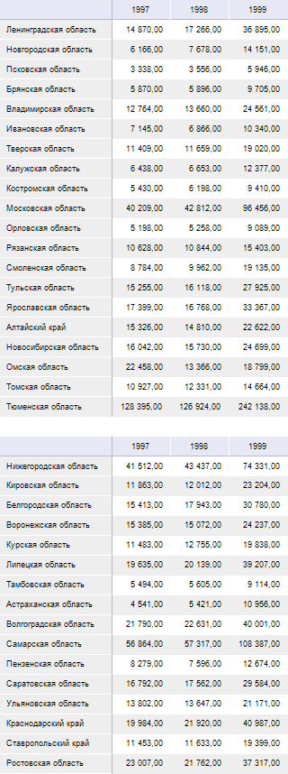

		- Страница 2:

	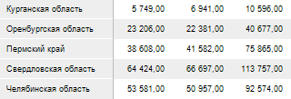

	Примечание.
	 На второй странице не отобразится шапка второй области данных.

### Решение

Для отображения при печати на каждом листе отчета шапок областей данных
 настройте [сквозные
 строки](../Desktop/Tuning/ParamPage/UiReport_Tuning_ParamPage_4.htm).

	- Для настройки отображения при печати сквозных строк выполните
	 команду главного меню «Отчет >
	 Печать > Параметры страницы». Откроется окно
	 «[Параметры страницы](../Desktop/Tuning/ParamPage/UiReport_Tuning_ParamPage.htm)».

	- Перейдите на вкладку «[Печать](../Desktop/Tuning/ParamPage/UiReport_Tuning_ParamPage_4.htm)»
	 и заполните поле ввода «Сквозные
	 строки». Для этого выделите диапазон строк, который будет выводиться
	 на печать на каждой странице. В данном случае необходимо выделить
	 строки, в которых расположены шапки областей данных - «0:0»
	 и «22:22».

После заполнения полей ввода окно
 «[Параметры
 страницы](../Desktop/Tuning/ParamPage/UiReport_Tuning_ParamPage.htm)» примет вид:

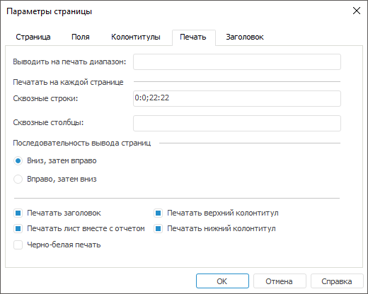

Сохраните заданные параметры печати.

После произведенных настроек первая страница отчета при печати
 останется без изменений, а вторая страница отчета будет выглядеть следующим
 образом:

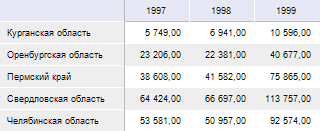

## Пример 2. Задание составного диапазона столбцов

### Исходные данные

В качестве исходных данных берутся [области
 данных](../Desktop/AreaData/UiReport_AreaData.htm), по высоте полностью помещающиеся на один лист.

[Процесс создания
 области данных](javascript:TextPopup(this))

	Для построения области данных будет использоваться куб «Социально-экономические
	 показатели», создание которого рассмотрено в разделе «[Пример
	 создания куба](UiNavObj.chm::/Cube/UiMd_Cube_Example.htm)».

	Добавьте данный куб в область «Источники
	 данных и срезы» панели «[Источники и срезы данных](../Desktop/Source/UiReport_Source.htm)».
	 Создайте для него срез, который будет использоваться для построения
	 области данных. Измерения среза разместите следующим образом:

		- По столбцам. Календарь;

		- По строкам. Территориальные
		 измерения;

		- Фиксированные.
		 Социально-экономические показатели, Источники данных, Факты.

	Произведите отметку в измерениях и [разместите](../Desktop/AreaData/UiReport_AreaData.htm#areadata_create)
	 область данных на листе регламентного отчета.

	[Вычислите](../Desktop/AreaData/UiReport_AreaData.htm#areadata_calc)
	 область данных.

	После вычисления области данных введите над ней необходимое название.
	 Ширину первого столбца измените таким образом, чтобы содержимое ячеек
	 боковика полностью отображалось.

[Результат при
 печати](javascript:TextPopup(this))

	Область данных будет выведена на нескольких страницах:

		- Страница 1:

	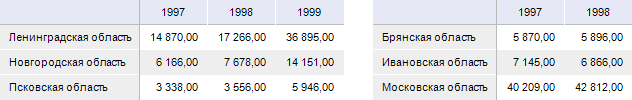

		- Страница 2:

	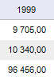

	Примечание.
	 На второй странице не отобразится боковик второй области данных.

### Решение

Для отображения при печати на каждом листе отчета боковиков областей
 данных настройте [сквозные
 столбцы](../Desktop/Tuning/ParamPage/UiReport_Tuning_ParamPage_4.htm).

	- Для настройки отображения при печати сквозных столбцов выполните
	 команду главного меню «Отчет >
	 Печать > Параметры страницы». Откроется окно
	 «[Параметры страницы](../Desktop/Tuning/ParamPage/UiReport_Tuning_ParamPage.htm)».

	- Перейдите на вкладку «[Печать](../Desktop/Tuning/ParamPage/UiReport_Tuning_ParamPage_4.htm)»
	 и заполните поле ввода «Сквозные
	 столбцы». Для этого выделите диапазон столбцов, который будет
	 выводиться на печать на каждой странице. В данном случае необходимо
	 выделить столбцы, в которых расположены боковики областей данных -
	 «A:A» и «F:F».

После заполнения полей ввода окно
 «[Параметры
 страницы](../Desktop/Tuning/ParamPage/UiReport_Tuning_ParamPage.htm)» примет вид:

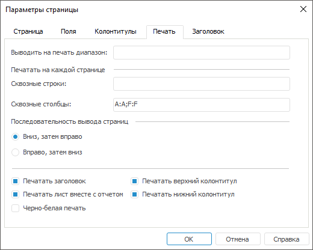

Сохраните заданные параметры печати.

После произведенных настроек первая страница отчета при печати
 останется без изменений, а вторая страница отчета будет выглядеть следующим
 образом:

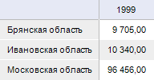

## Пример 3. Задание нескольких сквозных диапазонов

### Исходные данные

В качестве исходных данных берутся несколько [областей
 данных](../Desktop/AreaData/UiReport_AreaData.htm).

[Процесс создания
 области данных](javascript:TextPopup(this))

	Для построения области данных будет использоваться куб «Социально-экономические
	 показатели», создание которого рассмотрено в разделе «[Пример
	 создания куба](UiNavObj.chm::/Cube/UiMd_Cube_Example.htm)».

	Добавьте данный куб в область «Источники
	 данных и срезы» панели «[Источники и срезы данных](../Desktop/Source/UiReport_Source.htm)».
	 Создайте для него срез, который будет использоваться для построения
	 области данных. Измерения среза разместите следующим образом:

		- По столбцам. Календарь;

		- По строкам. Территориальные
		 измерения;

		- Фиксированные.
		 Социально-экономические показатели, Источники данных, Факты.

	Произведите отметку в измерениях и [разместите](../Desktop/AreaData/UiReport_AreaData.htm#areadata_create)
	 область данных на листе регламентного отчета.

	[Вычислите](../Desktop/AreaData/UiReport_AreaData.htm#areadata_calc)
	 область данных.

	После вычисления области данных введите над ней необходимое название.
	 Ширину первого столбца измените таким образом, чтобы содержимое ячеек
	 боковика полностью отображалось.

[Результат при
 печати](javascript:TextPopup(this))

	Область данных будет выведена на нескольких страницах:

		- Страница 1:

	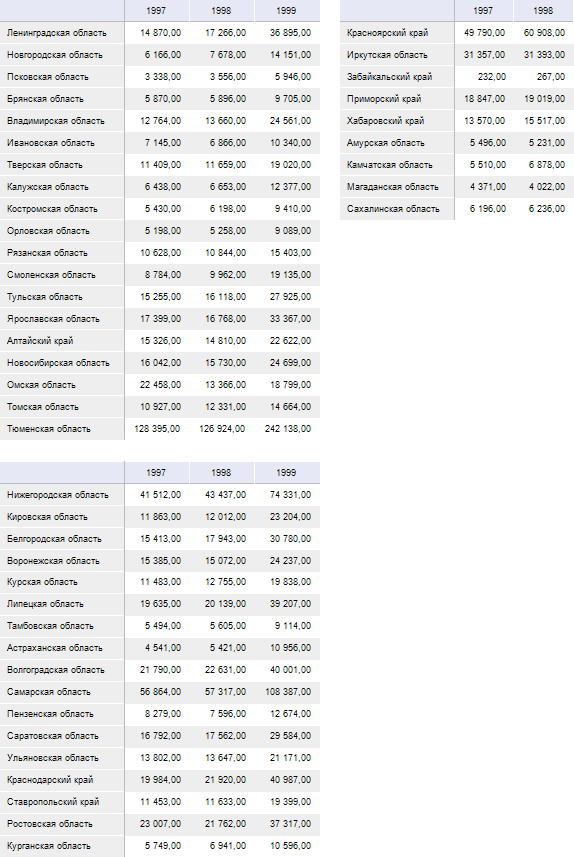

		- Страница 2:

	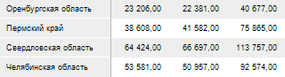

		- Страница 3:

	

	Примечание.
	 На второй странице не отобразится шапка второй области данных, а на
	 третьей - боковик третьей области данных.

### Решение

Для отображения при печати на каждом листе отчета шапок и боковиков
 областей данных настройте [сквозные
 строки и столбцы](../Desktop/Tuning/ParamPage/UiReport_Tuning_ParamPage_4.htm).

	- Для настройки отображения при печати сквозных строк и столбцов
	 выполните команду главного меню «Отчет
	 > Печать > Параметры страницы». Откроется окно «[Параметры страницы](../Desktop/Tuning/ParamPage/UiReport_Tuning_ParamPage.htm)».

	- Перейдите на вкладку «[Печать](../Desktop/Tuning/ParamPage/UiReport_Tuning_ParamPage_4.htm)»
	 и заполните поля ввода:

		- Сквозные строки.
		 Выделите диапазон строк, который будет выводиться на печать на
		 каждой странице. В данном случае необходимо выделить строки, в
		 которых расположены шапки областей данных - «0:0»
		 и «21:21».

		- Сквозные столбцы.
		 Выделите диапазон столбцов, который будет выводиться на печать
		 на каждой странице. В данном случае необходимо выделить столбцы,
		 в которых расположены боковики областей данных - «A:A»
		 и «F:F».

После заполнения полей ввода окно
 «[Параметры
 страницы](../Desktop/Tuning/ParamPage/UiReport_Tuning_ParamPage.htm)» примет вид:

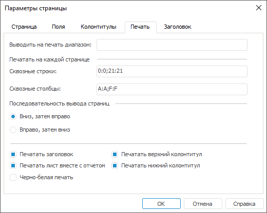

Сохраните заданные параметры печати.

После произведенных настроек первая страница отчета при печати
 останется без изменений, а вторая и третьи страницы будут выглядеть следующим
 образом:

	- Страница 2:

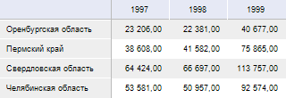

	- Страница 3:

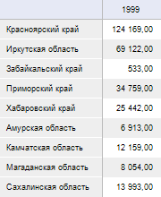

См. также:

[Вопросы и ответы](UiReport_FAQ.htm) | [Настройка
 отчёта под печать](../Desktop/Tuning/ParamPage/UiReport_Tuning_ParamPage.htm) | [Предварительный
 просмотр и печать отчёта](../Desktop/Reports/OperationReport/UiReport_Reports_Operation_Print.htm)

		Справочная
		 система на версию 10.9
		 от 18/08/2025,
		 © ООО «ФОРСАЙТ»,
