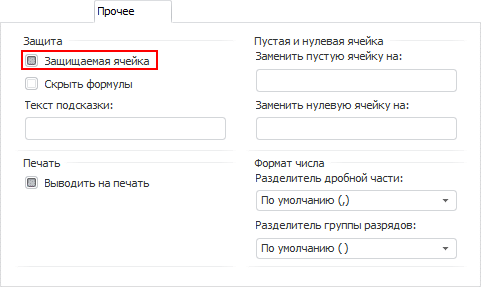
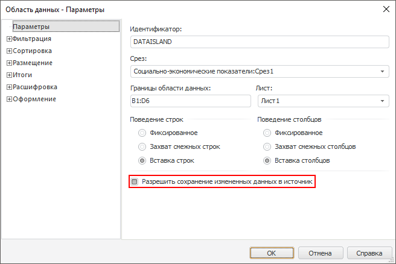
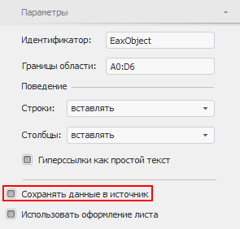

# Настройка защиты данных от редактирования

Настройка защиты данных от редактирования
-

# Настройка защиты данных от редактирования

## Вопрос

Как настроить защиту данных от редактирования?

## Область применения

В регламентном отчете можно настроить защиту данных от редактирования
 и последующее сохранение измененных данных в источник.

Данные настройки применимы при:

	- [редактировании
	 содержимого ячеек](../Desktop/Table/Work/UiReport_Table_Work_Data_Edit.htm);

	- [редактировании
	 данных](uidiagrams.chm::/Edit_DataSeries.htm)
	 в ячейках из диаграммы, которая на них построена. Данные, измененные
	 на диаграмме, автоматически изменяются в соответствующих ячейках.

## Исходные данные

Имеется [область
 данных](../Desktop/AreaData/UiReport_AreaData.htm), над содержимым ячеек которой возможно редактирование.

Необходимо настроить защиту данных от редактирования и последующее сохранение
 измененных данных отчета в источник.

## Решение

Ниже представлено несколько решений:

[Настройка защиты
 содержимого ячейки от редактирования](javascript:TextPopup(this))

	При работе с данными можно настроить защиту содержимого ячейки от
	 редактирования. Для этого установите флажок «Защищаемая
	 ячейка» на вкладке «[Прочее](UiNav.chm::/GUI/Format/UiReport_Table_Attribute_Others.htm)»
	 окна «Формат ячейки»:

	

	Если флажок был установлен, данные ячеек были отредактированы и
	 затем сохранены, то при [обновлении
	 отчета](../Desktop/Reports/OperationReport/UiReport_Reports_Operation_Execute.htm) все изменения данных будут отменены.

[Настройка сохранения
 измененных данных в источник](javascript:TextPopup(this))

	При работе с областью данных в регламентном отчете можно настроить
	 сохранение измененных данных. Для этого установите флажок «Разрешить
	 сохранение измененных данных в источник», расположенный на
	 вкладке «[Параметры](../Desktop/AreaData/Param/UiReport_AreaData_Param_Param.htm)»
	 окна «Свойства области
	 данных»:

	

	При работе с таблицей данных для сохранения измененных данных таблицы
	 установите флажок «Сохранять данные
	 в источник», расположенный на вкладке «[Параметры](UiAnalyticalArea.chm::/Parameters/Parameters.htm)»
	 боковой панели:

	

	При установленном флажке измененные данные будут сохраняться в источник
	 данных. Если флажок снят, то при [обновлении
	 отчета](../Desktop/Reports/OperationReport/UiReport_Reports_Operation_Execute.htm) все изменения данных будут отменены.

См. также:

[Вопросы и ответы](UiReport_FAQ.htm) | [Редактирование
 и сохранение данных](UiAnalyticalArea.chm::/Working_with_table_data/Edit_and_save_data.htm) | [Настройка
 общих параметров](../Desktop/AreaData/Param/UiReport_AreaData_Param_Param.htm) | [Защита
 листа](../Desktop/Sheets/UiReport_Sheets_defence.htm)

		Справочная
		 система на версию 10.9
		 от 18/08/2025,
		 © ООО «ФОРСАЙТ»,
