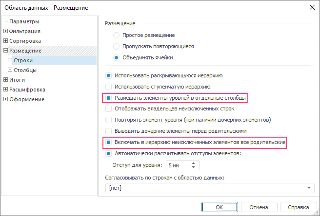
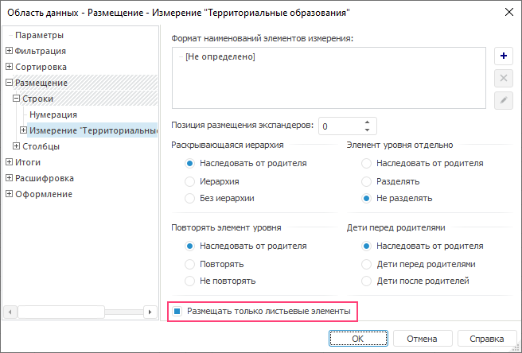
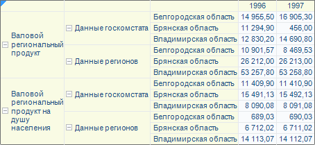
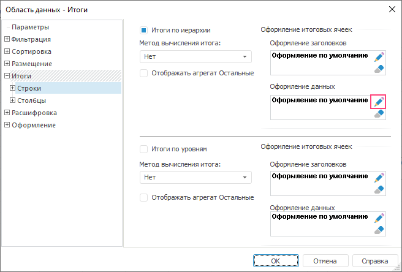
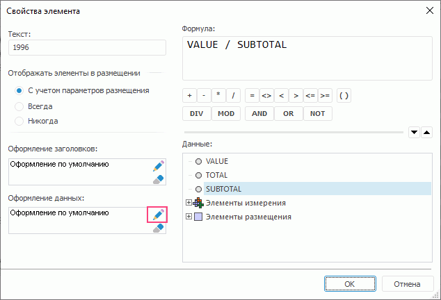
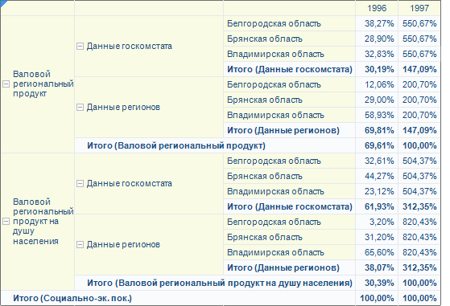
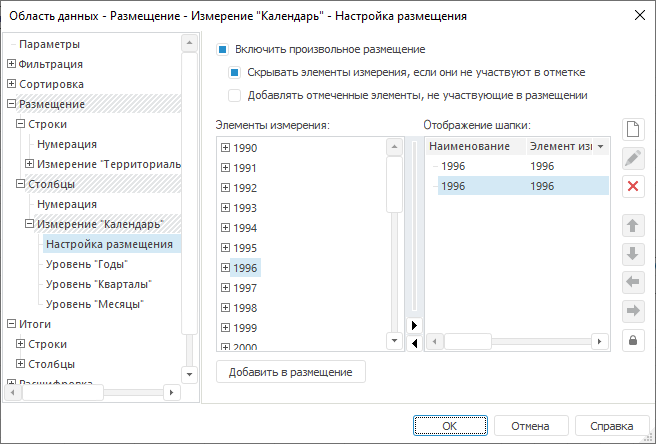
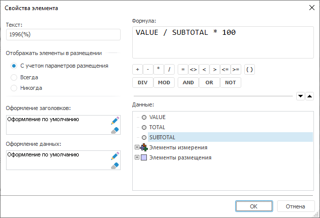
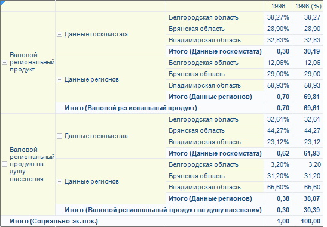

# Настройка вывода значения ячейки в процентах к промежуточному итогу

Настройка вывода значения ячейки в процентах к промежуточному итогу
-

# Настройка вывода значения ячейки в процентах к промежуточному итогу

## Вопрос

Как настроить вывод значения ячейки области данных в процентах к промежуточному
 итогу?

## Область применения

Для любой области данных можно настроить вывод итоговых значений. Иногда
 требуется отображение не самого значения ячейки, а его доли в процентах
 к промежуточному итогу по соответствующему уровню, либо общему итогу.
 Такой расчет может быть настроен только для отдельных столбцов/строк и
 при размещении нескольких измерений по строкам/столбцам. Для наглядности
 можно произвести настройку так, что некоторые столбцы/строки будут отображать
 абсолютные значения, а некоторые долю в процентах.

## Исходные данные

Для построения области данных будет использоваться куб «Социально-экономические
	 показатели», создание которого рассмотрено в разделе «[Пример
	 создания куба](UiNavObj.chm::/Cube/UiMd_Cube_Example.htm)».

[Процесс
 создания области данных](javascript:TextPopup(this))

Добавьте данный куб в область «Источники
 данных и срезы» панели «[Источники
 и срезы данных](../Desktop/Source/UiReport_Source.htm)». Создайте для него срез, который будет использоваться
 для построения области данных. Измерения среза разместите следующим образом:

	- По столбцам. Календарь;

	- По строкам. Территориальные
	 измерения;

	- Фиксированные. Социально-экономические
	 показатели, Источники данных, Факты.

	Произведите отметку в измерениях и [разместите](../Desktop/AreaData/UiReport_AreaData.htm#areadata_create)
	 область данных на листе регламентного отчета.

	При размещении области данных на листе отчета установите флажок
	 флажки «Размещать элементы уровней
	 в отдельные столбцы» и «Включать
	 в иерархию неисключенных элементов все родительские» на
	 вкладке «[Размещение > Строки](../Desktop/AreaData/Param/Order/UiReport_AreaData_Param_Order_RS.htm)»
	 окна «[Свойства области данных](../Desktop/AreaData/Param/UiReport_AreaData_Param.htm)»:

	

	На вкладке «[Размещение - Строки
	 - Измерение "Социально-экономические показатели"](../Desktop/AreaData/Param/Order/UiReport_AreaData_Param_Order_attach.htm)» и
	 «Размещение - Строки - Измерение
	 "Территориальные образования"» установите флаг «Размещать только листьевые элементы»:

	

	[Вычислите](../Desktop/AreaData/UiReport_AreaData.htm#areadata_calc)
	 область данных.

Область данных выглядит следующим образом:

## Решение

Ниже представлено два решения:

[Все столбцы
 отображают проценты к промежуточному итогу](javascript:TextPopup(this))

		- Отметьте любую ячейку данной области и выполните команду
		 контекстного меню «Параметры
		 области данных».

		- В открывшемся окне «[Свойства
		 области данных](../Desktop/AreaData/Param/UiReport_AreaData_Param.htm)» перейдите на вкладку «[Итоги
		 > Строки](../Desktop/AreaData/Param/UiReport_AreaData_Param_Totals.htm)» и задайте следующие настройки:

			- установите флажок «Итоги
			 по иерархии»;

			- в комбинированном списке «Метод
			 вычисления итога» выберите элемент «Сумма».

	Таким образом, была произведена настройка
	 вывода суммы показателей по дочерним элементам измерений:

	

		- Нажмите кнопку  «Настроить
		 оформление» в области «Оформление
		 данных» (кнопка вызова диалога выделена на изображении
		 выше).

		- В открывшемся окне «[Формат
		 ячейки](../Desktop/Table/Attribute/UiReport_Table_Attribute.htm)» перейдите на вкладку «[Формат числа](UiNav.chm::/GUI/Format/UiReport_Table_Attribute_Format.htm)»
		 и выберите формат данных «Процентный».

		- Перейдите на вкладку «[Размещение
		 > Столбцы > Измерение "Календарь" > Настройка
		 размещения](../Desktop/AreaData/Param/Order/UiReport_AreaData_Param_Order_Tuning.htm)» и задайте следующие настройки:

			- установите флажок «Включить
			 произвольное размещение»;

			- в области «Элементы
			 измерения» выделите элементы «1996»
			 и «1997», затем нажмите
			 на кнопку «Добавить в размещение».

	Выбранные элементы измерения будут добавлены
	 в область «Отображение шапки»:

	

		- Выберите элемент «1996»
		 в области «Отображение шапки»
		 и нажмите кнопку .

		- В открывшемся диалоге «[Свойства
		 элемента](../Desktop/AreaData/Param/Order/UiReport_AreaData_Param_Order_Elem_Prop.htm)» задайте следующие настройки:

			- в области «Формула»
			 создайте формулу «VALUE / SUBTOTAL»;

			- нажмите кнопку
			 «Настроить оформление»
			 в области «Оформление данных».
			 В открывшемся окне «[Формат
			 ячейки](../Desktop/Table/Attribute/UiReport_Table_Attribute.htm)» перейдите на вкладку «[Формат числа](UiNav.chm::/GUI/Format/UiReport_Table_Attribute_Format.htm)»
			 и выберите формат данных «Процентный»
			 (диалог аналогичен приведенному выше для задания формата итогов).
			 Для элемента «1997»
			 задайте аналогичные настройки:

	

		- Для того чтобы настройки вступили в силу, [вычислите
		 область данных](../Desktop/AreaData/UiReport_AreaData.htm#areadata_calc).

	После этого область данных будет выглядеть следующим образом:

	

	Таким образом, была произведена настройка отображения значения в
	 процентах к промежуточному итогу. Для оценки значения элемента используется
	 итоговое значение по элементу вышестоящего измерения. Например, для
	 оценки значения по Белгородской области берется промежуточный итог
	 «Итого (Данные госкомстата)»,
	 для оценки которого в свою очередь берется значение «Итого
	 (Валовой региональный продукт)» и т.д.

[В столбцах чередуются
 абсолютные значения и проценты](javascript:TextPopup(this))

		- Настройте итоги по иерархии как указано в примере выше,
		 но в окне «[Формат
		 ячейки](../Desktop/Table/Attribute/UiReport_Table_Attribute.htm)» на вкладке «[Формат числа](UiNav.chm::/GUI/Format/UiReport_Table_Attribute_Format.htm)»
		 выберите формат данных «Числовой».

		- Перейдите на вкладку «[Размещение
		 > Столбцы > Измерение "Календарь" > Настройка
		 размещения](../Desktop/AreaData/Param/Order/UiReport_AreaData_Param_Order_Tuning.htm)» окна «[Свойства
		 области данных](../Desktop/AreaData/Param/UiReport_AreaData_Param.htm)». Установите флажок «Включить
		 произвольное размещение». В области «Элементы
		 измерения» выделите элемент «1996»
		 и два раза нажмите кнопку «Добавить
		 в размещение»:

	

		- Выберите в области «Отображение
		 боковика» второй элемент «1996»
		 и нажмите кнопку .

		- В открывшемся диалоге «[Свойства
		 элемента](../Desktop/AreaData/Param/Order/UiReport_AreaData_Param_Order_Elem_Prop.htm)» задайте следующие настройки:

			- в поле «Текст» измените заголовок на «1996
			 (%)»;

			- в области «Формула»
			 создайте формулу «VALUE / SUBTOTAL * 100»;

			- нажмите кнопку
			 «Настроить оформление»
			 в области «Оформление данных».
			 В открывшемся окне «[Формат
			 ячейки](../Desktop/Table/Attribute/UiReport_Table_Attribute.htm)» перейдите на вкладку «[Формат числа](UiNav.chm::/GUI/Format/UiReport_Table_Attribute_Format.htm)»
			 и выберите формат данных «Числовой»
			 (диалог аналогичен приведенному выше для задания формата итогов).

	

		- Для того чтобы настройки вступили в силу, [вычислите
		 область данных](../Desktop/AreaData/UiReport_AreaData.htm#areadata_calc).

	После этого область данных будет выглядеть следующим образом:

	

	Таким образом, была произведена настройка параметров так, что в
	 одном столбце отображается процент к промежуточному итогу, а в другом
	 - числовое значение элементов.

См. также:

[Вопросы и ответы](UiReport_FAQ.htm)

		Справочная
		 система на версию 10.9
		 от 18/08/2025,
		 © ООО «ФОРСАЙТ»,
