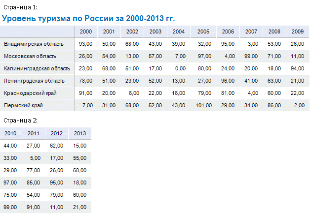
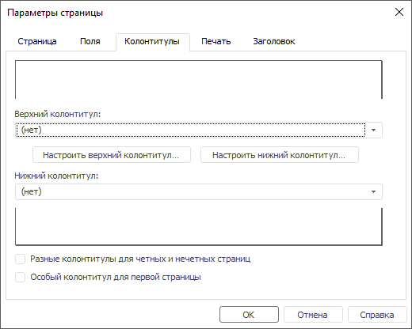
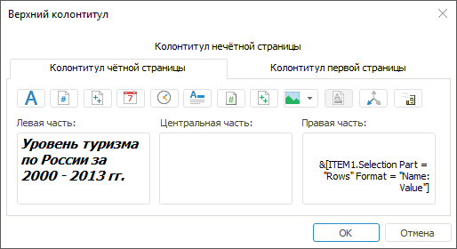
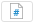
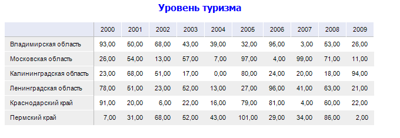
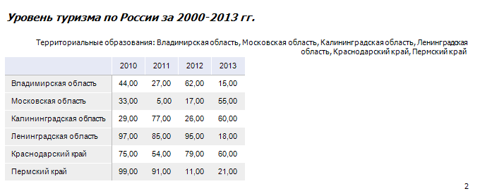
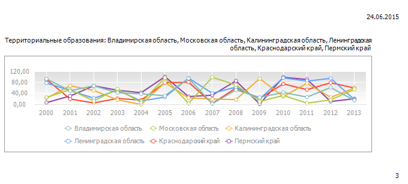

# Настройка вывода необходимой информации на каждой странице при многостраничной печати

Настройка вывода необходимой информации на каждой странице при многостраничной печати
-

# Настройка вывода необходимой информации на каждой странице при многостраничной
 печати

## Вопрос

Как при печати нескольких страниц на каждой вывести повторяющуюся информацию?

## Область применения

Часто при многостраничной печати требуется выводить повторяющуюся информацию
 на каждой странице.

Например, при печати отчета требуется:

	- на первой странице вывести название отчета и текущую дату;

	- на каждой четной странице - заголовок области данных, отметку
	 по измерению и номер текущей страницы;

	- на каждой нечётной странице - отметку по измерению, текущую
	 дату и номер текущей страницы;

	- при печати области данных нужно вывести её заголовок, шапку
	 и боковик.

## Исходные данные

В качестве исходных данных берётся [область
 данных](../Desktop/AreaData/UiReport_AreaData.htm) и [диаграмма](../Desktop/Diagrams/UiReport_Diagrams_appointment.htm),
 построенная по области данных.

[Процесс создания
 области данных](javascript:TextPopup(this))

	Для построения области данных будет использоваться куб «Социально-экономические
	 показатели», создание которого рассмотрено в разделе «[Пример
	 создания куба](UiNavObj.chm::/Cube/UiMd_Cube_Example.htm)».

	Добавьте данный куб в область «Источники
	 данных и срезы» панели «[Источники и срезы данных](../Desktop/Source/UiReport_Source.htm)».
	 Создайте для него срез, который будет использоваться для построения
	 области данных. Измерения среза разместите следующим образом:

		- По столбцам. Календарь;

		- По строкам. Территориальные
		 измерения;

		- Фиксированные.
		 Социально-экономические показатели, Источники данных, Факты.

	Произведите отметку в измерениях и [разместите](../Desktop/AreaData/UiReport_AreaData.htm#areadata_create)
	 область данных на листе регламентного отчета.

	[Вычислите](../Desktop/AreaData/UiReport_AreaData.htm#areadata_calc)
	 область данных.

	После вычисления области данных введите над ней необходимое название.
	 Ширину первого столбца измените таким образом, чтобы содержимое ячеек
	 боковика полностью отображалось.

При печати область данных будет выведена на нескольких страницах:

На третьей странице будет выведена диаграмма.

При печати отчета должна быть отображена следующая информация:

	- на первой странице - название отчета и текущая дата;

	- на каждой четной странице - заголовок области данных, отметка
	 по измерению и номер текущей страницы;

	- на каждой нечётной странице - отметка по измерению, текущая
	 дата и номер текущей страницы;

	- при печати области данных нужно вывести её заголовок, шапку
	 и боковик.

## Решение

Для отображения при печати на каждом листе отчета дополнительной информации
 настройте следующие параметры страницы: [колонтитулы](../Desktop/Tuning/ParamPage/UiReport_Tuning_ParamPage_3.htm),
 [сквозные
 столбцы и строки](../Desktop/Tuning/ParamPage/UiReport_Tuning_ParamPage_4.htm).

	- Поскольку заголовок таблицы будет отображаться как колонтитул,
	 его нужно удалить. Для этого выберите ячейку с заголовком и нажмите
	 клавишу DELETE.

	- Для настройки отображения при печати колонтитулов выполните
	 команду главного меню «Отчет >
	 Печать > Параметры страницы».

	- В открывшемся окне «Параметры
	 страницы» перейдите на вкладку «[Колонтитулы](../Desktop/Tuning/ParamPage/UiReport_Tuning_ParamPage_3.htm)»:

	- Установите флажки «Разные колонтитулы
	 для четных и нечетных страниц» и «Особый
	 колонтитул для первой страницы».

	- Нажмите кнопку «Настроить верхний
	 колонтитул». В открывшемся одноименном окне задайте следующие
	 параметры колонтитулов:

		- на вкладке «Колонтитул
		 первой страницы» установите курсор в области «Центральная
		 часть» и нажмите кнопку .

Таким образом, в левой части верхнего колонтитула
 будет отображаться наименование отчета. Если необходимо, настройте формат
 выводимого текста, для этого нажмите кнопку ;

		- на вкладке «Колонтитул
		 нечётной страницы»:

			- установите курсор в область «Левая
			 часть» и нажмите кнопку . В открывшемся
			 окне «[Вывод
			 отметки](../Desktop/Tuning/ParamPage/UiReport_Tuning_ParamPage_3_Slice.htm)» установите флажок «Измерения
			 в строках». Если необходимо, настройте формат
			 выводимого текста, для этого нажмите кнопку ;

			- установите курсор в область «Правая
			 часть» и нажмите кнопку .

После выполнения данных действий для нечётных
 страниц в центральной части колонтитула будет отображаться отметка по
 измерению, а в правой части - текущая дата;

		- на вкладке «Колонтитул
		 чётной страницы»:

			- установите курсор в область «Левая
			 часть» и с помощью клавиатуры введите заголовок области
			 данных;

			- установите курсор в область «Правая
			 часть» и нажмите кнопку .
			 В открывшемся окне «[Вывод
			 отметки](../Desktop/Tuning/ParamPage/UiReport_Tuning_ParamPage_3_Slice.htm)» установите флажок «Измерения
			 в строках». Если необходимо, настройте формат выводимого
			 текста, для этого нажмите кнопку .

После выполнения данных действий для чётных
 страниц в левой части колонтитула будет отображаться заголовок области
 данных, а в центральной части - отметка по измерению.

Пример заполненной вкладки «Колонтитул
 чётной страницы» окна «Верхний
 колонтитул»:

Сохраните параметры оформления верхнего колонтитула.

	- Нажмите кнопку «Настроить нижний
	 колонтитул» и аналогичным образом задайте настройки. На вкладках
	 «Колонтитул нечётной страницы»
	 и «Колонтитул чётной страницы»
	 установите курсор в область «Правая
	 часть» и нажмите кнопку .

В качестве колонтитулов для всех страниц,
 кроме первой, будет использоваться номер текущей страницы.

Сохраните параметры оформления нижнего колонтитула.

	- Перейдите на вкладку «[Печать](../Desktop/Tuning/ParamPage/UiReport_Tuning_ParamPage_4.htm)»
	 окна «[Параметры страницы](../Desktop/Tuning/ParamPage/UiReport_Tuning_ParamPage.htm)».
	 Установите на вкладке флажки «Печатать
	 верхний колонтитул» и «Печатать
	 нижний колонтитул» для отображения колонтитулов и заполните
	 поля ввода:

		- Выводить на печать диапазон.
		 Выделите диапазон области данных, который необходимо вывести на
		 печать;

		- Сквозные строки.
		 Выделите диапазон строк, который будет выводиться на печать на
		 каждой странице. В данном случае необходимо выделить строку, в
		 которой расположена шапка области данных - «1:1»;

		- Сквозные столбцы.
		 Выделите диапазон столбцов, который будет выводиться на печать
		 на каждой странице. В данном случае необходимо выделить столбец,
		 в котором расположен боковик области данных - «A:A».

После заполнения полей ввода окно
 «[Параметры
 страницы](../Desktop/Tuning/ParamPage/UiReport_Tuning_ParamPage.htm)» примет вид:

Сохраните заданные параметры печати.

После произведенных настроек отчет при печати будет выглядеть следующим
 образом:

Страница 1:

Страница 2:

Страница 3:

Таким образом, была произведена настройка параметров страницы так, чтобы
 при печати на каждой странице присутствовали колонтитулы, а также настроен
 вывод шапки и боковика области данных.

См. также:

[Вопросы и ответы](UiReport_FAQ.htm) | [Настройка
 отчёта под печать](../Desktop/Tuning/ParamPage/UiReport_Tuning_ParamPage.htm) | [Предварительный
 просмотр и печать отчёта](../Desktop/Reports/OperationReport/UiReport_Reports_Operation_Print.htm) | [Предварительный просмотр](uinav.chm::/GUI/Object_preview.htm)

		Справочная
		 система на версию 10.9
		 от 18/08/2025,
		 © ООО «ФОРСАЙТ»,
