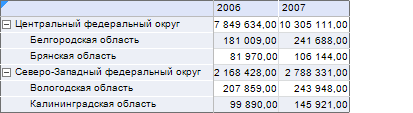
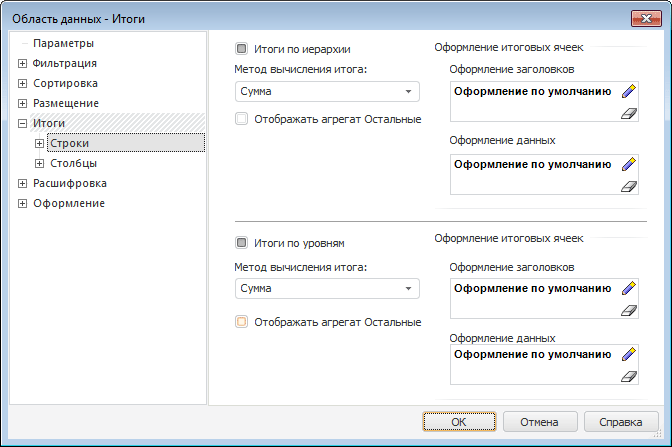
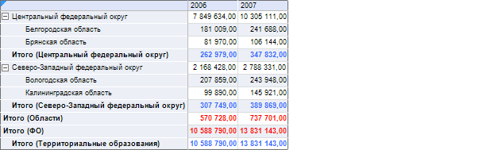

# Настройка итогов области данных по уровням измерения

Настройка итогов области данных по уровням измерения
-

# Настройка итогов области данных по уровням измерения

## Вопрос

Как настроить итоги области данных по уровням измерения?

## Область применения

Для любой области данных можно организовать вывод итоговых значений.
 Для повышения информативности можно организовать вывод итоговых значений,
 привязанных к уровням измерения.

## Исходные данные

[Процесс создания
 области данных](javascript:TextPopup(this))

	Для построения области данных будет использоваться куб «Социально-экономические
	 показатели», создание которого рассмотрено в разделе «[Пример
	 создания куба](UiNavObj.chm::/Cube/UiMd_Cube_Example.htm)».

Добавьте данный куб в область «Источники
 данных и срезы» панели «[Источники
 и срезы данных](../Desktop/Source/UiReport_Source.htm)». Создайте для него срез, который будет использоваться
 для построения области данных. Измерения среза разместите следующим образом:

	- По столбцам. Календарь;

	- По строкам. Территориальные
	 измерения;

	- Фиксированные. Социально-экономические
	 показатели, Источники данных, Факты.

	Произведите отметку в измерениях и [разместите](../Desktop/AreaData/UiReport_AreaData.htm#areadata_create)
	 область данных на листе регламентного отчета.

	[Вычислите](../Desktop/AreaData/UiReport_AreaData.htm#areadata_calc)
	 область данных.

Область данных выглядит следующим образом:

Необходимо вывести по представленным данным следующие итоги:

	- сумма показателей по дочерним элементам уровней измерений;

	- сумма показателей по всем элементам уровней измерений.

## Решение

Настройте параметры вывода итоговых значений области данных. Для этого:

	- Отметьте любую ячейку данной области и выполните команду контекстного
	 меню «Параметры области данных».

	- В открывшемся окне «[Свойства
	 области данных](../Desktop/AreaData/Param/UiReport_AreaData_Param.htm)» перейдите на вкладку «[Итоги
	 > Строки](../Desktop/AreaData/Param/UiReport_AreaData_Param_Totals.htm)» и задайте следующие параметры:

		- для настройки вывода суммы показателей по
		 дочерним элементам уровней измерений:

			- установите флажок «Итоги
			 по иерархии»;

			- в комбинированном списке «Метод
			 вычисления итога» выберите элемент «Сумма»;

		- для настройки вывода суммы показателей по
		 всем элементам уровней измерений:

			- установите флажок «Итоги
			 по уровням»;

			- в комбинированном списке «Метод
			 вычисления итога» выберите элемент «Сумма».

Примечание.
 Настройка итогов, привязанных к уровням и измерениям, аналогична настройке
 итогов, привязанных к строкам/столбцам.

	- Для сохранения настроек нажмите кнопку «ОК».

	- Для того чтобы настройки вступили в силу, [вычислите
	 область данных](../Desktop/AreaData/UiReport_AreaData.htm#areadata_calc).

После этого область данных будет выглядеть следующим образом:

Для лучшего понимания к вычисленным итогам применено следующее [оформление](../Desktop/AreaData/Param/UiReport_AreaData_Param_Totals.htm#formatting):

	- итоги по уровням выделены
	 красным цветом;

	- итоги по иерархии выделены
	 синим цветом.

Таким образом, была произведена настройка агрегации области данных по
 уровням измерения.

См. также:

[Вопросы и ответы](UiReport_FAQ.htm) | [Область данных](../Desktop/AreaData/UiReport_AreaData.htm) | [Свойства
 области данных](../Desktop/AreaData/Param/UiReport_AreaData_Param.htm)

		Справочная
		 система на версию 10.9
		 от 18/08/2025,
		 © ООО «ФОРСАЙТ»,
