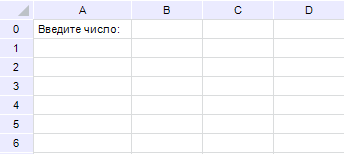
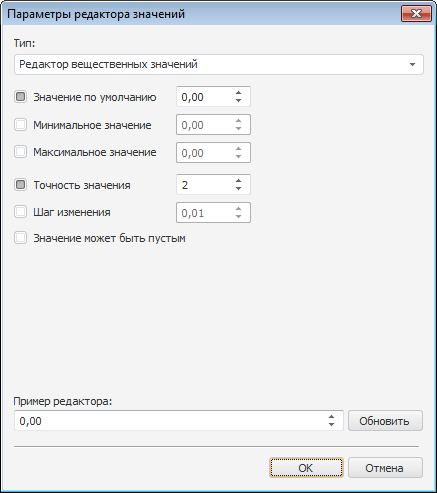
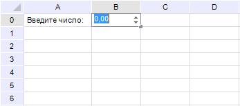

# Настройка редактора ячейки

Настройка редактора ячейки
-

# Настройка редактора ячейки

## Вопрос

Как разрешить ввод только числовых значений в ячейки регламентного отчета?

## Область применения

Для ограничения ввода значений в ячейки листа регламентного отчета можно
 настроить формат данных. Например, настроить ввод только числовых или
 только логических значений.

## Исходные данные

Лист регламентного отчета:

В ячейку B0 должны вводиться
 только числовые значения (целые или вещественные).

## Решение

Необходимо настроить формат числа в ячейке B0.
 Для этого:

	- Отметьте ячейку B0.

	- Выполните одно из действий:

		- выполните команду «Формат
		 > Формат ячеек», расположенную в группе «Ячейки»
		 на вкладке ленты «Главная»;

		- выполните команду контекстного меню «Формат
		 ячеек»;

		- нажмите сочетание клавиш CTRL+1.

После выполнения действия будет открыто окно
 «[Формат
 ячейки](UiNav.chm::/GUI/Format.htm)».

	- Перейдите на вкладку «[Формат числа](UiNav.chm::/GUI/Format/UiReport_Table_Attribute_Format.htm)»:

	- Нажмите кнопку «Настроить».
	 Откроется окно «[Параметры редактора
	 значений](UiNav.chm::/GUI/ValueEditorParameters.htm)».

	- В раскрывающемся списке «Тип»
	 выберите значение «Редактор вещественных
	 значений»:

	- Установите флажки «Значение
	 по умолчанию» и «Точность
	 измерения».

	- Для сохранения настроек нажмите кнопку «ОK»
	 в окне «Параметры редактора значений»,
	 а затем кнопку «ОK» в окне
	 «Формат ячейки».

После произведенных настроек ячейка B0
 при выделении (двойном щелчке по ячейке) выглядит следующим образом:

Таким образом, была произведена настройка атрибутов ячейки B0
 так, чтобы в нее было можно вводить только числовые значения.

См. также:

[Вопросы и ответы](UiReport_FAQ.htm) │
 [Атрибуты
 ячеек таблицы](../Desktop/Table/Attribute/UiReport_Table_Attribute.htm) │ [Параметры редактора
 значений](UiNav.chm::/GUI/ValueEditorParameters.htm)

		Справочная
		 система на версию 10.9
		 от 18/08/2025,
		 © ООО «ФОРСАЙТ»,
