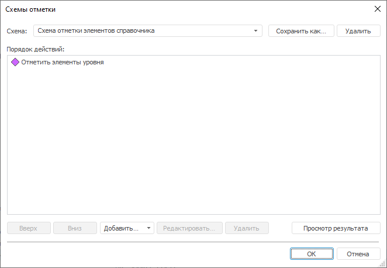
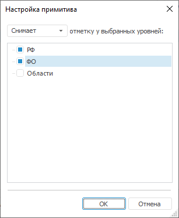
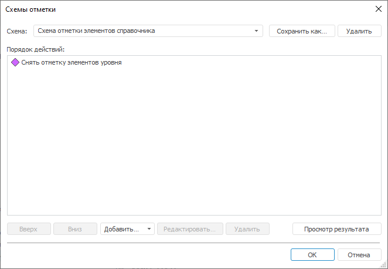
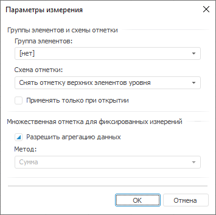
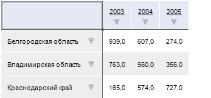

# Настройка работы со схемой отметки измерения при использовании элементов управления

Настройка работы со схемой отметки измерения при использовании элементов управления
-

# Настройка работы со схемой отметки измерения при использовании элементов
 управления

## Вопрос

Как настроить работу со схемой отметки измерения при использовании областью
 данных элементов управления?

## Область применения

В режиме просмотра регламентного отчета можно осуществлять оперирование
 данными при помощи элементов управления. Если элемент управления содержит
 большое количество уровней, то для облегчения работы с ним можно использовать
 схемы отметки.

## Исходные данные

Для построения области данных будет использоваться куб «Социально-экономические
	 показатели», создание которого рассмотрено в разделе «[Пример
	 создания куба](UiNavObj.chm::/Cube/UiMd_Cube_Example.htm)».

[Процесс создания
 области данных](javascript:TextPopup(this))

Добавьте данный куб в область «Источники
 данных и срезы» панели «[Источники
 и срезы данных](../Desktop/Source/UiReport_Source.htm)». Создайте для него срез, который будет использоваться
 для построения области данных. Измерения среза разместите следующим образом:

	- По столбцам. Календарь;

	- По строкам. Территориальные
	 измерения;

	- Фиксированные. Социально-экономические
	 показатели, Источники данных, Факты.

	Произведите отметку в измерениях и [разместите](../Desktop/AreaData/UiReport_AreaData.htm#areadata_create)
	 область данных на листе регламентного отчета.

	[Добавьте](../Desktop/Source/Controls.htm#add) элемент
	 управления на панель «Элементы управления»
	 и [вычислите](../Desktop/AreaData/UiReport_AreaData.htm#areadata_calc)
	 область данных.

Область данных выглядит следующим образом:

Необходимо выводить элементы только последнего уровня в боковике области
 данных.

## Решение

Необходимо создать и настроить схему отметки измерения «Территориальные
 образования».

### Этап 1. Создание схемы отметки

Для создания схемы отметки:

	- Перейдите в окно «[Навигатор
	 объектов](GetStarted.chm::/Interface/Interface_Navigator.htm)» и выполните команду контекстного
	 меню «Схемы отметки» для справочника
	 «Территориальные образования».

	- В открывшемся окне «[Схемы
	 отметки](UiNavObj.chm::/reference_book/look-and-feel_Reference_book/uimd_reference_book_look-and-feel_scheme.htm)» нажмите кнопку «Добавить»
	 и выберите из раскрывающегося списка вариант «Отметить
	 уровень». В список «Порядок
	 действий» будет добавлен элемент «Отметить
	 элементы уровня»:

	- Выделите добавленный элемент и нажмите кнопку «Редактировать».

	- В открывшемся окне «[Настройка примитива](UiNavObj.chm::/reference_book/look-and-feel_Reference_book/UiMd_reference_book_look-and-feel_Scheme.htm#configure_primitive)» из раскрывающегося списка выберите
	 вариант действия: «Снимает».

	- Установите флажки «РФ»
	 и «ФО» (напротив названий
	 верхних уровней справочника «Территориальные
	 образования»):

	- Для сохранения настроек примитива нажмите кнопку «ОК».

В списке «Порядок
 действий» элемент «Отметить элементы
 уровня» изменил название на «Снять
 отметку элементов уровня»:

	- Для сохранения схемы отметки нажмите на кнопку «Сохранить
	 как». Будет открыт стандартный диалог «Свойства
	 объекта». В поле «Наименование»
	 введите название схемы отметки: «Снять
	 отметку верхних элементов уровня».

	- Для сохранения настроек нажмите кнопку «ОK»
	 в окне «Свойства объекта»,
	 затем нажмите кнопку «ОK»
	 в окне «[Схемы
	 отметки](UiNavObj.chm::/reference_book/look-and-feel_Reference_book/uimd_reference_book_look-and-feel_scheme.htm)».

Схема отметки создана. Теперь необходимо настроить ее использование.

### Этап 2. Настройка схемы отметки

Перейдите в окно инструмента «Отчеты»:

	- В области «[Измерения](../Desktop/Source/UiReport_Source.htm#old)»
	 на панели «Источники и срезы данных»
	 нажмите кнопку , расположенную
	 напротив измерения «Территориальные
	 образования».

	- В открывшемся окне «Параметры
	 измерения» из раскрывающегося списка «Схема
	 отметки» выберите элемент «Снять
	 отметку верхних элементов уровня»:

	- Для сохранения настроек параметров измерения нажмите кнопку
	 «ОК».

После выполнения этих действий область данных будет выглядеть следующим
 образом:

При выборе в элементе управления «Территориальные
 образования» любых уровней в области данных будут отображаться
 только элементы нижнего уровня.

Таким образом, была создана и настроена схема отметки измерения так,
 чтобы облегчить оперирование данными при помощи элементов управления в
 режиме просмотра отчета.

См. также:

[Вопросы и ответы](UiReport_FAQ.htm) | [Схемы отметки](UiNavObj.chm::/reference_book/look-and-feel_Reference_book/uimd_reference_book_look-and-feel_scheme.htm) | [Выбор источников данных
 и работа с ними](../Desktop/Source/UiReport_Source.htm) | [Добавление
 интерактивных элементов управления содержимым отчёта](../Desktop/Source/Controls.htm)

		Справочная
		 система на версию 10.9
		 от 18/08/2025,
		 © ООО «ФОРСАЙТ»,
