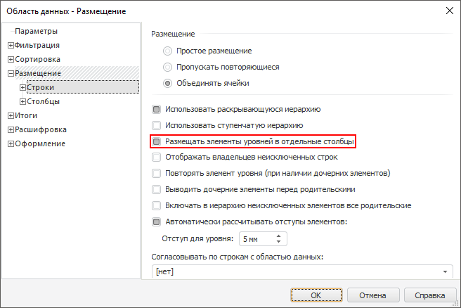
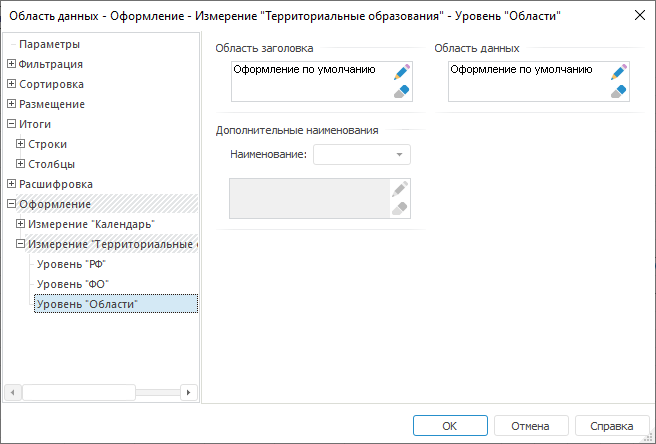
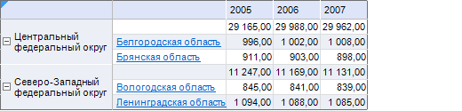

# Настройка оформления и расшифровки данных для одного уровня измерения

Настройка оформления и расшифровки данных для одного уровня измерения
-

# Настройка оформления и расшифровки данных для одного уровня измерения

## Вопрос

Как настроить оформление и расшифровку данных для одного уровня измерения?

## Область применения

В боковике области данных может быть отражено несколько уровней измерения.
 Для более наглядного представления можно использовать различное оформление
 уровней боковика, а для повышения информативности можно задать расшифровку
 для каждого уровня.

## Исходные данные

Для построения области данных будет использоваться куб «Социально-экономические
	 показатели», создание которого рассмотрено в разделе «[Пример
	 создания куба](UiNavObj.chm::/Cube/UiMd_Cube_Example.htm)».

[Процесс создания
 области данных](javascript:TextPopup(this))

Добавьте данный куб в область «Источники
 данных и срезы» панели «[Источники
 и срезы данных](../Desktop/Source/UiReport_Source.htm)». Создайте для него срез, который будет использоваться
 для построения области данных. Измерения среза разместите следующим образом:

	- По столбцам. Календарь;

	- По строкам. Территориальные
	 измерения;

	- Фиксированные. Социально-экономические
	 показатели, Источники данных, Факты.

	Произведите отметку в измерениях и [разместите](../Desktop/AreaData/UiReport_AreaData.htm#areadata_create)
	 область данных на листе регламентного отчета.

	При размещении области данных на листе отчета установите флажок
	 «Размещать элементы уровней в отдельные
	 столбцы» на вкладке «[Размещение
	 > Строки](../Desktop/AreaData/Param/Order/UiReport_AreaData_Param_Order_RS.htm)» окна «[Свойства области
	 данных](../Desktop/AreaData/Param/UiReport_AreaData_Param.htm)»:

	

	[Вычислите](../Desktop/AreaData/UiReport_AreaData.htm#areadata_calc)
	 область данных.

Область данных выглядит следующим образом:

Необходимо сделать элементы одного из уровней боковика гиперссылками
 на другой лист отчета.

## Решение

Необходимо настроить расшифровку и ее оформление для данных уровня измерения.

Далее будет рассмотрено оформление уровня «Области»
 в измерении «Территориальные образования».

	- Настройте расшифровку уровня «Области»
	 измерения «Территориальные измерения»
	 на вкладке «Параметры расшифровки,
	 привязанные к измерениям» («[Расшифровка
	 > Измерение](../Desktop/AreaData/Param/UiReport_AreaData_Param_Decipher.htm)»).

Примечание.
 Подробное описание процесса настройки расшифровки приведено в разделе
 «[Пример настройки расшифровки](../Desktop/AreaData/Param/UiReport_AreaData_Param_ExampleDeciphering.htm)».

	- Отметьте любую ячейку области данных и выполните команду контекстного
	 меню «Параметры области данных».

	- В открывшемся окне «[Свойства
	 области данных](../Desktop/AreaData/Param/UiReport_AreaData_Param.htm)» перейдите на вкладку «Параметры
	 оформления, привязанные к измерениям» («[Оформление
	 > Измерение](../Desktop/AreaData/Param/UiReport_AreaData_Param_AppearanceDim.htm)»). Выберите
	 измерение «Территориальные образования»
	 и уровень «Области»:

	- Нажмите кнопку
	 «Настроить оформление» в группе
	 элементов «Область заголовка».

	- В открывшемся окне «[Формат
	 ячейки](../Desktop/Table/Attribute/UiReport_Table_Attribute.htm)» перейдите на вкладку «[Гиперссылка](uinav.chm::/GUI/Format/UiReport_Table_Attribute_Hyperlink.htm)»
	 и задайте следующие параметры:

		- установите флажок «Рассматривать
		 текст как ссылку»;

		- в комбинированном списке «Требуемое
		 действие» выберите элемент «Открыть
		 лист отчета»;

		- в появившемся списке «Листы
		 отчета» выберите лист, на который будет осуществляться
		 переход.

	- Нажмите на кнопку «ОК»
	 в окне «[Формат ячейки](../Desktop/Table/Attribute/UiReport_Table_Attribute.htm)», а затем
	 на кнопку «ОК» в окне «[Свойства
	 области данных](../Desktop/AreaData/Param/UiReport_AreaData_Param.htm)».

	- Для того чтобы настройки вступили в силу, [вычислите
	 область данных](../Desktop/AreaData/UiReport_AreaData.htm#areadata_calc).

После этого область данных будет выглядеть следующим образом:

Таким образом, была произведена настройка элементов уровня боковика
 так, чтобы они стали гиперссылками на другой лист отчета.

См. также:

[Вопросы и ответы](UiReport_FAQ.htm) | [Атрибуты
 ячеек таблицы](../Desktop/Table/Attribute/UiReport_Table_Attribute.htm) | [Область данных](../Desktop/AreaData/UiReport_AreaData.htm) | [Свойства
 области данных](../Desktop/AreaData/Param/UiReport_AreaData_Param.htm)

		Справочная
		 система на версию 10.9
		 от 18/08/2025,
		 © ООО «ФОРСАЙТ»,
