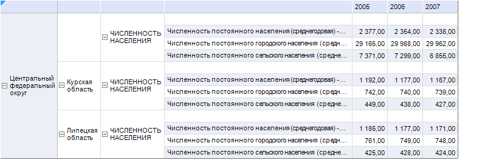
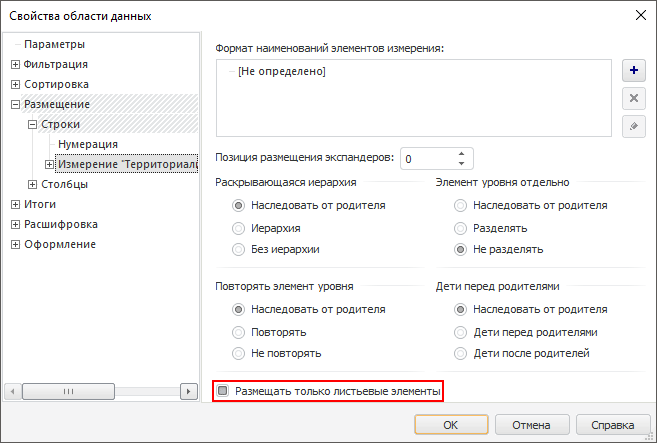
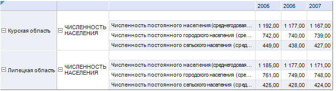

# Настройка боковика области данных

Настройка боковика области данных
-

# Настройка боковика области данных

## Вопрос

Как настроить боковик области данных таким образом, чтобы в нем отображались
 только листьевые элементы?

## Область применения

В боковике области данных может быть использовано несколько измерений,
 причем у каждого измерения может быть своя иерархия. Если у измерения
 довольно большая иерархия, то для более удобного представления боковика
 может потребоваться отображение только листьевых элементов измерения,
 т.е. элементов нижнего уровня иерархии.

## Исходные данные

[Процесс
 создания области данных](javascript:TextPopup(this))

	Для построения области данных будет использоваться куб «Социально-экономические
	 показатели», создание которого рассмотрено в разделе «[Пример
	 создания куба](UiNavObj.chm::/Cube/UiMd_Cube_Example.htm)».

	Добавьте данный куб в область «Источники
	 данных и срезы» панели «[Источники и срезы данных](../Desktop/Source/UiReport_Source.htm)».
	 Создайте для него срез, который будет использоваться для построения
	 области данных. Измерения среза разместите следующим образом:

		- По столбцам. Календарь;

		- По строкам. Территориальные
		 измерения, Социально-экономические показатели;

		- Фиксированные.
		 Источники данных, Факты.

	Произведите отметку в измерениях и [разместите](../Desktop/AreaData/UiReport_AreaData.htm#areadata_create)
	 область данных на листе регламентного отчета.

	При размещении области данных на листе отчета установите флажок
	 «Размещать элементы уровней в отдельные
	 столбцы» на вкладке «[Размещение
	 > Строки](../Desktop/AreaData/Param/Order/UiReport_AreaData_Param_Order_RS.htm)» окна «[Свойства области
	 данных](../Desktop/AreaData/Param/UiReport_AreaData_Param.htm)»:

	

	[Вычислите](../Desktop/AreaData/UiReport_AreaData.htm#areadata_calc)
	 область данных.

Область данных выглядит следующим образом:

Необходимо чтобы в боковике отображались только листьевые элементы измерения
 «Территориальные измерения».

## Решение

Настройте параметры области данных. Для этого:

	- Отметьте любую ячейку данной области и выполните команду контекстного
	 меню «Параметры области данных».

	- В открывшемся окне «[Свойства
	 области данных](../Desktop/AreaData/Param/UiReport_AreaData_Param.htm)» перейдите на вкладку «[Размещение
	 > Строки > Измерение](../Desktop/AreaData/Param/Order/UiReport_AreaData_Param_Order_attach.htm)».

	- Выберите измерение «Территориальные
	 измерения» и установите для него флажок «Размещать
	 только листьевые элементы»:

	- Для измерения «Социально-экономические
	 показатели» флажок «Размещать
	 только листьевые элементы» устанавливать не надо.

	- Для сохранения настроек нажмите кнопку «ОК».

	- Для того чтобы настройки вступили в силу, [вычислите
	 область данных](../Desktop/AreaData/UiReport_AreaData.htm#areadata_calc).

После этого область данных будет выглядеть следующим образом:

Таким образом, была произведена настройка боковика области данных так,
 чтобы в нем отображались только листьевые элементы измерения «Территориальные
 измерения».

См. также:

[Вопросы и ответы](UiReport_FAQ.htm) | [Область данных](../Desktop/AreaData/UiReport_AreaData.htm) | [Свойства
 области данных](../Desktop/AreaData/Param/UiReport_AreaData_Param.htm)

		Справочная
		 система на версию 10.9
		 от 18/08/2025,
		 © ООО «ФОРСАЙТ»,
