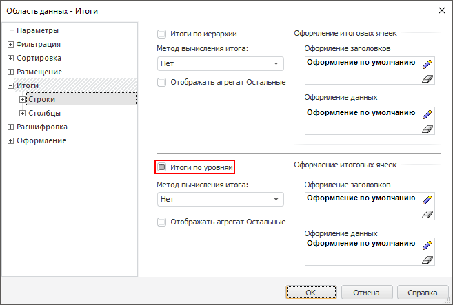
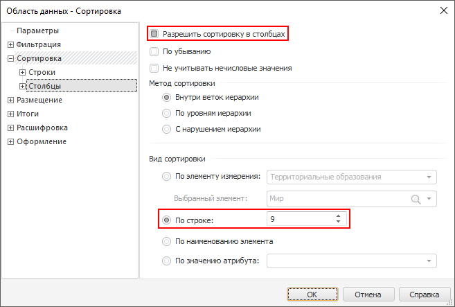

# Настройка итогов и сортировки области данных

Настройка итогов и сортировки области данных
-

# Настройка итогов и сортировки области данных

## Вопрос

Как настроить совместное использование итогов и сортировки для упорядочивания
 данных?

## Область применения

Для любой области данных можно организовать вывод итоговых значений.
 Для повышения информативности можно организовать сортировку данных по
 итоговым значениям.

## Исходные данные

[Процесс создания
 области данных](javascript:TextPopup(this))

	Для построения области данных будет использоваться куб «Социально-экономические
	 показатели», создание которого рассмотрено в разделе «[Пример
	 создания куба](UiNavObj.chm::/Cube/UiMd_Cube_Example.htm)».

	Добавьте данный куб в область «Источники
	 данных и срезы» панели «[Источники и срезы данных](../Desktop/Source/UiReport_Source.htm)».
	 Создайте для него срез, который будет использоваться для построения
	 области данных. Измерения среза разместите следующим образом:

		- По столбцам. Территориальные
		 измерения;

		- По строкам. Социально-экономические
		 показатели, Календарь;

		- Фиксированные. Источники
		 данных, Факты.

	Произведите отметку в измерениях и [разместите](../Desktop/AreaData/UiReport_AreaData.htm#areadata_create)
	 область данных на листе регламентного отчета.

	[Вычислите](../Desktop/AreaData/UiReport_AreaData.htm#areadata_calc)
	 область данных.

Область данных выглядит следующим образом:

Необходимо вывести сумму показателей по элементам измерений и произвести
 сортировку по столбцам в порядке возрастания итоговых показателей.

## Решение

Необходимо настроить параметры вывода итоговых значений и сортировки
 области данных. Для этого:

	- Отметьте любую из ячеек данной области и выполните команду контекстного
	 меню «Параметры области данных».

	- В открывшемся окне «[Свойства
	 области данных](../Desktop/AreaData/Param/UiReport_AreaData_Param.htm)» перейдите на вкладку «[Итоги
	 > Строки](../Desktop/AreaData/Param/UiReport_AreaData_Param_Totals.htm)» и задайте следующие параметры:

		- установите флажок «Итоги
		 по уровням»;

		- в комбинированном списке «Метод
		 вычисления итога» выберите элемент «Сумма».

Таким образом, была произведена настройка
 вывода суммы показателей по всем элементам измерений:

Примечание.
 Настройка итогов, привязанных к уровням и измерениям, аналогична настройке
 итогов, привязанных к строкам/столбцам.

	- Для сохранения настроек нажмите кнопку «ОК».

	- Для того чтобы настройки вступили в силу [вычислите
	 область данных](../Desktop/AreaData/UiReport_AreaData.htm#areadata_calc). После этого область данных будет выглядеть следующим
	 образом:

	- Определите номер строки, по которой будет осуществляться сортировка.
	 В данном случае, сортировка будет производиться по столбцам на основании
	 строки «Итого (Уровень 0)».
	 Эта строка является девятой (нумерация строк начинается с нуля).

	- Отметьте любую ячейку данной области и выполните команду контекстного
	 меню «Параметры области данных».

	- В открывшемся окне «[Свойства
	 области данных](../Desktop/AreaData/Param/UiReport_AreaData_Param.htm)» перейдите на вкладку «[Сортировка
	 > Столбцы](../Desktop/AreaData/Param/UiReport_AreaData_Param_Sort.htm)» и задайте следующие параметры:

		- установите флажок «Разрешить
		 сортировку в столбцах»;

		- в области «Вид сортировки»
		 установите переключатель «По
		 строке» и в редакторе чисел введите номер строки, по которой
		 будет осуществляться сортировка (строка номер девять).

Примечание.
 Настройка параметров сортировки, привязанных к измерениям, аналогична
 настройке параметров сортировки, привязанных к области размещения (по
 строкам/столбцам).

	- Для сохранения настроек нажмите кнопку «ОК».

	- Для того чтобы настройки вступили в силу, [вычислите
	 область данных](../Desktop/AreaData/UiReport_AreaData.htm#areadata_calc).

После этого область данных будет выглядеть следующим образом:

Таким образом, была произведена настройка сортировки области данных
 по итоговым значениям.

См. также:

[Вопросы и ответы](UiReport_FAQ.htm) | [Область данных](../Desktop/AreaData/UiReport_AreaData.htm) | [Свойства
 области данных](../Desktop/AreaData/Param/UiReport_AreaData_Param.htm)

		Справочная
		 система на версию 10.9
		 от 18/08/2025,
		 © ООО «ФОРСАЙТ»,
