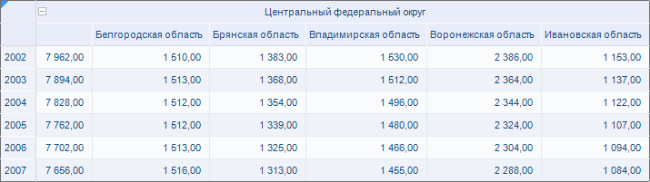
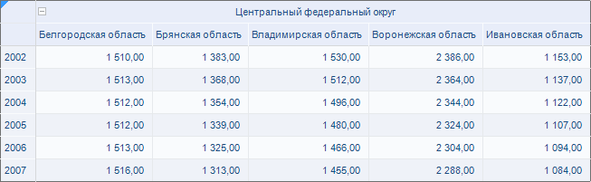

# Настройка заголовка области данных

Настройка заголовка области данных
-

# Настройка заголовка области данных

## Вопрос

Как настроить заголовок области данных в виде иерархии (элементы уровней
 размещены в отдельных строках) без добавления дополнительного столбца
 под родительские элементы?

## Область применения

В заголовке области данных может быть использовано несколько уровней
 иерархии элементов. При таком размещении добавляются дополнительные столбцы
 под родительские элементы.

## Исходные данные

[Процесс создания
 области данных](javascript:TextPopup(this))

	Для построения области данных будет использоваться куб «Социально-экономические
	 показатели», создание которого рассмотрено в разделе «[Пример
	 создания куба](UiNavObj.chm::/Cube/UiMd_Cube_Example.htm)».

	Добавьте данный куб в область «Источники
	 данных и срезы» панели «[Источники и срезы данных](../Desktop/Source/UiReport_Source.htm)».
	 Создайте для него срез, который будет использоваться для построения
	 области данных. Измерения среза разместите следующим образом:

		- По столбцам. Территориальные
		 измерения;

		- По строкам. Календарь;

		- Фиксированные. Социально-экономические
		 показатели, Источники данных, Факты.

	Произведите отметку в измерениях и [разместите](../Desktop/AreaData/UiReport_AreaData.htm#areadata_create)
	 область данных на листе регламентного отчета.

	При размещении области данных на листе отчета установите флажок
	 «Размещать элементы уровней в отдельные
	 строки» на вкладке «[Размещение
	 > Столбцы](../Desktop/AreaData/Param/Order/UiReport_AreaData_Param_Order_RS.htm)» окна «[Свойства области
	 данных](../Desktop/AreaData/Param/UiReport_AreaData_Param.htm)».

	[Вычислите](../Desktop/AreaData/UiReport_AreaData.htm#areadata_calc)
	 область данных.

Область данных выглядит следующим образом:

Необходимо, чтобы в заголовке отсутствовал дополнительный столбец под
 родительский элемент иерархии.

## Решение

Необходимо настроить параметры области данных. Для этого:

	- Отметьте любую ячейку данной области и выполните команду контекстного
	 меню «Параметры области данных».

	- В открывшемся окне «[Свойства
	 области данных](../Desktop/AreaData/Param/UiReport_AreaData_Param.htm)» перейдите на вкладку «[Размещение
	 > Строки/Столбцы](../Desktop/AreaData/Param/Order/UiReport_AreaData_Param_Order_RS.htm)» и установите флажок «Включать
	 в иерархию неисключенных элементов все родительские».

	- Перейдите на вкладку «[Размещение
	 > Строки/Столбцы > Измерение](../Desktop/AreaData/Param/Order/UiReport_AreaData_Param_Order_attach.htm)» и установите флажок
	 «Размещать только листьевые элементы».

Более подробную информацию по заданию параметров произвольного размещения
 смотрите в разделе «[Настройка произвольного
 размещения](../Desktop/AreaData/Param/Order/UiReport_AreaData_Param_Order_Tuning.htm)».

См. также:

[Вопросы и ответы](UiReport_FAQ.htm) | [Область данных](../Desktop/AreaData/UiReport_AreaData.htm) | [Свойства
 области данных](../Desktop/AreaData/Param/UiReport_AreaData_Param.htm)

		Справочная
		 система на версию 10.9
		 от 18/08/2025,
		 © ООО «ФОРСАЙТ»,
