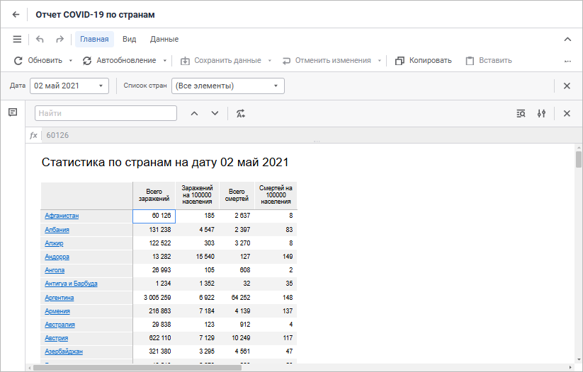

# Построение отчёта для печати

Построение отчёта для печати
-

# Построение отчёта для печати

Для построения отчёта под печать используйте инструмент «Отчёты»:

Инструмент «Отчёты» для создания
 отчётов со сложным форматированием, предназначенных для печати.

Ключевые возможности:

	- построение отчётов;

	- редактирование данных и сохранение изменений в источник;

	- визуализация данных на листе отчёта;

	- настройка отчёта под печать;

	- использование интерактивных элементов управления;

	- поддержка реляционного, в виде плоских таблиц, и многомерного,
	 в виде кросс-таблиц, представления данных;

	- настройка детализации и обобщения данных, переход от одной формы
	 отображения к любой другой, переход от многомерных данных к реляционным;

	- интеграция Microsoft Office.

Для работы с инструментом «Отчёты»
 вам понадобится:

	- [Единица
	 лицензирования](setup.chm::/08_Licensing/Admin_Licensing.htm)
	 «PP_ReportEditor» для построения
	 и редактирования регламентного отчёта.

	- [Единица
	 лицензирования](setup.chm::/08_Licensing/Admin_Licensing.htm)
	 «PP_ReportViewer» для интерактивного
	 просмотра готового регламентного отчёта.

	- Источники данных. В качестве источников данных доступны: все
	 виды кубов, базы данных временных рядов, переменные моделирования,
	 наборы данных, экспресс-отчёты. Если нужный источник данных отсутствует
	 в репозитории, то он может быть добавлен с помощью [мастера
	 импорта данных](UiNavObj.chm::/Data_import_wizard/Data_import_wizard.htm).

Для начала работы с инструментом
 в веб-приложении смотрите статью «[Начало работы с
 инструментом «Отчёты» в веб-приложении](Web/organizational_management/Starting.htm)».

Для начала работы с инструментом
 в настольном приложении смотрите статью «[Начало работы
 с инструментом «Отчёты» в настольном приложении](Desktop/organizational_management/Starting.htm)».

Если остались вопросы, смотрите
 статью «[Вопросы
 и ответы](FAQ/UiReport_FAQ.htm)».

См. также:

[Начало
 работы с инструментом «Отчёты» в веб-приложении](Web/organizational_management/Starting.htm) | [Начало
 работы с инструментом «Отчёты» в настольном приложении](Desktop/organizational_management/Starting.htm) | [Вопросы
 и ответы](FAQ/UiReport_FAQ.htm)

		Справочная
		 система на версию 10.9
		 от 18/08/2025,
		 © ООО «ФОРСАЙТ»,
