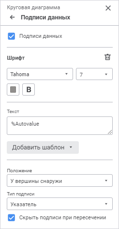
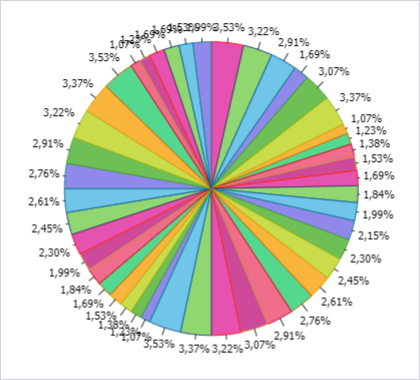
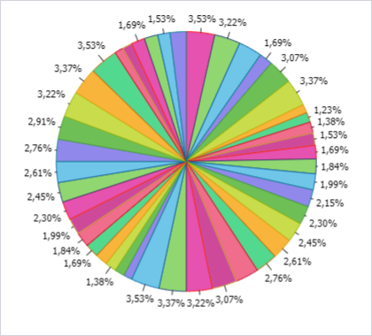

# Подписи данных: Регламентный отчёт, веб-приложение

Подписи данных: Регламентный отчёт, веб-приложение
-

# Подписи данных

Подписи данных содержат сведения о рядах или отдельных точках данных
 и упрощают понимание диаграммы. Подписи добавляются ко всем рядам диаграммы.
 В зависимости от того, что нужно выделить в диаграмме, подписи можно добавлять:

	- ко всем рядам диаграммы;

	- к одному ряду;

	- к [линии уровня](Level_Lines.htm).

Для настройки подписей данных используйте группу параметров «Подписи
 данных» панели параметров.

[Для открытия
 группы параметров «Подписи данных»](javascript:TextPopup(this))

	Для открытия группы параметров «Подписи
	 данных» выделите диаграмму и нажмите кнопку  «Параметры» панели инструментов,
	 затем выберите требуемую группу.

Для настройки параметров подписей данных установите флажок «Подписи
 данных».

Задайте параметры:

	- [Шрифт](#font);

	- [Текст подписи](#text);

	- [Положение подписи](#position);

	- [Тип
	 подписи](Data_Labels.htm#type). Доступен для всех типов диаграмм, кроме [пузырьковых](Type_diagrams/Bubble_Chart.htm).

## Шрифт подписи

Задайте настройки шрифта:

	- Шрифт. Выберите один
	 из доступных шрифтов в раскрывающемся списке. При необходимости можно
	 загрузить [пользовательские
	 шрифты](Setup.chm::/UiWebSetup/03_Setup_Web/General_for_linux/Loading_Custom_Fonts.htm);

	- Размер шрифта. Установите
	 требуемый размер шрифта. Размер задаётся в пунктах, его можно
	 выбрать из раскрывающегося списка или ввести с помощью клавиатуры.
	 Диапазон допустимых значений: [8; 36];

	- Цвет. Выберите цвет
	 шрифта в раскрывающейся палитре. Для выбора доступны стандартные и
	 пользовательские цвета. По умолчанию палитра содержит только стандартные
	 цвета.

Для создания пользовательского цвета:

		- Нажмите кнопку  «Добавить
		 цвет». Откроется расширенная палитра цветов.

		- Выберите цвет в расширенной палитре цветов, на странице
		 браузера с помощью пипетки или задайте код цвета в формате RGB/HEX.

После выполнения действий пользовательский
 цвет будет создан и добавлен в палитру.

Примечание.
 Максимально возможное количество пользовательских цветов в палитре равно
 23.

Для удаления пользовательского цвета из палитры
 выполните команду «Удалить» контекстного
 меню выбранного цвета.

	- Начертание. Выберите
	 начертание шрифта:

		- B. Полужирное начертание;

		- I.
		 Курсивное начертание;

		- U.
		 Подчеркивание текста.

При нажатой кнопке будет использоваться соответствующий
 стиль начертания. Доступно использование нескольких стилей одновременно,
 например, нажатие кнопок «B» и
 «I» даёт полужирное
 курсивное начертание.

Для сброса настроек шрифта нажмите кнопку  «Удалить».

## Текст подписи

Для подписи может быть задан произвольный текст, шаблон или использовано
 сочетание текста с шаблонами. Для ввода текста и шаблонов используйте
 поле «Текст».

Для добавления шаблона в текст подписи:

	- Нажмите кнопку «Добавить шаблон».

	- В раскрывающемся списке выберите один из доступных шаблонов
	 текста.

После выполнения действий выбранный шаблон будет добавлен в текст подписи
 после позиции курсора.

Доступные шаблоны:

	- %PointNo. Номер точки;

	- %PointName. Имя точки;

	- %SerieNo. Номер ряда;

	- %SerieName. Имя ряда;

	- %Data. Пользовательский
	 формат данных. Настройка формата возможна только с помощью языка Fore;

	- %PercentPartHundredth.
	 Доли с накоплением;

	- %PercentPart. Доли в
	 процентах с накоплением;

	- %PercentHundredth. Доли
	 - отношение значения точки ряда к сумме значений этой же точки всех
	 рядов;

	- %Percent. Доли в процентах
	 - отношение значения точки ряда к сумме значений этой же точки всех
	 рядов, представленное в процентах;

	- %Part. Значение с накоплением;

	- %YValue. Значение точки
	 по оси Y;

	- %XValue. Значение точки
	 по оси X;

	- %Value. Значение точки;

	- %Autovalue. По умолчанию.
	 Автоматический формат значения. Для всех диаграмм, кроме [круговой](Type_diagrams/UiDiagrams_round.htm),
	 будет использовано значение точки ряда данных. Для круговой диаграммы,
	 вторичной круговой диаграммы и вторичной гистограммы используется
	 отношение значения точки ряда к сумме значений этой же точки всех
	 рядов.

## Положение подписи

Для диаграмм доступны варианты расположения подписей данных:

	- Автоматически;

	- В
	 центре;

	- У вершины внутри;

	- У
	 вершины снаружи;

	- У
	 основания внутри;

	- Пользовательское.

Примечание.
 Для [линейных](Type_diagrams/UiDiagrams_lenear.htm), [точечных](Type_diagrams/UiDiagrams_scatter.htm),
 [пузырьковых](Type_diagrams/Bubble_Chart.htm), [ступенчатых](Type_diagrams/Stepped_Chart.htm),
 [лепестковых](Type_diagrams/uidiagrams_petalous.htm) диаграмм,
 а также [диаграмм с областями](Type_diagrams/uidiagrams_area.htm)
 доступны варианты «Слева», «Сверху», «Справа»,
 «Снизу». Варианты «У
 вершины внутри», «У вершины снаружи»
 и «У основания внутри» недоступны.

При выборе пользовательского расположения подписей становится доступным
 определение:

	- расположения подписей по горизонтали. Выберите из раскрывающегося списка
	 расположение подписей по горизонтали:

		- справа;

		- по центру;

		- слева.

По умолчанию
 выбрано расположение по центру;

	- расположения подписей по вертикали.
	 Выберите из раскрывающегося списка расположение подписей по вертикали:

		- снизу;

		- по центру;

		- сверху.

По умолчанию выбрано расположение по центру.

	- смещения подписи. Задайте
	 длину смещения подписи относительно ряда по горизонтали, по вертикали
	 и процент смещения подписи относительно длины столбика.

## Тип подписи

Для диаграмм доступны следующие варианты размещения подписей данных:

	- Простая. Подпись отображается
	 в виде метки, не соединенной линией с рядом (установлен по умолчанию);

	- Выноска. Подпись отображается
	 в виде выноски, соединенной линией с рядом;

	- Указатель. Подпись отображается
	 в виде указателя, соединенного линией с рядом.

Для [круговых и кольцевых
 диаграмм](Type_diagrams/UiDiagrams_round.htm) для варианта [расположения
 подписи данных](Data_Labels.htm#position) «У вершины снаружи»
 для типов подписей «Выноска» и
 «Указатель» доступен флажок «Скрыть подписи при пересечнии».

Отображение круговой диаграммы, если флажок «Скрыть
 подписи при пересечнии» снят:

Отображение круговой диаграммы, если флажок «Скрыть
 подписи при пересечнии» установлен:

В результате будет использоваться новый механизм размещения подписей
 данных, который позволяет предотвратить их пересечение.

См. также:

[Визуализация
 данных в виде диаграмм](UiReport_Diagrams_appointment.htm)

		Справочная
		 система на версию 10.9
		 от 18/08/2025,
		 © ООО «ФОРСАЙТ»,
