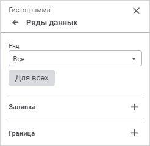
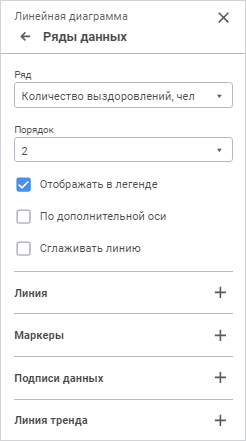
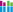
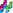
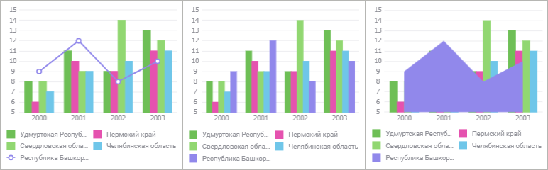
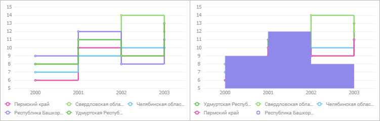
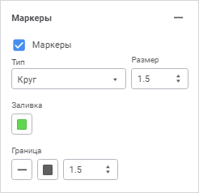
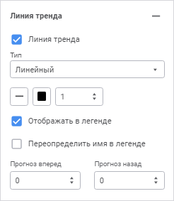

# Ряды данных: Регламентный отчёт, веб-приложение

Ряды данных: Регламентный отчёт, веб-приложение
-

# Ряды данных

	Ряд данных - это элемент диаграммы, представляющий массив данных.
	 На основе совокупности рядов данных строится диаграмма.

	На диаграмме ряды данных отображаются в графической форме, например,
	 в форме набора разноцветных столбиков.

	Ряд данных диаграммы, для которого определено наименование, обозначается
	 отдельным цветом и значком, указанными в легенде.

	Примечание.
	 По умолчанию на диаграмме может отображаться не более 99 рядов. Если
	 выбрано большее число рядов, то будут отображены первые 99, остальные
	 будут скрыты. Для изменения максимального количества рядов, отображаемых
	 на диаграмме, используйте [настройки
	 в реестре](UIExpress.chm::/FAQ/SelectionLimit.htm#diagram_selection_limit).

	Примеры рядов для различных типов диаграмм:

	

	Для настройки рядов данных диаграммы используйте группу параметров
	 «Ряды данных» панели
	 параметров.

	[Для открытия
	 группы параметров «Ряды данных»](javascript:TextPopup(this))

		Для открытия группы параметров «Ряды
		 данных» выделите диаграмму и нажмите кнопку  «Параметры»
		 панели инструментов, затем выберите требуемую группу.

	

	Примечание.
	 Количество отображаемых параметров зависит от типа диаграммы/ряда.

	По умолчанию для всех типов диаграмм, кроме
	 [каскадной](Type_diagrams/WaterFall_chart.htm), [биржевой](Type_diagrams/UiDiagrams_birg.htm),
	 [коробчатой](Type_diagrams/Box_chart.htm), а также [гистограммы
	 с интервалами колебаний](Type_diagrams/UiDiagrams_BarVibration.htm), в раскрывающемся списке «Ряд»
	 выбрано значение «Все». Данное
	 значение позволяет задать настройки, которые применяются для всех
	 существующих на диаграмме рядов. В каскадной и биржевой диаграммах
	 по умолчанию отображается ряд, для которого была построена диаграмма.

	Параметры, доступные для ряда «Все»:

		- [линия ряда](#line);

		- [заливка ряда](#fill);

		- [граница ряда](#border);

		- [сглаживание линии ряда](#smooth);

		- [тип ряда](#type);

		- [положение ступеньки](#position).

	Примечание.
	 Набор параметров, доступных для ряда «Все»,
	 зависит от типа диаграммы.

	Для настройки определённого ряда выберите его в раскрывающемся списке
	 «Ряд», а для настройки всех
	 рядов выберите ряд «Все».
	 Следует учитывать, что настройки, заданные для ряда «Все»,
	 не перекрывают настройки, заданные вручную для конкретного ряда.

	Для применения настроек ряда «Все»
	 для всех рядов, включая ряды с пользовательскими настройками, нажмите
	 кнопку «Для всех».

	Вид панели настройки рядов данных при выборе конкретного ряда:

	

	Задайте параметры:

		- [порядок следования ряда](#order);

		- [отображение/скрытие ряда в легенде](#legend);

		- [тип ряда](#type);

		- [сглаживание линии ряда](#smooth);

		- [заливка ряда](#fill);

		- [граница ряда](#border);

		- [положение ступеньки](#position);

		- [линия ряда](#line);

		- [маркеры](#markers);

		- [подписи данных](#caption);

		- [построение ряда по дополнительной оси](#add_axis);

		- [линия тренда](#trend);

		- [цветовая схема](#color);

		- [видимость соединительных линий](#connection).

## Порядок следования ряда

	Изменение порядка следования рядов на диаграмме доступно при снятом
	 флажке «[Привязать
	 к источнику](General_Settings.htm#source_binding)» для всех типов диаграмм, кроме [каскадной](Type_diagrams/WaterFall_chart.htm)
	 и [биржевой](Type_diagrams/UiDiagrams_birg.htm).

	В раскрывающемся списке «Порядок»
	 выберите порядок следования ряда на диаграмме. Нумерация рядов начинается
	 с единицы.

	Порядок следования ряда на диаграмме устанавливает порядок его отображения
	 в [легенде](Legend.htm).

	Настройка порядка следования рядов на диаграмме также доступна в
	 группе параметров «[Группы
	 рядов](Groups.htm)» для [гистограмм](Type_diagrams/UiDiagrams_Bar.htm)
	 типа  «Накопительная с группами» и  «Накопительная
	 с группами трехмерная».

## Отображение/скрытие ряда в легенде

	Для настройки отображения ряда в [легенде](Legend.htm)
	 используйте флажок «Отображать в
	 легенде». По умолчанию флажок установлен, и ряд в легенде отображается.

	Примечание.
	 Отображение/скрытие ряда в легенде доступно для всех типов диаграмм,
	 кроме [каскадной](Type_diagrams/WaterFall_chart.htm).

## Тип ряда

	Для изменения типа ряда [смешанных](Type_diagrams/UiDiagrams_mixed_diagram.htm)
	 и [лепестковых](Type_diagrams/uidiagrams_petalous.htm)
	 диаграмм в раскрывающемся списке «Тип
	 ряда» выберите тип:

		- Линия. Ряд будет
		 отображаться в виде линии;

		- Столбик. Ряд будет
		 отображаться в виде столбика. Доступно только для смешанных диаграмм;

		- Область. Ряд будет
		 отображаться в виде закрашенной области.

	Ниже приведён пример смешанной диаграммы с различными настройками
	 одного из рядов данных («Линия»,
	 «Столбик» и «Область»
	 соответственно):

	

	Для [ступенчатых диаграмм](Type_diagrams/Stepped_Chart.htm)
	 доступны типы рядов:

		- Ступенчатый график.
		 Ряд будет отображаться в виде ломаной линии;

		- Ступенчатый областной.
		 Ряд будет отображаться в виде закрашенной области.

	Ниже приведён пример ступенчатой диаграммы с различными настройками
	 одного из рядов данных («Ступенчатый
	 график» и «Ступенчатый областной»
	 соответственно):

	

## Сглаживание линии ряда

	Сглаживание линии используется для устранения эффекта ломаной линии,
	 возникающего при построении [линейных](Type_diagrams/UiDiagrams_lenear.htm)
	 и [лепестковых](Type_diagrams/uidiagrams_petalous.htm)
	 диаграмм, ряда [типа](#type) «Линия»
	 [смешанной диаграммы](Type_diagrams/UiDiagrams_mixed_diagram.htm),
	 а также [точечной диаграммы](Type_diagrams/UiDiagrams_scatter.htm)
	 с соединительными линиями.

	Для сглаживания линейных рядов диаграммы установите флажок «Сглаживать линию».

## Заливка ряда

	Для настройки заливки ряда откройте раскрывающуюся палитру и выберите
	 тип заливки в раскрывающемся списке:

	Примечание.
	 Заливка ряда доступна для всех типов диаграмм, кроме [линейной](Type_diagrams/UiDiagrams_lenear.htm),
	 [точечной](Type_diagrams/UiDiagrams_scatter.htm) и [биржевой](Type_diagrams/UiDiagrams_birg.htm),
	 а также для всех [типов рядов](#type), кроме типов «Линия» и «Ступенчатый
	 график».

		- Без заливки. Заливка
		 не используется;

		- Автоматическая заливка.
		 По умолчанию. Применяется автоматическая однотонная сплошная заливка;

		- Сплошная заливка.
		 Выберите в раскрывающейся палитре цвет однотонной заливки области
		 построения. При необходимости укажите процент непрозрачности заливки;

		- Двухцветная заливка.
		 Выберите в раскрывающейся палитре начальный и конечный цвета двухцветного
		 градиента. При необходимости укажите угол наклона и процент непрозрачности
		 заливки;

		- Неоднородная заливка.
		 Выберите в раскрывающейся палитре базовый цвет заливки линейным
		 градиентом. При необходимости укажите процент непрозрачности заливки;

	- Заливка со штриховкой.
	 Выполните действия:

		- Выберите цвет однотонной заливки в раскрывающейся палитре.
		 При необходимости укажите процент непрозрачности заливки и цвета
		 штриховки.

		- Выберите образец текстуры в раскрывающемся списке «Штриховка».

		- Выберите цвет штриховки в раскрывающейся палитре.

В раскрывающейся палитре для выбора доступны стандартные и пользовательские
 цвета. По умолчанию палитра содержит только стандартные цвета.

Для создания пользовательского цвета:

	- Нажмите кнопку  «Добавить
	 цвет». Откроется расширенная палитра цветов.

	- Выберите цвет в расширенной палитре цветов, на странице браузера
	 с помощью пипетки или задайте код цвета в формате RGB/HEX.

После выполнения действий пользовательский цвет будет создан и добавлен
 в палитру.

Примечание.
 Максимально возможное количество пользовательских цветов в палитре равно
 23.

Для удаления пользовательского цвета из палитры выполните команду «Удалить» контекстного меню выбранного
 цвета.

	Если в раскрывающемся списке «[Ряд](#series)»
	 выбрано значение «Все», то
	 в зависимости от используемого типа заливки дополнительно будут доступны
	 флажки:

		- Выбор цвета. Флажок
		 доступен для сплошной и неоднородной заливок. При установке флажка
		 к диаграмме применяется заливка выбранным цветом;

		- От, До. Флажки доступны
		 для двухцветной заливки. При установке каждого из флажков к диаграмме
		 применяется двухцветная заливка выбранными цветами.

	Примечание.
	 Если для какого-то ряда диаграммы задана своя заливка, то она сохраняется,
	 независимо от состояния флажков. Для применения заданной заливки ко
	 всей диаграмме нажмите кнопку «Для
	 всех».

	По умолчанию все флажки сняты.

## Граница

	Для настройки границы ряда данных задайте:

	Примечание.
	 Настройка границы ряда доступна для всех типов диаграмм, кроме [линейной](Type_diagrams/UiDiagrams_lenear.htm), [точечной](Type_diagrams/UiDiagrams_scatter.htm)
	 и [биржевой](Type_diagrams/UiDiagrams_birg.htm), а также
	 для всех [типов рядов](#type), кроме типов «Линия»
	 и «Ступенчатый график».

		- Тип линии. Из раскрывающегося
		 списка выберите тип линии;

	- Цвет линии. Выберите
	 цвет линии в раскрывающейся палитре. Для выбора доступны стандартные
	 и пользовательские цвета. По умолчанию палитра содержит только стандартные
	 цвета.

Для создания пользовательского цвета:

		- Нажмите кнопку  «Добавить
		 цвет». Откроется расширенная палитра цветов.

		- Выберите цвет в расширенной палитре цветов, на странице
		 браузера с помощью пипетки или задайте код цвета в формате RGB/HEX.

После выполнения действий пользовательский
 цвет будет создан и добавлен в палитру.

Примечание.
 Максимально возможное количество пользовательских цветов в палитре равно
 23.

Для удаления пользовательского цвета из палитры
 выполните команду «Удалить» контекстного
 меню выбранного цвета.

		- Толщина линии. Задайте
		 требуемую толщину линии с помощью клавиатуры или редактора чисел.

## Положение ступеньки

	Ступенька представляет собой ломаную линию, соединяющую два соседних
	 значения ряда.

	Для изменения положения ступеньки относительно точки ряда данных
	 выберите в раскрывающемся списке «Ступенька»
	 необходимый вариант расположения: слева, по центру или справа от точки
	 ряда.

	Примечание.
	 Настройка положения ступеньки доступна только для [ступенчатой
	 диаграммы](Type_diagrams/Stepped_Chart.htm).

	Ниже приведён пример ступенчатой диаграммы с различными настройками
	 положения ступеньки («Слева»,
	 «По центру» и «Справа»
	 соответственно):

	

## Линия ряда

	Для настройки линии ряда данных задайте:

	Примечание.
	 Настройка линии ряда доступна для рядов [линейной
	 диаграммы](Type_diagrams/UiDiagrams_lenear.htm), а также для рядов [типа](#type) «Линия»
	 в [смешанной](Type_diagrams/UiDiagrams_mixed_diagram.htm),
	 [ступенчатой](Type_diagrams/Stepped_Chart.htm) и [лепестковой](Type_diagrams/uidiagrams_petalous.htm)
	 диаграммах.

		- Тип линии. Из раскрывающегося
		 списка выберите тип линии;

	- Цвет линии. Выберите
	 цвет линии в раскрывающейся палитре. Для выбора доступны стандартные
	 и пользовательские цвета. По умолчанию палитра содержит только стандартные
	 цвета.

Для создания пользовательского цвета:

		- Нажмите кнопку  «Добавить
		 цвет». Откроется расширенная палитра цветов.

		- Выберите цвет в расширенной палитре цветов, на странице
		 браузера с помощью пипетки или задайте код цвета в формате RGB/HEX.

После выполнения действий пользовательский
 цвет будет создан и добавлен в палитру.

Примечание.
 Максимально возможное количество пользовательских цветов в палитре равно
 23.

Для удаления пользовательского цвета из палитры
 выполните команду «Удалить» контекстного
 меню выбранного цвета.

		- Толщина линии. Задайте
		 требуемую толщину линии с помощью клавиатуры или редактора чисел.

## Маркеры

	Маркер - это отдельное значение массива данных, отображаемое в виде
	 точки или фигуры.

	Для настройки отображения маркеров ряда данных убедитесь, что установлен
	 флажок «Маркеры» на панели
	 параметров:

	

	Примечание.
	 Настройка отображения маркеров доступна для рядов [гистограммы
	 с интервалами колебаний](Type_diagrams/UiDiagrams_BarVibration.htm), [линейной](Type_diagrams/UiDiagrams_lenear.htm),
	 [точечной](Type_diagrams/UiDiagrams_scatter.htm), [биржевой](Type_diagrams/UiDiagrams_birg.htm),
	 [коробчатой](Type_diagrams/Box_chart.htm), [коробчатой
	 диаграммы с линейными рядами](Type_diagrams/Box_chart_with_Line_Series.htm), для рядов [типа](#type)
	 «Линия» [смешанной](Type_diagrams/UiDiagrams_mixed_diagram.htm)
	 и [лепестковой](Type_diagrams/uidiagrams_petalous.htm)
	 диаграмм, для ряда [типа](#type) «Ступенчатый
	 график» [ступенчатой](Type_diagrams/Stepped_Chart.htm)
	 диаграммы. Перечисленные типы диаграмм должны быть двумерными.

	Задайте параметры:

		- Тип. Выберите в
		 раскрывающемся списке тип маркера:

			- Ромб. Маркеры
			 отображаются в виде ромбов;

			- Обратный треугольник.
			 Маркеры отображаются в виде треугольников с вершинами, направленными
			 вниз;

			- Треугольник.
			 Маркеры отображаются в виде треугольников с вершинами, направленными
			 вверх;

			- Круг. Маркеры
			 отображаются в виде кругов;

			- Квадрат. Маркеры
			 отображаются в виде квадратов;

			- Линия. Маркеры
			 отображаются в виде штриха;

		- Автоматический поворот.
		 Установите флажок для наклона маркеров по касательной к линии
		 ряда диаграммы. При снятом флажке маркеры располагаются строго
		 вертикально;

	Примечание.
	 Автоматический поворот маркеров доступен только для типа маркеров
	 «Обратный треугольник», «Треугольник».

		- Размер. Задайте
		 размер маркеров в миллиметрах с помощью клавиатуры или редактора
		 чисел;

		- Заливка. Выберите
		 способ заливки маркеров в раскрывающейся палитре и выполните соответствующие
		 настройки.

	Доступны следующие типы заливки:

			- Сплошная заливка.
			 По умолчанию. Выберите цвет однотонной заливки маркеров. При
			 необходимости укажите процент непрозрачности заливки;

			- Без заливки.
			 Заливка фона подсказок использоваться не будет. Нажмите кнопку
			  «Без
			 цвета».

Для выбора доступны стандартные и пользовательские цвета. По умолчанию
 палитра содержит только стандартные цвета.

Для создания пользовательского цвета:

	- Нажмите кнопку  «Добавить
	 цвет». Откроется расширенная палитра цветов.

	- Выберите цвет в расширенной палитре цветов, на странице браузера
	 с помощью пипетки или задайте код цвета в формате RGB/HEX.

После выполнения действий пользовательский цвет будет создан и добавлен
 в палитру.

Примечание.
 Максимально возможное количество пользовательских цветов в палитре равно
 23.

Для удаления пользовательского цвета из палитры выполните команду «Удалить» контекстного меню выбранного
 цвета.

		- Граница. Настройте
		 отображение границы:

			- Тип. Выберите
			 в раскрывающемся списке тип границы;

			- Цвет. Выберите
			 цвет однотонной заливки границы в раскрывающейся палитре.

Для выбора доступны стандартные и пользовательские цвета. По умолчанию
 палитра содержит только стандартные цвета.

Для создания пользовательского цвета:

	- Нажмите кнопку  «Добавить
	 цвет». Откроется расширенная палитра цветов.

	- Выберите цвет в расширенной палитре цветов, на странице браузера
	 с помощью пипетки или задайте код цвета в формате RGB/HEX.

После выполнения действий пользовательский цвет будет создан и добавлен
 в палитру.

Примечание.
 Максимально возможное количество пользовательских цветов в палитре равно
 23.

Для удаления пользовательского цвета из палитры выполните команду «Удалить» контекстного меню выбранного
 цвета.

			- Толщина. Задайте
			 толщину границы с помощью клавиатуры или редактора чисел.

	После выполнения действий маркеры будут отображаться для ряда данных
	 в соответствии с заданными параметрами.

	При необходимости снимите флажок «Маркеры»
	 для скрытия маркеров ряда данных на диаграмме.

## Подписи данных

	Подписи данных содержат сведения о рядах или отдельных точках данных
	 и упрощают понимание диаграммы.

	Для отображения подписей для выбранного ряда установите флажок «Подписи данных».

	Примечание.
	 Настройка подписей данных ряда доступна для рядов всех типов диаграмм,
	 кроме [каскадной](Type_diagrams/WaterFall_chart.htm).

	Подробное описание настройки подписи данных приведено в разделе
	 «[Подписи данных](Data_Labels.htm)».

## Построение ряда по дополнительной оси

	Дополнительная ось - вспомогательная ось значений, в которую могут
	 быть помещены:

		- значения рядов данных, значительно отличающиеся от значений
		 других рядов;

		- значения рядов, представленные на диаграмме в другом типе
		 данных.

	Для построения ряда по дополнительной оси значений установите флажок
	 «По дополнительной оси». После
	 установки флажка на панели параметров появится группа параметров «Ось значений дополнительная», предназначенная
	 для настройки дополнительной оси.

	Примечание.
	 Построение ряда по дополнительной оси доступно для всех типов диаграмм,
	 кроме [лепестковой](Type_diagrams/uidiagrams_petalous.htm),
	 [круговой](Type_diagrams/UiDiagrams_round.htm) и [каскадной](Type_diagrams/WaterFall_chart.htm).

	Подробное описание настройки дополнительной оси приведено в разделе
	 «[Оси диаграммы](Axes.htm)».

## Линия тренда

	Линия тренда позволяет графически отображать тенденции данных
	 и прогнозировать их дальнейшие изменения.

	Пример линии тренда с прогнозом на одну точку вперёд:

	

	Для отображения линии тренда установите флажок «Линия
	 тренда».

	Примечание.
	 Настройка линии тренда доступна только для [гистограммы](Type_diagrams/UiDiagrams_Bar.htm),
	 [гистограммы с
	 интервалами колебаний](Type_diagrams/UiDiagrams_BarVibration.htm), [диаграммы
	 с областями](Type_diagrams/uidiagrams_area.htm), [линейной](Type_diagrams/UiDiagrams_lenear.htm),
	 [смешанной](Type_diagrams/UiDiagrams_mixed_diagram.htm),
	 [точечной](Type_diagrams/UiDiagrams_scatter.htm), [пузырьковой](Type_diagrams/Bubble_Chart.htm)
	 и [ступенчатой диаграммы](Type_diagrams/Stepped_Chart.htm).

	После установки флажка появится панель настройки параметров линии
	 тренда:

	

	Задайте параметры:

		- Тип. Выберите в
		 раскрывающемся списке тип линии тренда:

			- Линейный. Применяется
			 в самых простых случаях, когда точки ряда данных расположены
			 близко к прямой. Линейный тип линии тренда применим для величины,
			 которая увеличивается или убывает с постоянной скоростью;

			- Логарифмический.
			 Логарифмическая линия тренда хорошо описывает величину, которая
			 вначале быстро растёт или убывает, а затем постепенно стабилизируется.
			 Логарифмическая линия тренда может использоваться как для
			 отрицательных, так и для положительных значений данных;

			- Экспоненциальный.
			 Экспоненциальная линия тренда - кривая линия, которую следует
			 использовать, если скорость изменения данных непрерывно возрастает.
			 Однако для данных, которые содержат нулевые или отрицательные
			 значения, этот тип линии тренда неприменим;

			- Степенной. Степенная
			 линия тренда даёт хорошие результаты, если зависимость, которая
			 содержится в данных, характеризуется постоянной скоростью
			 роста. Примером такой зависимости может служить ускорение
			 автомобиля за каждый интервал времени, равный одной секунде.
			 Если в данных есть нулевые или отрицательные значения, использование
			 степенной линии тренда невозможно;

			- Среднее. Линия
			 тренда проходит через среднее значение ряда данных. Такая
			 линия тренда позволяет просмотреть динамику изменения рассматриваемой
			 величины в зависимости от среднего значения;

			- Пиковые значения.
			 Строятся линии тренда: проходящая через максимальное значение
			 ряда данных и проходящая через минимальное значение ряда данных;

		- Вид линии. Из раскрывающегося
		 списка выберите вид линии;

		Примечание.
		 Выбор вида линии тренда доступен только для двумерных типов диаграмм.

	- Цвет линии. Выберите
	 цвет линии в раскрывающейся палитре. Для выбора доступны стандартные
	 и пользовательские цвета. По умолчанию палитра содержит только стандартные
	 цвета.

Для создания пользовательского цвета:

		- Нажмите кнопку  «Добавить
		 цвет». Откроется расширенная палитра цветов.

		- Выберите цвет в расширенной палитре цветов, на странице
		 браузера с помощью пипетки или задайте код цвета в формате RGB/HEX.

После выполнения действий пользовательский
 цвет будет создан и добавлен в палитру.

Примечание.
 Максимально возможное количество пользовательских цветов в палитре равно
 23.

Для удаления пользовательского цвета из палитры
 выполните команду «Удалить» контекстного
 меню выбранного цвета.

		- Толщина линии. Задайте
		 требуемую толщину линии с помощью клавиатуры или редактора чисел.

	Для настройки отображения линии тренда в [легенде](Legend.htm)
	 используйте флажок «Отображать в
	 легенде» . По умолчанию флажок установлен, и линия тренда в
	 легенде отображается.

	Для переопределения названия линии тренда в легенде установите флажок
	 «Переопределить имя в легенде»
	 и задайте новое название линии. Доступно только при установленном
	 флажке «Отображать в легенде».

	В зависимости от выбора типа линии тренда будут доступны дополнительные
	 поля:

		- Прогноз вперёд/Прогноз
		 назад. Задайте требуемое количество шагов прогнозирования
		 с помощью клавиатуры или редактора чисел. Данная настройка доступна
		 для всех типов линий тренда, кроме «Среднее»
		 и «Пиковые значения»;

		- Пиковый интервал.
		 Задайте требуемый интервал, на котором будут вычисляться пиковые
		 значения ряда, с помощью клавиатуры или редактора чисел. Данная
		 настройка доступна только для линий тренда типа «Пиковые
		 значения».

## Цветовая схема

	Цветовая схема определяет цвета для столбцов: «Увеличить»,
	 «Уменьшить», «Итог».

	Для изменения цвета столбца выберите в раскрывающейся палитре необходимый
	 цвет  или задайте его в формате RGB или HEX.

	Примечание.
	 Настройка цветовой схемы доступна только для [каскадной
	 диаграммы](Type_diagrams/WaterFall_chart.htm).

## Видимость соединительных линий

	Для отображения соединительных линий используйте флажок «Соединительные
	 линии». По умолчанию флажок установлен, и соединительные линии
	 отображаются. Цвет, тип и толщина линий настраиваются на панели «[Граница](#border)».

	Примечание.
	 Настройка видимости соединительных линий доступна только для [каскадной
	 диаграммы](Type_diagrams/WaterFall_chart.htm).

См. также:

[Визуализация
 данных в виде диаграмм](UiReport_Diagrams_appointment.htm)

		Справочная
		 система на версию 10.9
		 от 18/08/2025,
		 © ООО «ФОРСАЙТ»,
