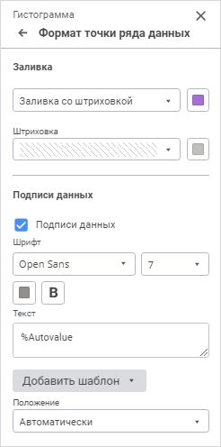

# Формат точки ряда данных: Регламентный отчёт, веб-приложение

Формат точки ряда данных: Регламентный отчёт, веб-приложение
-

# Формат точки ряда данных

Точка ряда данных - отдельное
 значение ряда данных, отображающее значение из массива данных, на основе
 которого построен ряд данных.

Для настройки параметров оформления точки ряда данных используйте группу
 параметров «Формат точки ряда данных»
 панели параметров.

[Для открытия
 группы параметров «Формат точки ряда данных»](javascript:TextPopup(this))

	Для открытия группы параметров «Формат
	 точки ряда данных»:

		- Выделите ряд данных;

		- Выделите точку ряда, дважды щелкнув по ней;

		- Выберите пункт «Формат
		 точки ряда данных» контекстного меню точки.

Примечание.
 Количество отображаемых параметров зависит от типа диаграммы/ряда.

На вкладке доступны следующие параметры точки:

	- [заливка](Data_Series_Point.htm#fill);

	- [подписи данных](Data_Series_Point.htm#label).

## Заливка точки

Для настройки заливки точки откройте раскрывающуюся палитру и выберите
 тип заливки в раскрывающемся списке:

Примечание.
 Заливка точки доступна для гистограмм, смешанной и круговой диаграмм.

	- Без заливки. Заливка
	 не используется;

	- Автоматическая заливка.
	 По умолчанию. Применяется автоматическая однотонная сплошная заливка;

	- Сплошная заливка. Выберите
	 в раскрывающейся палитре цвет однотонной заливки точки. При необходимости
	 укажите процент непрозрачности заливки;

	- Двухцветная заливка.
	 Выберите в раскрывающейся палитре начальный и конечный цвета двухцветного
	 градиента. При необходимости укажите угол наклона и процент непрозрачности
	 заливки;

	- Неоднородная заливка.
	 Выберите в раскрывающейся палитре базовый цвет заливки линейным градиентом.
	 При необходимости укажите процент непрозрачности заливки;

	- Заливка со штриховкой.
	 Выполните действия:

		- Выберите цвет однотонной заливки в раскрывающейся палитре.
		 При необходимости укажите процент непрозрачности заливки и цвета
		 штриховки.

		- Выберите образец текстуры в раскрывающемся списке «Штриховка».

		- Выберите цвет штриховки в раскрывающейся палитре.

В раскрывающейся палитре для выбора доступны стандартные и пользовательские
 цвета. По умолчанию палитра содержит только стандартные цвета.

Для создания пользовательского цвета:

	- Нажмите кнопку  «Добавить
	 цвет». Откроется расширенная палитра цветов.

	- Выберите цвет в расширенной палитре цветов, на странице браузера
	 с помощью пипетки или задайте код цвета в формате RGB/HEX.

После выполнения действий пользовательский цвет будет создан и добавлен
 в палитру.

Примечание.
 Максимально возможное количество пользовательских цветов в палитре равно
 23.

Для удаления пользовательского цвета из палитры выполните команду «Удалить» контекстного меню выбранного
 цвета.

Для сброса заданных настроек заливки нажмите кнопку  «Удалить».

## Подписи данных точки

Для отображения подписей для выбранного ряда установите флажок «Подписи данных».

Задайте настройки:

	- [шрифт подписи](#font);

	- [текст подписи](#text);

	- [положение подписи](#position).

## Шрифт подписи

Задайте настройки шрифта:

	- Шрифт. Выберите один
	 из доступных шрифтов в раскрывающемся списке. При необходимости можно
	 загрузить [пользовательские
	 шрифты](Setup.chm::/UiWebSetup/03_Setup_Web/General_for_linux/Loading_Custom_Fonts.htm);

	- Размер шрифта. Установите
	 требуемый размер шрифта. Размер задаётся в пунктах, его можно
	 выбрать из раскрывающегося списка или ввести с помощью клавиатуры.
	 Диапазон допустимых значений: [8; 36];

	- Цвет. Выберите цвет
	 шрифта в раскрывающейся палитре. Для выбора доступны стандартные и
	 пользовательские цвета. По умолчанию палитра содержит только стандартные
	 цвета.

Для создания пользовательского цвета:

		- Нажмите кнопку  «Добавить
		 цвет». Откроется расширенная палитра цветов.

		- Выберите цвет в расширенной палитре цветов, на странице
		 браузера с помощью пипетки или задайте код цвета в формате RGB/HEX.

После выполнения действий пользовательский
 цвет будет создан и добавлен в палитру.

Примечание.
 Максимально возможное количество пользовательских цветов в палитре равно
 23.

Для удаления пользовательского цвета из палитры
 выполните команду «Удалить» контекстного
 меню выбранного цвета.

	- Начертание. Выберите
	 начертание шрифта:

		- B. Полужирное начертание;

		- I.
		 Курсивное начертание;

		- U.
		 Подчеркивание текста.

При нажатой кнопке будет использоваться соответствующий
 стиль начертания. Доступно использование нескольких стилей одновременно,
 например, нажатие кнопок «B» и
 «I» даёт полужирное
 курсивное начертание.

## Текст подписи

Для подписи может быть задан произвольный текст, шаблон или использовано
 сочетание текста с шаблонами. Для ввода текста и шаблонов используйте
 поле «Текст».

Для добавления шаблона в текст подписи:

	- Нажмите кнопку «Добавить шаблон».

	- В раскрывающемся списке выберите один из доступных шаблонов
	 текста.

После выполнения действий выбранный шаблон будет добавлен в текст подписи
 после позиции курсора.

Доступные шаблоны:

	- %PointNo. Номер точки;

	- %PointName. Имя точки;

	- %SerieNo. Номер ряда;

	- %SerieName. Имя ряда;

	- %Data. Пользовательский
	 формат данных. Настройка формата возможна только с помощью языка Fore;

	- %PercentPartHundredth.
	 Доли с накоплением;

	- %PercentPart. Доли в
	 процентах с накоплением;

	- %PercentHundredth. Доли
	 - отношение значения точки ряда к сумме значений этой же точки всех
	 рядов;

	- %Percent. Доли в процентах
	 - отношение значения точки ряда к сумме значений этой же точки всех
	 рядов, представленное в процентах;

	- %Part. Значение с накоплением;

	- %YValue. Значение точки
	 по оси Y;

	- %XValue. Значение точки
	 по оси X;

	- %Value. Значение точки;

	- %Autovalue. По умолчанию.
	 Автоматический формат значения. Для всех диаграмм, кроме [круговой](Type_diagrams/UiDiagrams_round.htm),
	 будет использовано значение точки ряда данных. Для круговой диаграммы,
	 вторичной круговой диаграммы и вторичной гистограммы используется
	 отношение значения точки ряда к сумме значений этой же точки всех
	 рядов.

## Положение подписи

Для точек доступны варианты расположения подписей данных:

	- автоматически;

	- в центре;

	- у вершины внутри;

	- у вершины снаружи;

	- у основания внутри;

	- пользовательское размещение подписей.

Примечание.
 Для [линейных](Type_diagrams/UiDiagrams_lenear.htm), [точечных](Type_diagrams/UiDiagrams_scatter.htm),
 [пузырьковых](Type_diagrams/Bubble_Chart.htm), [ступенчатых](Type_diagrams/Stepped_Chart.htm),
 [лепестковых](Type_diagrams/uidiagrams_petalous.htm) диаграмм,
 а также [диаграмм с областями](Type_diagrams/uidiagrams_area.htm)
 доступны варианты «Слева», «Сверху», «Справа»,
 «Снизу». Варианты «У
 вершины внутри», «У вершины снаружи»
 и «У основания внутри» недоступны.

При выборе пользовательского размещения подписей становится доступным
 определение:

	- расположения подписей по горизонтали. Выберите из раскрывающегося списка
	 расположение подписей по горизонтали:

		- справа;

		- по центру;

		- слева.

По умолчанию
 выбрано расположение по центру;

	- расположения подписей по вертикали.
	 Выберите из раскрывающегося списка расположение подписей по вертикали:

		- снизу;

		- по центру;

		- сверху.

По умолчанию выбрано расположение по центру.

	- смещения подписи. Задайте
	 длину смещения подписи относительно ряда по горизонтали, по вертикали
	 и процент смещения подписи относительно длины столбика.

См. также:

[Визуализация
 данных в виде диаграмм](UiReport_Diagrams_appointment.htm)

		Справочная
		 система на версию 10.9
		 от 18/08/2025,
		 © ООО «ФОРСАЙТ»,
