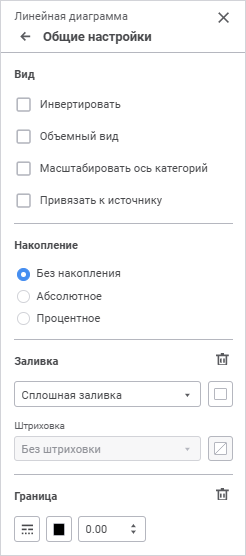
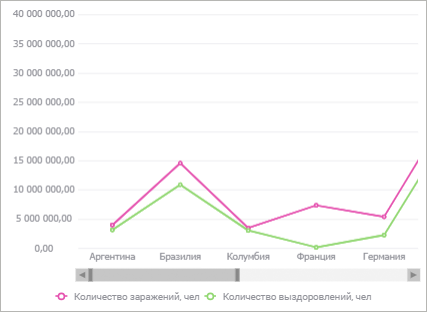
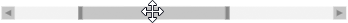

# Общие настройки: Регламентный отчёт, веб-приложение

Общие настройки: Регламентный отчёт, веб-приложение
-

# Общие настройки

	Для настройки вида отображения, типа накопления, заливки фона и
	 границы диаграммы используйте группу параметров «Общие
	 настройки» панели параметров.

	[Для открытия
	 группы параметров «Общие настройки»](javascript:TextPopup(this))

		Для открытия группы параметров «Общие
		 настройки» выделите диаграмму и нажмите кнопку  «Параметры»
		 панели инструментов, затем выберите требуемую группу.

	

	Задайте параметры:

		- [вид](General_Settings.htm#view);

		- [накопление](General_Settings.htm#staking);

		- [заливка](General_Settings.htm#fill);

		- [граница](General_Settings.htm#border).

## Вид

	Для настройки вида отображения диаграммы задайте:

		- Инвертировать. Установите
		 флажок для изменения ориентации шкал, при этом ось X будет ориентирована
		 снизу вверх, а ось Y слева направо. Также будет инвертирован порядок
		 отображения рядов в [легенде](Legend.htm). При снятом
		 флажке ориентация шкал и порядок рядов в легенде вернутся к исходному
		 виду;

	Примечание.
	 Доступно только для [линейной](Type_diagrams/UiDiagrams_lenear.htm),
	 [смешанной](Type_diagrams/UiDiagrams_mixed_diagram.htm),
	 [точечной](Type_diagrams/UiDiagrams_scatter.htm), [коробчатой](Type_diagrams/Box_chart.htm),
	 [каскадной](Type_diagrams/WaterFall_chart.htm), [ступенчатой](Type_diagrams/Stepped_Chart.htm)
	 диаграмм, [гистограммы](Type_diagrams/UiDiagrams_Bar.htm),
	 [диаграммы с областями](Type_diagrams/uidiagrams_area.htm)
	 и [коробчатой
	 диаграммы с линейными рядами](Type_diagrams/Box_chart_with_Line_Series.htm).

		- Объемный вид. Установите
		 флажок для отображения диаграммы в объёмном виде;

	Примечание.
	 Доступно только для [линейной](Type_diagrams/UiDiagrams_lenear.htm),
	 [круговой](Type_diagrams/UiDiagrams_round.htm), [смешанной](Type_diagrams/UiDiagrams_mixed_diagram.htm)
	 диаграмм, [гистограммы](Type_diagrams/UiDiagrams_Bar.htm)
	 и [диаграммы с областями](Type_diagrams/uidiagrams_area.htm).

		- Масштабировать ось категорий.
		 Для изменения масштаба диаграммы с помощью «скроллера» установите
		 флажок «Масштабировать ось категорий».

	Примечание.
	 Доступно только для [линейной](Type_diagrams/UiDiagrams_lenear.htm),
	 [смешанной](Type_diagrams/UiDiagrams_mixed_diagram.htm),
	 [каскадной](Type_diagrams/WaterFall_chart.htm), [ступенчатой](Type_diagrams/Stepped_Chart.htm)
	 диаграмм, [гистограммы](Type_diagrams/UiDiagrams_Bar.htm),
	 и [диаграммы с областями](Type_diagrams/uidiagrams_area.htm).

	После установки флажка будет отображаться
	 «скроллер» под областью диаграммы:

	

	Для выполнения масштабирования наведите
	 указатель мыши к границе «скроллера». Указатель примет вид двунаправленной
	 стрелки:

	

	Щёлкните по границе «скроллера» и передвиньте
	 её. Диаграмма автоматически перестроится. В области построения диаграммы
	 будет отображаться участок, соответствующий участку «скроллера»:

	

	Для перемещения «скроллера» наведите
	 на него указатель мыши. Указатель примет вид четырехнаправленной стрелки:

	

	Нажмите кнопку мыши и, удерживая ее,
	 передвиньте участок «скроллера» в необходимую позицию. В области построения
	 отобразится соответствующий участок диаграммы.

	Для быстрого выполнения масштабирования
	 наведите указатель мыши на «скроллер» или на область диаграммы и прокрутите
	 колесико мыши вверх для увеличения масштаба, вниз - для уменьшения
	 масштаба.

	Для возвращения диаграммы к исходному
	 виду выполните одно из действий:

			- снимите флажок «Масштабирование
			 оси категорий»;

			- передвиньте границы «скроллера» в исходное положение.

		- Привязать к источнику. Для сохранения
		 оформления [рядов данных](Data_Series.htm) диаграммы
		 установите флажок «Привязать
		 к источнику». После установки флажка оформление рядов данных
		 не будет меняться при изменении отметки в измерении. При работе
		 со [смешанной
		 диаграммой](Type_diagrams/UiDiagrams_mixed_diagram.htm) ряды линейного типа будут отображаться на переднем
		 плане относительно других типов рядов.

	Примечание.
	 Доступно, если диаграмма построена на основе [среза
	 данных](../Source/Window/UiReport_Source_Window_AreaSource.htm#add_visualizer).

## Накопление

	Выберите используемый тип накопления из раскрывающегося списка:

		- Без накопления.
		 Диаграмма отображает абсолютные значения ряда;

		- Абсолютное. Диаграмма
		 отображает значения с накоплением, позволяя оценить вклад каждого
		 значения в общую сумму;

		- Процентное. Диаграмма
		 отображает значения в процентном стиле, позволяя оценить долю
		 каждого значения в общей сумме.

	Примечание.
	 Доступно для рядов [линейной](Type_diagrams/UiDiagrams_lenear.htm),
	 [смешанной](Type_diagrams/UiDiagrams_mixed_diagram.htm)
	 диаграмм, [гистограммы](Type_diagrams/UiDiagrams_Bar.htm)
	 и [диаграммы с областями](Type_diagrams/uidiagrams_area.htm).

## Заливка

	Для настройки фона диаграммы выберите тип заливки в раскрывающемся
	 списке:

	- Без заливки. По умолчанию.
	 Заливка не используется;

	- Сплошная заливка. Выберите
	 цвет однотонной заливки в раскрывающейся палитре. При необходимости
	 укажите процент непрозрачности заливки;

	- Двухцветная заливка.
	 Выберите начальный и конечный цвета градиента в раскрывающейся палитре.
	 При необходимости укажите угол наклона и процент непрозрачности заливки;

	- Заливка со штриховкой.
	 Выполните действия:

		- Выберите цвет однотонной заливки в раскрывающейся палитре.
		 При необходимости укажите процент непрозрачности заливки и цвета
		 штриховки.

		- Выберите образец текстуры в раскрывающемся списке «Штриховка».

		- Выберите цвет штриховки в раскрывающейся палитре.

В раскрывающейся палитре для выбора доступны стандартные и пользовательские
 цвета. По умолчанию палитра содержит только стандартные цвета.

Для создания пользовательского цвета:

	- Нажмите кнопку  «Добавить
	 цвет». Откроется расширенная палитра цветов:

	- Выберите цвет в расширенной палитре цветов, на странице браузера
	 с помощью пипетки или задайте код цвета в формате RGB/HEX.

После выполнения действий пользовательский цвет будет создан и добавлен
 в палитру.

Примечание.
 Максимально возможное количество пользовательских цветов в палитре равно
 23.

Для удаления пользовательского цвета из палитры выполните команду «Удалить» контекстного меню выбранного
 цвета.

Для сброса заданных настроек заливки нажмите кнопку  «Удалить».

## Граница

	Для настройки границы диаграммы задайте:

	- Тип линии. Из раскрывающегося
	 списка выберите тип линии;

	- Цвет линии. Выберите
	 цвет линии в раскрывающейся палитре. Для выбора доступны стандартные
	 и пользовательские цвета. По умолчанию палитра содержит только стандартные
	 цвета.

Для создания пользовательского цвета:

		- Нажмите кнопку  «Добавить
		 цвет». Откроется расширенная палитра цветов.

		- Выберите цвет в расширенной палитре цветов, на странице
		 браузера с помощью пипетки или задайте код цвета в формате RGB/HEX.

После выполнения действий пользовательский
 цвет будет создан и добавлен в палитру.

Примечание.
 Максимально возможное количество пользовательских цветов в палитре равно
 23.

Для удаления пользовательского цвета из палитры
 выполните команду «Удалить» контекстного
 меню выбранного цвета.

	- Толщина линии. Задайте
	 требуемую толщину линии с помощью клавиатуры или редактора чисел.

Для сброса заданных настроек границы нажмите кнопку  «Удалить».

См. также:

[Визуализация
 данных в виде диаграмм](UiReport_Diagrams_appointment.htm)

		Справочная
		 система на версию 10.9
		 от 18/08/2025,
		 © ООО «ФОРСАЙТ»,
