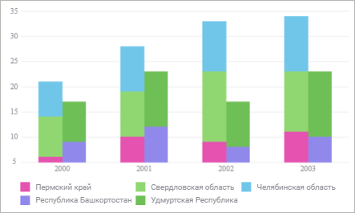
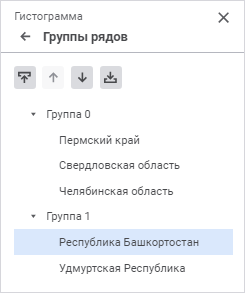

# Группы рядов: Регламентный отчёт, веб-приложение

Группы рядов: Регламентный отчёт, веб-приложение
-

# Группы рядов

Группы рядов предназначены для визуального объединения нескольких рядов.

Пример накопительной гистограммы с рядами, распределёнными по двум группам:

Для настройки групп рядов диаграммы используйте группу параметров «Группы рядов» панели параметров.

Примечание.
 Группа параметров «Группы рядов»
 доступна только для [гистограмм](Type_diagrams/UiDiagrams_Bar.htm)
 типа  «Накопительная
 с группами» и  «Накопительная с группами трехмерная».

[Для открытия
 группы параметров «Группы рядов»](javascript:TextPopup(this))

	Для открытия группы параметров «Группы
	 рядов» выделите диаграмму и нажмите кнопку  «Параметры» панели инструментов,
	 затем выберите требуемую группу.

Для формирования групп рядов используйте кнопки на панели параметров:

	-  «Переместить в предыдущую группу».
	 Перемещает выделенный ряд в предыдущую группу, при этом ставя его
	 в конец списка рядов группы. Кнопка недоступна, если ряд находится
	 в первой группе с наименованием «Группа 0»;

	-  «Переместить в следующую группу».
	 Перемещает выделенный ряд в следующую группу, при этом ставя его в
	 начало списка рядов группы. Если ряд находится в последней группе,
	 то при нажатии кнопки создастся новая группа с наименованием «Группа
	 N», где N - порядковый номер группы, начиная с нуля, и ряд переместится
	 в эту группу. Кнопка недоступна, если ряд находится в последней группе
	 и является единственным рядом этой группы;

	-  «Переместить выше». Перемещает выделенный
	 ряд на одну позицию выше в рамках группы. Кнопка недоступна, если
	 ряд находится выше всех остальных рядов в группе;

	-  «Переместить ниже». Перемещает выделенный
	 ряд на одну позицию ниже в рамках группы. Кнопка недоступна, если
	 ряд находится ниже всех остальных рядов в группе.

Примечание.
 Настройки групп рядов влияют на [порядок
 следования рядов](Data_Series.htm#order) на диаграмме и порядок их отображения в [легенде](Legend.htm).

См. также:

[Визуализация
 данных в виде диаграмм](UiReport_Diagrams_appointment.htm)

		Справочная
		 система на версию 10.9
		 от 18/08/2025,
		 © ООО «ФОРСАЙТ»,
