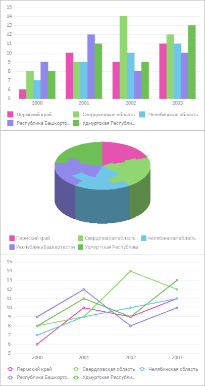
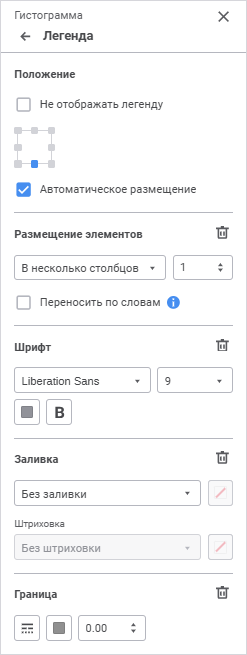
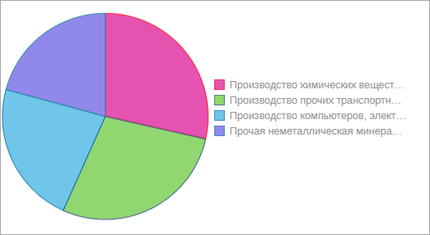
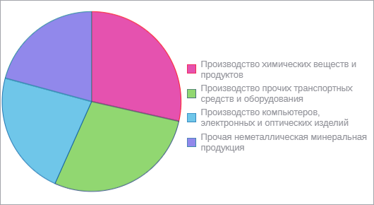

# Легенда: Регламентный отчёт, веб-приложение

Легенда: Регламентный отчёт, веб-приложение
-

# Легенда

	Легенда содержит названия и маркеры рядов данных на диаграмме. Порядок
	 отображения рядов данных в легенде соответствует их [порядку
	 следования](Data_Series.htm#order) на диаграмме.

	Примечание.
	 В легенде отображаются только те ряды данных, для которых установлен
	 флажок «[Отображать
	 в легенде](Data_Series.htm#series)».

	Примеры отображения легенды для различных типов диаграмм:

	

	Для настройки легенды диаграммы используйте группу параметров «Легенда» панели параметров.

	[Для открытия
	 группы параметров «Легенда»](javascript:TextPopup(this))

		Для открытия группы параметров «Легенда»
		 выделите диаграмму и нажмите кнопку  «Параметры» панели инструментов,
		 затем выберите требуемую группу.

	

	Задайте параметры:

		- [положение](Legend.htm#position);

		- [размещение элементов](Legend.htm#layout);

		- [шрифт](Legend.htm#font);

		- [заливка](Legend.htm#fill);

		- [граница](Legend.htm#border).

## Положение

	Выберите вариант расположения легенды относительно области диаграммы,
	 выделив его мышью. Доступны варианты: в левом верхнем углу, по центру
	 верхней границы, в правом верхнем углу, по центру правой границы,
	 в правом нижнем углу, по центру нижней границы блока, в левом нижнему
	 углу, по центру левой границы. При выборе варианта расположения будет
	 автоматически установлен флажок «Автоматическое
	 размещение легенды».

	По умолчанию легенда размещается внизу области диаграммы.

	Для скрытия легенды установите флажок «Не
	 отображать легенду».

## Размещение элементов

	Определите настройки размещения элементов в легенде:

		- для задания варианта размещения элементов выберите требуемый
		 вариант из раскрывающегося списка:

			- Автоматическое.
			 По умолчанию. Количество строк и столбцов подбирается в зависимости
			 от количества элементов легенды и её размеров;

			- В несколько столбцов.
			 Укажите количество столбцов для размещения элементов легенды.
			 При любом размере легенды будет использоваться заданное количество
			 столбцов;

			- В несколько строк.
			 Укажите количество строк для размещения элементов легенды.
			 При любом размере легенды будет использоваться заданное количество
			 строк;

	Примечание.
	 Для просмотра элементов диаграммы, которые не помещаются в легенде,
	 используйте полосу прокрутки строк/столбцов.

		- для переноса слов в легенде установите флажок «Переносить
		 по словам». Настройка используется только для варианта
		 размещения элементов легенды «В
		 несколько столбцов» со значением «1».

	Возможные варианты отображения наименований
	 элементов легенды:

			- наименования элементов без переноса слов:

	

			- наименования элементов с переносом слов:

	

## Шрифт

	Для настройки шрифта задайте параметры:

		- Шрифт. Выберите
		 один из доступных шрифтов в раскрывающемся списке. При необходимости
		 можно загрузить [пользовательские
		 шрифты](Setup.chm::/UiWebSetup/03_Setup_Web/General_for_linux/Loading_Custom_Fonts.htm);

		- Размер шрифта. Установите
		 требуемый размер шрифта. Размер задаётся в пунктах, его можно
		 выбрать из раскрывающегося списка или ввести вручную. Диапазон
		 допустимых значений: [8; 36];

	- Цвет. Выберите цвет
	 шрифта в раскрывающейся палитре. Для выбора доступны стандартные и
	 пользовательские цвета. По умолчанию палитра содержит только стандартные
	 цвета.

Для создания пользовательского цвета:

		- Нажмите кнопку  «Добавить
		 цвет». Откроется расширенная палитра цветов.

		- Выберите цвет в расширенной палитре цветов, на странице
		 браузера с помощью пипетки или задайте код цвета в формате RGB/HEX.

После выполнения действий пользовательский
 цвет будет создан и добавлен в палитру.

Примечание.
 Максимально возможное количество пользовательских цветов в палитре равно
 23.

Для удаления пользовательского цвета из палитры
 выполните команду «Удалить» контекстного
 меню выбранного цвета.

		- Начертание. Выберите
		 начертание шрифта:

			- B. Полужирное
			 начертание;

			- I.
			 Курсивное начертание;

			- U.
			 Подчеркивание текста.

	При нажатой кнопке будет использоваться
	 соответствующий стиль начертания. Доступно использование нескольких
	 стилей одновременно, например, нажатие кнопок «B»
	 и «I»
	 даёт полужирное курсивное начертание.

## Заливка

	Для настройки фона легенды выберите тип заливки в раскрывающемся
	 списке:

	- Без заливки. По умолчанию.
	 Заливка не используется;

	- Сплошная заливка. Выберите
	 цвет однотонной заливки в раскрывающейся палитре. При необходимости
	 укажите процент непрозрачности заливки;

	- Двухцветная заливка.
	 Выберите начальный и конечный цвета градиента в раскрывающейся палитре.
	 При необходимости укажите угол наклона и процент непрозрачности заливки;

	- Заливка со штриховкой.
	 Выполните действия:

		- Выберите цвет однотонной заливки в раскрывающейся палитре.
		 При необходимости укажите процент непрозрачности заливки и цвета
		 штриховки.

		- Выберите образец текстуры в раскрывающемся списке «Штриховка».

		- Выберите цвет штриховки в раскрывающейся палитре.

В раскрывающейся палитре для выбора доступны стандартные и пользовательские
 цвета. По умолчанию палитра содержит только стандартные цвета.

Для создания пользовательского цвета:

	- Нажмите кнопку  «Добавить
	 цвет». Откроется расширенная палитра цветов:

	- Выберите цвет в расширенной палитре цветов, на странице браузера
	 с помощью пипетки или задайте код цвета в формате RGB/HEX.

После выполнения действий пользовательский цвет будет создан и добавлен
 в палитру.

Примечание.
 Максимально возможное количество пользовательских цветов в палитре равно
 23.

Для удаления пользовательского цвета из палитры выполните команду «Удалить» контекстного меню выбранного
 цвета.

Для сброса заданных настроек заливки нажмите кнопку  «Удалить».

## Граница

	Для настройки границы легенды задайте:

	- Тип линии. Из раскрывающегося
	 списка выберите тип линии;

	- Цвет линии. Выберите
	 цвет линии в раскрывающейся палитре. Для выбора доступны стандартные
	 и пользовательские цвета. По умолчанию палитра содержит только стандартные
	 цвета.

Для создания пользовательского цвета:

		- Нажмите кнопку  «Добавить
		 цвет». Откроется расширенная палитра цветов.

		- Выберите цвет в расширенной палитре цветов, на странице
		 браузера с помощью пипетки или задайте код цвета в формате RGB/HEX.

После выполнения действий пользовательский
 цвет будет создан и добавлен в палитру.

Примечание.
 Максимально возможное количество пользовательских цветов в палитре равно
 23.

Для удаления пользовательского цвета из палитры
 выполните команду «Удалить» контекстного
 меню выбранного цвета.

	- Толщина линии. Задайте
	 требуемую толщину линии с помощью клавиатуры или редактора чисел.

Для сброса заданных настроек границы нажмите кнопку  «Удалить».

См. также:

[Визуализация
 данных в виде диаграмм](UiReport_Diagrams_appointment.htm)

		Справочная
		 система на версию 10.9
		 от 18/08/2025,
		 © ООО «ФОРСАЙТ»,
