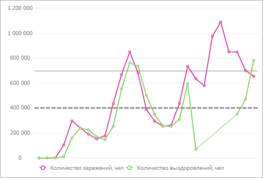
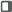
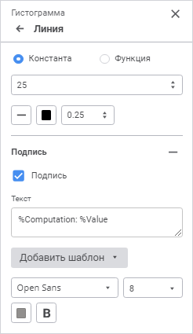

# Линии уровня: Регламентный отчёт, веб-приложение

Линии уровня: Регламентный отчёт, веб-приложение
-

# Линии уровня

Линия уровня - линия в области построения диаграммы, перпендикулярная
 заданной оси.

Примечание.
 Настройка линий уровня доступна для всех двумерных типов диаграмм, кроме
 [круговой](Type_diagrams/UiDiagrams_round.htm).

Для настройки линий уровня используйте группу параметров «Линии
 уровня» панели параметров.

[Для открытия
 группы параметров «Линии уровня»](javascript:TextPopup(this))

	Для открытия группы параметров «Линии
	 уровня» выделите диаграмму и нажмите кнопку  «Параметры» панели инструментов,
	 затем выберите требуемую группу.

В группе параметров содержатся добавленные линии уровня с наименованиями
 в формате: <способ построения линии
 уровня>:<значение>.

Для добавления линии уровня:

	- Нажмите кнопку «Добавить линию».
	 Линия уровня будет добавлена с настройками по умолчанию.

	- Дважды щёлкните по линии уровня. После чего будет открыт набор
	 параметров:

	- Задайте параметры:

		- [построение линии уровня](#settings);

		- [отображение подписи](#label).

Для удаления линии уровня нажмите кнопку  «Удалить», расположенную напротив
 наименования линии уровня и отображаемую при наведении на неё.

Примечание.
 Сетка [области построения диаграммы](UiReport_Diagrams_appointment.htm)
 также строится из линий уровня. Для настройки основных линий уровня в
 области построения используйте раздел «[Линии
 сетки](Axes.htm#lines)» в группе параметров «[Ось
 значений](Axes.htm)» панели параметров.

## Построение линии уровня

Для построения линии уровня установите один из переключателей:

	- Константа. Задайте постоянное
	 значение линии уровня с помощью клавиатуры или редактора чисел;

	- Функция. Выберите в
	 раскрывающемся списке функцию, исходя из значения которой будет построена
	 линия уровня. Доступны следующие виды функций: «Максимум», «Минимум»,
	 «Сумма», «Медиана» или «Среднее».

При необходимости настройте параметры отображения линии уровня:

	- Тип линии. Выберите
	 в раскрывающемся списке тип линии;

	- Цвет линии. Выберите
	 цвет линии в раскрывающейся палитре. Для выбора доступны стандартные
	 и пользовательские цвета. По умолчанию палитра содержит только стандартные
	 цвета.

Для создания пользовательского цвета:

		- Нажмите кнопку  «Добавить
		 цвет». Откроется расширенная палитра цветов.

		- Выберите цвет в расширенной палитре цветов, на странице
		 браузера с помощью пипетки или задайте код цвета в формате RGB/HEX.

После выполнения действий пользовательский
 цвет будет создан и добавлен в палитру.

Примечание.
 Максимально возможное количество пользовательских цветов в палитре равно
 23.

Для удаления пользовательского цвета из палитры
 выполните команду «Удалить» контекстного
 меню выбранного цвета.

	- Толщина линии. Задайте
	 толщину линии в пунктах с помощью клавиатуры или редактора чисел.
	 Диапазон допустимых значений: [0, 10].

После выполнения действий линия уровня будет построена на диаграмме
 в соответствии с заданными параметрами.

## Отображение подписи линии уровня

Для отображения подписи линии уровня установите флажок «Подпись».
 По умолчанию флажок снят.

### Текст подписи

Для подписи может быть задан произвольный текст, шаблон или использовано
 сочетание текста с шаблонами. Для ввода текста и шаблонов используйте
 поле «Текст».

Для добавления шаблона в текст подписи:

	- Нажмите кнопку «Добавить шаблон».

	- Выберите в раскрывающемся списке один из доступных шаблонов
	 текста:

		- %Computation. Способ
		 построения линии уровня: «Константа» или «Функция»;

		- %Value. Значение
		 линии уровня.

После выполнения действий выбранный шаблон будет добавлен в текст подписи.

### Шрифт подписи

Для настройки шрифта подписи:

	- Шрифт. Выберите в раскрывающемся
	 списке один из доступных шрифтов. При необходимости можно загрузить
	 [пользовательские
	 шрифты](Setup.chm::/UiWebSetup/03_Setup_Web/General_for_linux/Loading_Custom_Fonts.htm);

	- Размер шрифта. Выберите
	 в раскрывающемся списке размер шрифта в пунктах. Диапазон допустимых
	 значений: [6; 36];

	- Цвет. Выберите цвет
	 шрифта в раскрывающейся палитре. Для выбора доступны стандартные и
	 пользовательские цвета. По умолчанию палитра содержит только стандартные
	 цвета.

Для создания пользовательского цвета:

		- Нажмите кнопку  «Добавить
		 цвет». Откроется расширенная палитра цветов.

		- Выберите цвет в расширенной палитре цветов, на странице
		 браузера с помощью пипетки или задайте код цвета в формате RGB/HEX.

После выполнения действий пользовательский
 цвет будет создан и добавлен в палитру.

Примечание.
 Максимально возможное количество пользовательских цветов в палитре равно
 23.

Для удаления пользовательского цвета из палитры
 выполните команду «Удалить» контекстного
 меню выбранного цвета.

	- Начертание. Выберите
	 начертание шрифта:

		- B. Полужирное начертание;

		- I.
		 Курсивное начертание;

		- U.
		 Подчеркивание текста.

При нажатой кнопке будет использоваться соответствующий
 стиль начертания. Доступно использование нескольких стилей одновременно,
 например, нажатие кнопок «B» и
 «I» даёт полужирное
 курсивное начертание.

После выполнения действий заданные настройки шрифта будут применены
 для текста подписи.

См. также:

[Визуализация
 данных в виде диаграмм](UiReport_Diagrams_appointment.htm)

		Справочная
		 система на версию 10.9
		 от 18/08/2025,
		 © ООО «ФОРСАЙТ»,
