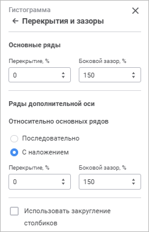

# Перекрытия и зазоры

Перекрытия и зазоры
-

# Перекрытия и зазоры

Настройка перекрытия и зазоров помогает отрегулировать расстояние между
 рядами и их положение относительно друг друга на диаграмме.

Для настройки перекрытия и зазоров используйте группу параметров «Перекрытия и зазоры» панели параметров.

[Для открытия
 группы параметров «Перекрытия и зазоры»](javascript:TextPopup(this))

	Для открытия группы параметров «Перекрытия
	 и зазоры» выделите диаграмму и нажмите кнопку  «Параметры»
	 панели инструментов, затем выберите требуемую группу.

Примечание.
 Отображаемые параметры зависят от типа диаграммы.

Задайте параметры:

	- [перекрытие](Overlap_and_gap.htm#overlap);

	- [боковой зазор](Overlap_and_gap.htm#gap);

	- [использовать закругление
	 рядов](Overlap_and_gap.htm#rounded_columns);

	- [зазор между
	 окружностями](Overlap_and_gap.htm#gap_between_circles);

	- [диаметр отверстия](Overlap_and_gap.htm#diameter);

	- [угол поворота](Overlap_and_gap.htm#angle).

## Перекрытие

Доступно для [гистограммы](Type_diagrams/UiDiagrams_Bar.htm)
 абсолютные значения, гистограммы накопительной с группами, [смешанной](Type_diagrams/UiDiagrams_mixed_diagram.htm)
 абсолютные значения, если есть ряды типа «Столбик».

Параметр определяет положение рядов относительно друг друга. Задайте
 значение перекрытия в процентах. Если значение положительное, то ряды
 накладываются друг на друга, если отрицательное - между рядами будет зазор.
 По умолчанию значение 0. Диапазон допустимых значений: [-100; 100].

## Боковой зазор

Доступно для всех типов [гистограмм](Type_diagrams/UiDiagrams_Bar.htm),
 всех типов [смешанных](Type_diagrams/UiDiagrams_mixed_diagram.htm)
 диаграмм, если есть ряды типа «Столбик»,
 [каскадно](Type_diagrams/WaterFall_chart.htm)й, [коробчатой](Type_diagrams/Box_chart.htm),
 [коробчатой с линейными
 рядами](Type_diagrams/Box_chart_with_Line_Series.htm) диаграмм.

Параметр определяет расстояние между рядами в соседних точках диаграммы.
 Задайте значение бокового зазора в процентах. По умолчанию значение 150%.
 Диапазон допустимых значений: [0, 500].

## Относительно основных рядов

Доступно для всех типов [гистограмм](Type_diagrams/UiDiagrams_Bar.htm)
 и всех типов [смешанных
 диаграмм](Type_diagrams/UiDiagrams_mixed_diagram.htm), если есть ряды типа «Столбик».

Для выбора варианта положения рядов [дополнительной
 оси](Data_Series.htm#add_axis) в группе «Относительно основных
 рядов» установите переключатель в положение:

	- Последовательно. Основные
	 ряды и ряды дополнительно оси располагаются последовательно;

	- С наложением. Ряды дополнительной
	 оси будут накладываться на основные ряды. Значение по умолчанию.

При выборе расположения дополнительных рядов «С
 наложением» для них станут доступны параметры «Перекрытие»
 и «Боковой зазор». Доступные параметры
 будут определяться наличием этих параметров для основных рядов.

## Использовать закругление столбиков

Доступно для [гистограмм](Type_diagrams/UiDiagrams_Bar.htm)
 в плоском виде, [смешанных](Type_diagrams/UiDiagrams_mixed_diagram.htm)
 диаграмм в плоском виде, если есть ряды типа «Столбик»,
 [каскадно](Type_diagrams/WaterFall_chart.htm)й диаграммы.

Параметр определяет отображение рядов диаграммы в виде закругленных
 столбиков. Установите флажок «Использовать
 закругление столбиков» для закругления.

## Зазор между окружностями

Доступно для [круговой](Type_diagrams/UiDiagrams_round.htm),
 круговой трехмерной и [кольцевой](Type_diagrams/UiDiagrams_round.htm#doughnut)
 диаграмм.

Параметр определяет расстояние между рядами диаграммы. Задайте значение
 зазора в миллиметрах. По умолчанию значение 0. Диапазон допустимых значений:
 [0, 100].

## Диаметр отверстия

Доступно для [кольцевой](Type_diagrams/UiDiagrams_round.htm#doughnut)
 диаграммы.

Параметр определяет размер диаметра отверстия относительно диаметра
 диаграммы. Задайте значение в процентах. По умолчанию значение 50%. Диапазон
 допустимых значений: [10%, 90%].

## Угол поворота

Доступно для [круговой](Type_diagrams/UiDiagrams_round.htm),
 круговой трехмерной и [кольцевой](Type_diagrams/UiDiagrams_round.htm#doughnut)
 диаграмм.

Параметр определяет угол поворота центральной оси в градусах. Поворот
 осуществляется по часовой стрелке.  Задайте значение в градусах.
 По умолчанию значение 0. Диапазон допустимых значений: [0, 360].

См. также:

[Визуализация
 данных в виде диаграмм](UiReport_Diagrams_appointment.htm)

		Справочная
		 система на версию 10.9
		 от 18/08/2025,
		 © ООО «ФОРСАЙТ»,
