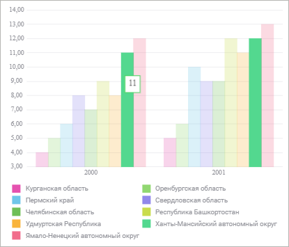
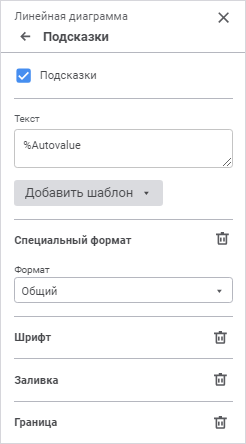

# Всплывающие подсказки: Регламентный отчёт, веб-приложение

Всплывающие подсказки: Регламентный отчёт, веб-приложение
-

# Всплывающие подсказки

	Всплывающая подсказка отображает необходимую информацию о точке
	 ряда данных, линии уровня или ряде данных в [легенде](Legend.htm)
	 при наведении курсора на соответствующий элемент диаграммы.

	Примечание.
	 Отображение всплывающих подсказок для рядов данных в легенде доступно
	 для всех диаграмм, кроме [кольцевых](Type_diagrams/UiDiagrams_round.htm)
	 и [каскадных](Type_diagrams/WaterFall_chart.htm).

	Пример всплывающей подсказки:

	

	Для настройки параметров всплывающих подсказок используйте группу
	 параметров «Подсказки» на
	 панели параметров.

	[Для открытия
	 группы параметров «Подсказки»](javascript:TextPopup(this))

		Для открытия группы параметров «Подсказки»
		 выделите диаграмму и нажмите кнопку  «Параметры» панели инструментов,
		 затем выберите требуемую группу.

	

	Установите флажок «Подсказки»
	 для отображения подсказок на диаграмме и задайте параметры:

		- [текст](#text);

		- [специальный формат](#speacial_format);

		- [шрифт](#font);

		- [заливка](#fill);

		- [граница](#margin).

## Текст

	Для подсказок может быть задан произвольный текст, шаблон или использовано
	 сочетание текста с шаблонами. Для ввода текста и шаблонов используйте
	 поле «Текст».

	Для добавления шаблона в текст подписи:

		- Нажмите кнопку «Добавить
		 шаблон».

		- В раскрывающемся списке выберите один из доступных шаблонов
		 текста.

	После выполнения действий выбранный шаблон будет добавлен в текст
	 подписи после позиции курсора.

	Доступные шаблоны:

		- %PointNo. Номер
		 точки;

		- %PointName. Имя
		 точки;

		- %SerieNo. Номер
		 ряда;

		- %SerieName. Имя
		 ряда;

		- %PercentPartHundredth.
		 Доли с накоплением;

		- %PercentPart. Доли
		 в процентах с накоплением;

		- %PercentHundredth.
		 Доли - отношение значения точки ряда к сумме значений этой же
		 точки всех рядов;

		- %Percent. Доли в
		 процентах - отношение значения точки ряда к сумме значений этой
		 же точки всех рядов, представленное в процентах;

		- %Part. Значение
		 с накоплением;

		- %YValue. Значение
		 точки по оси Y;

		- %XValue. Значение
		 точки по оси X;

		- %Value. Значение
		 точки;

		- %Autovalue. По умолчанию.
		 Автоматический формат значения.

	Примечание.
	 Текст всплывающих подсказок для [линий уровня](Level_Lines.htm)
	 определяется автоматически.

## Специальный формат

	В раскрывающемся списке «Формат»
	 выберите формат отображаемых значений.

	В зависимости от выбранного формата станут доступны дополнительные
	 настройки отображения значений:

		- при выборе формата значений «Числовой»,
		 «Денежный», «Процентный»
		 или «Экспоненциальный»
		 станет доступно поле «Десятичных
		 знаков», в котором определите число отображаемых знаков
		 после запятой с помощью редактора чисел или клавиатуры;

		- при выборе формата значений «Числовой»
		 или «Денежный» станет
		 доступен раскрывающийся список «Отрицательные
		 числа», в котором выберите требуемый способ отображения
		 отрицательных чисел;

		- при выборе формата значений «Денежный»
		 станет доступен раскрывающийся список «Обозначение»,
		 в котором выберите требуемую валюту;

		- при выборе формата значений «Числовой»
		 станет доступен флажок «Разделитель
		 группы разрядов». При необходимости установите его для
		 разделения групп разрядов чисел;

		- при выборе формата значений «Дата»,
		 «Время» или «Дополнительный»
		 станет доступен раскрывающийся список «Тип»,
		 в котором выберите требуемый тип отображения значений выбранного
		 формата;

		- при выборе формата значений «Пользовательский»
		 станет доступно поле «Тип»,
		 в котором определите свой собственный способ отображения значений.

	Для сброса заданных настроек формата нажмите кнопку  «Удалить».

## Шрифт

	Задайте настройки шрифта:

		- Шрифт. Выберите
		 один из доступных шрифтов в раскрывающемся списке. При необходимости
		 можно загрузить [пользовательские
		 шрифты](Setup.chm::/UiWebSetup/03_Setup_Web/General_for_linux/Loading_Custom_Fonts.htm);

		- Размер шрифта. Установите
		 требуемый размер шрифта. Размер задаётся в пунктах, его можно
		 выбрать из раскрывающегося списка или ввести с помощью клавиатуры.
		 Диапазон допустимых значений: [8; 36];

	- Цвет. Выберите цвет
	 шрифта в раскрывающейся палитре. Для выбора доступны стандартные и
	 пользовательские цвета. По умолчанию палитра содержит только стандартные
	 цвета.

Для создания пользовательского цвета:

		- Нажмите кнопку  «Добавить
		 цвет». Откроется расширенная палитра цветов.

		- Выберите цвет в расширенной палитре цветов, на странице
		 браузера с помощью пипетки или задайте код цвета в формате RGB/HEX.

После выполнения действий пользовательский
 цвет будет создан и добавлен в палитру.

Примечание.
 Максимально возможное количество пользовательских цветов в палитре равно
 23.

Для удаления пользовательского цвета из палитры
 выполните команду «Удалить» контекстного
 меню выбранного цвета.

		- Начертание. Выберите
		 начертание шрифта:

			- B. Полужирное
			 начертание;

			- I.
			 Курсивное начертание;

			- U.
			 Подчеркивание текста.

	При нажатой кнопке будет использоваться
	 соответствующий стиль начертания. Доступно использование нескольких
	 стилей одновременно, например, нажатие кнопок «B»
	 и «I»
	 даёт полужирное курсивное начертание.

	Для сброса настроек шрифта нажмите кнопку  «Удалить».

## Заливка

	В раскрывающейся палитре выберите способ заливки фона подсказок:

		- Сплошная заливка.
		 По умолчанию. Выберите цвет однотонной заливки фона подсказок.
		 При необходимости укажите процент непрозрачности заливки.

Для выбора доступны стандартные и пользовательские цвета. По умолчанию
 палитра содержит только стандартные цвета.

Для создания пользовательского цвета:

	- Нажмите кнопку  «Добавить
	 цвет». Откроется расширенная палитра цветов.

	- Выберите цвет в расширенной палитре цветов, на странице браузера
	 с помощью пипетки или задайте код цвета в формате RGB/HEX.

После выполнения действий пользовательский цвет будет создан и добавлен
 в палитру.

Примечание.
 Максимально возможное количество пользовательских цветов в палитре равно
 23.

Для удаления пользовательского цвета из палитры выполните команду «Удалить» контекстного меню выбранного
 цвета.

		- Без заливки.
		 Заливка фона подсказок использоваться не будет. Нажмите кнопку
		  «Без цвета».

	Для сброса заданных настроек заливки нажмите кнопку  «Удалить».

## Граница

	Для настройки границы области подсказок задайте параметры:

		- Тип линии. Выберите
		 тип линии из раскрывающегося списка;

	- Цвет линии. Выберите
	 цвет линии в раскрывающейся палитре. Для выбора доступны стандартные
	 и пользовательские цвета. По умолчанию палитра содержит только стандартные
	 цвета.

Для создания пользовательского цвета:

		- Нажмите кнопку  «Добавить
		 цвет». Откроется расширенная палитра цветов.

		- Выберите цвет в расширенной палитре цветов, на странице
		 браузера с помощью пипетки или задайте код цвета в формате RGB/HEX.

После выполнения действий пользовательский
 цвет будет создан и добавлен в палитру.

Примечание.
 Максимально возможное количество пользовательских цветов в палитре равно
 23.

Для удаления пользовательского цвета из палитры
 выполните команду «Удалить» контекстного
 меню выбранного цвета.

	Примечание.
	 Настройка цвета линии доступна только при отключённом флажке «В цвет показателя»;

		- Толщина линии. Задайте
		 требуемую толщину линии с помощью клавиатуры или редактора чисел.

	При установленном флажке «В цвет
	 показателя» цвет границы области подсказки совпадает с цветом
	 области, для которой отображается подсказка. Флажок установлен по
	 умолчанию.

	Для сброса заданных настроек границы нажмите кнопку  «Удалить».

См. также:

[Визуализация
 данных в виде диаграмм](UiReport_Diagrams_appointment.htm)

		Справочная
		 система на версию 10.9
		 от 18/08/2025,
		 © ООО «ФОРСАЙТ»,
