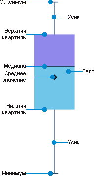

# Коробчатая диаграмма: Регламентный отчёт, веб-приложение

Коробчатая диаграмма: Регламентный отчёт, веб-приложение
-

# Коробчатая диаграмма

Коробчатая диаграмма используется
 для изучения одного или нескольких наборов данных в графическом виде.
 Данный тип диаграммы может использоваться для сравнения распределений
 между несколькими группами или наборами данных. Для каждой группы
 или набора данных вычисляется статистика центра (медиана, среднее) и статистики
 диапазона (квартили, стандартные отклонения) для различных моментов времени,
 и выбранные значения изображаются на диаграмме.

При построении диаграммы всегда используется полный набор данных. На
 диаграмме отображаются статистические характеристики набора данных, рассчитанных
 автоматически.

Коробчатая диаграмма состоит из «свечей», у каждой из которых есть «тело»
 и «усики»:

«Тело» свечи задается значениями верхней и нижней квартилей и медианой.

«Усики» свечи задаются значениями минимума и максимума:

	- нижний «усик» строится от точки минимума до нижней квартили;

	- верхний «усик» строится от верхней квартили до точки максимума.

Примечание.
 Ширина «тела» свечек рассчитывается автоматически. Ширина линий максимума
 и минимума фиксирована.

Рассмотрим пример диаграммы с отображением статистических характеристик
 набора данных, рассчитанных автоматически. Исходные данные для диаграммы
 «Динамика курса акций, долл»:

Отображение данных в виде коробчатой диаграммы:

При редактировании диаграммы доступны настройки:

	- [исходные данные](../UiDiagrams_Report_create_source.htm);

	- [общие настройки](../General_Settings.htm);

	- [ряды данных](../Data_Series.htm);

	- [легенда](../Legend.htm);

	- [оси диаграммы](../Axes.htm);

	- [подписи данных](../Data_Labels.htm);

	- [всплывающие подсказки](../Tooltips.htm);

	- [перекрытия и зазоры](../Overlap_and_gap.htm);

	- [область построения](../diagram_construction_area.htm);

	- [свойства
	 объекта](../../Objects/UiReport_Objects_StandartProperty.htm).

См. также:

[Типы диаграмм](uidiagrams_type_diagrams.htm)
 | [Визуализация данных в
 виде диаграмм](../UiReport_Diagrams_appointment.htm)

		Справочная
		 система на версию 10.9
		 от 18/08/2025,
		 © ООО «ФОРСАЙТ»,
