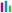
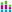
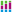

# Гистограмма: Регламентный отчёт, веб-приложение

Гистограмма: Регламентный отчёт, веб-приложение
-

# Гистограмма

Гистограмма используется для
 демонстрации изменений данных за определенный период времени или для иллюстрирования
 сравнения объектов.

На гистограмме значение каждого элемента отображается в виде горизонтального
 (вертикального) столбика, длина которого пропорциональна значению элемента.
 Для каждой из групп данных отображается свой набор столбиков, каждый ряд
 данных обозначается отдельным цветом, указанным в [легенде](../Legend.htm).

Пример отображения гистограммы с абсолютными значениями и такой же трехмерной:

Доступные типы гистограмм:

	- 
	 абсолютные значения;

	-  накопительная;

	-  процентная;

	-  накопительная с группами;

	- 
	 абсолютные значения трехмерная;

	-  накопительная трехмерная;

	-  процентная трехмерная;

	-  накопительная с группами
	 трехмерная.

При редактировании диаграммы доступны настройки:

	- [исходные данные](../UiDiagrams_Report_create_source.htm);

	- [общие настройки](../General_Settings.htm);

	- [ряды данных](../Data_Series.htm);

	- [группы рядов](../Groups.htm);

	- [легенда](../Legend.htm);

	- [оси диаграммы](../Axes.htm);

	- [подписи данных](../Data_Labels.htm);

	- [всплывающие подсказки](../Tooltips.htm);

	- [перекрытия и зазоры](../Overlap_and_gap.htm);

	- [область построения](../diagram_construction_area.htm);

	- [свойства
	 объекта](../../Objects/UiReport_Objects_StandartProperty.htm).

См. также:

[Типы
 диаграмм](uidiagrams_type_diagrams.htm) | [Визуализация
 данных в виде диаграмм](../UiReport_Diagrams_appointment.htm)

		Справочная
		 система на версию 10.9
		 от 18/08/2025,
		 © ООО «ФОРСАЙТ»,
