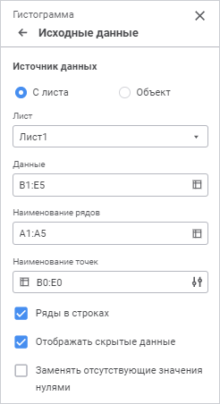
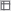
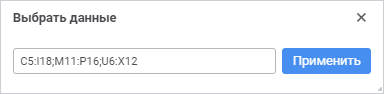
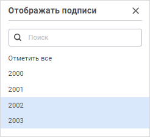
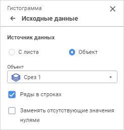
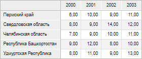
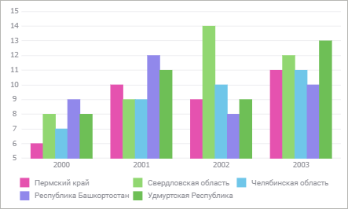
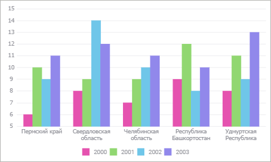
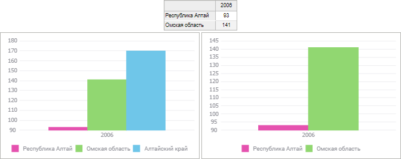

# Исходные данные: Регламентный отчёт, веб-приложение

Исходные данные: Регламентный отчёт, веб-приложение
-

# Исходные данные

Для выбора источника данных для диаграммы используйте группу параметров
 «Исходные данные» панели параметров.

При создании диаграммы группа
 параметров «Исходные данные» открывается
 автоматически.

Выберите тип источника данных, установив переключатель:

	- С листа. Исходными данными
	 для диаграммы будет выделенный диапазон ячеек;

	- Объект. Исходными данными
	 для диаграммы будет выбранный объект.

Дальнейшая настройка зависят от выбранного типа источника.

## С листа

В качестве источника данных для диаграммы используется область, расположенная
 на листе отчёта:

После установки переключателя определите следующие параметры:

[Лист](javascript:TextPopup(this))

	В раскрывающемся списке выберите лист с исходными данными.

[Данные](javascript:TextPopup(this))

	Задайте диапазон ячеек с данными для диаграммы.

Для выбора диапазона:

	- введите вручную;

	- выделите на рабочей области диапазон ячеек;

	- нажмите кнопку  «Выбрать данные». Будет открыт диалог
	 «Выбрать данные»:

Введите вручную или выделите диапазон ячеек
 на рабочей области и нажмите кнопку «Применить».

Для изменения размеров диалога наведите курсор
 на правый нижний угол и потяните его, при этом курсор примет вид двунаправленной
 стрелки.

Для выбора диапазона на другом листе:

	- откройте диалог «Выбрать
	 данные», перейдите на требуемый лист и выберите диапазон;

	- введите наименование листа в формате
	 «<наименование листа>!»,
	 затем укажите требуемый диапазон вручную.

	Диапазон ячеек может задаваться в виде комбинированной или прямоугольной
	 области. При использовании нескольких диапазонов ряды на диаграмме
	 будут отражены в порядке выделения этих диапазонов.

[Наименование
 рядов](javascript:TextPopup(this))

	Задайте диапазон ячеек с наименованиями рядов. Указанные наименования
	 будут отображаться в легенде.

Для выбора диапазона:

	- введите вручную;

	- выделите на рабочей области диапазон ячеек;

	- нажмите кнопку  «Выбрать данные». Будет открыт диалог
	 «Выбрать данные»:

Введите вручную или выделите диапазон ячеек
 на рабочей области и нажмите кнопку «Применить».

Для изменения размеров диалога наведите курсор
 на правый нижний угол и потяните его, при этом курсор примет вид двунаправленной
 стрелки.

Для выбора диапазона на другом листе:

	- откройте диалог «Выбрать
	 данные», перейдите на требуемый лист и выберите диапазон;

	- введите наименование листа в формате
	 «<наименование листа>!»,
	 затем укажите требуемый диапазон вручную.

	Если диапазон наименований задан в виде открытого диапазона, весь
	 столбец или строка, то для наименования ряда будет использовано значение
	 в ячейке, находящейся на пересечении диапазона данных и диапазона
	 наименований рядов. Если для построения диаграммы используется нескольких
	 диапазонов, то диапазоны наименований рядов необходимо указывать в
	 том же порядке, что и выделение данных.

	Примечание.
	 Для [каскадной диаграммы](Type_diagrams/WaterFall_chart.htm) в
	 легенде отображаются предопределенные названия: «Увеличить»,
	 «Уменьшить» и «Итог».

	При задании диапазона ячеек с наименованиями рядов учитывайте следующие
	 особенности:

		- [легенда диаграммы](Legend.htm) не будет отображаться,
		 если в заданном диапазоне наименований рядов отсутствует хотя
		 бы одно значение.

[Наименование
 точек](javascript:TextPopup(this))

	Задайте диапазон ячеек с наименованиями точек. Указанные наименования
	 будут отображены на горизонтальной оси диаграммы, если она присутствует.

Для выбора диапазона:

	- введите вручную;

	- выделите на рабочей области диапазон ячеек;

	- нажмите кнопку  «Выбрать данные». Будет открыт диалог
	 «Выбрать данные»:

Введите вручную или выделите диапазон ячеек
 на рабочей области и нажмите кнопку «Применить».

Для изменения размеров диалога наведите курсор
 на правый нижний угол и потяните его, при этом курсор примет вид двунаправленной
 стрелки.

Для выбора диапазона на другом листе:

	- откройте диалог «Выбрать
	 данные», перейдите на требуемый лист и выберите диапазон;

	- введите наименование листа в формате
	 «<наименование листа>!»,
	 затем укажите требуемый диапазон вручную.

	Если диапазон наименований задан в виде открытого диапазона, весь
	 столбец или строка, то для наименования точки будет использовано значение
	 в ячейке, находящейся на пересечении диапазона данных и диапазона
	 наименований точек.

	При задании диапазона ячеек с наименованиями точек учитывайте следующие
	 особенности:

		- подпись точки не будет отображаться на диаграмме, если соответствующая
		 ячейка диапазона наименований точек не содержит значения (пуста);

		- при использовании [каскадной
		 диаграммы](Type_diagrams/WaterFall_chart.htm) в поле «Наименование
		 точек» указываются столбцы, которые будут располагаться
		 по оси категорий (X).

	Для настройки отображения подписей точек нажмите кнопку  «Настроить».
	 В результате будет открыта панель «Отображать
	 подписи»:

	

	Примечание.
	 Кнопка  «Настроить»
	 доступна, если введён корректный диапазон ячеек «Наименование
	 точек».

	На панели находится список наименований точек с учётом параметров,
	 установленных в группе параметров «Исходные
	 данные».

	Выделите наименования точек, подписи к которым должны быть отображены
	 на оси категорий. Для установки всех отметок нажмите кнопку «Отметить все», в результате чего
	 кнопка будет выделена. Для снятия всех отметок снимите выделение с
	 кнопки «Отметить все».

	Для выбранных точек доступна настройка [подсказок](Tooltips.htm)
	 и [подписей данных](Data_Labels.htm).

	Для быстрого поиска точки введите её наименование частично или полностью
	 в строку поиска в верхней части панели «Отображать
	 подписи».

## Объект

При установленном переключателе в качестве источника данных для диаграммы
 используется имеющаяся таблица:

После установки переключателя определите следующие параметры:

[Объект](javascript:TextPopup(this))

	В раскрывающемся списке выберите срез, который будет служить источником
	 данных для диаграммы.

## Параметры данных диаграммы

После задания параметров, связанных с источником данных, определите
 параметры данных диаграммы:

[Ряды
 в строках](javascript:TextPopup(this))

	Задайте способ интерпретации числовых рядов для указанной области
	 данных.

	Установите флажок «Ряды в строках»
	 для построчного формирования массива значений для ряда данных на диаграмме.
	 При снятии флажка массив формируется из значений по столбцам.

	Для примера использования флажка «Ряды
	 в строках» построим гистограмму. В качестве исходных данных
	 используем «Объём продукции по регионам,
	 млн. руб.»:

	

	Отображение гистограммы при расположении рядов в строках:

	

	Отображение гистограммы при расположении рядов в столбцах:

	

[Отображать
 скрытые данные](javascript:TextPopup(this))

	При установленном флажке «Отображать
	 скрытые данные» появляется возможность отображать на диаграмме
	 все значения области данных, в том числе данные скрытых строк/столбцов
	 и данные строк/столбцов, высота/ширина которых равна нулю. Если флажок
	 снят, то диаграмма будет построена только по видимой области данных.
	 По умолчанию флажок установлен. Данный флажок недоступен, если
	 в качестве источника диаграммы используется срез.

	Ниже приведён пример диаграммы области данных, часть строк которой
	 скрыта, с установленным (слева) и со снятым (справа) флажком:

	

[Заменять
 отсутствующие значения нулями](javascript:TextPopup(this))

	При установленном флажке «Заменять
	 отсутствующие значения нулями» отсутствующие значения автоматически
	 заменяются нулями. При снятом флажке промежутки, содержащие отсутствующие
	 значения, отображаются пунктиром, соединяя два ближайших имеющихся
	 значения.

См. также:

[Визуализация
 данных в виде диаграмм](UiReport_Diagrams_appointment.htm) | Создание
 диаграммы

		Справочная
		 система на версию 10.9
		 от 18/08/2025,
		 © ООО «ФОРСАЙТ»,
