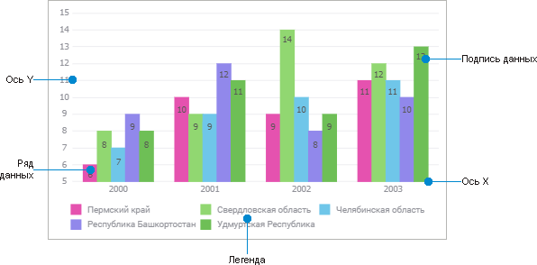
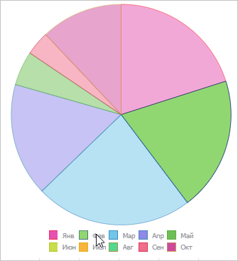
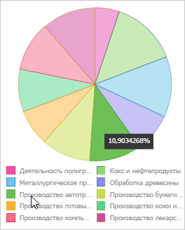
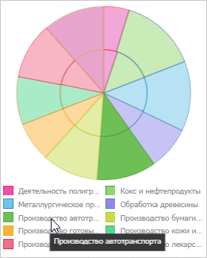
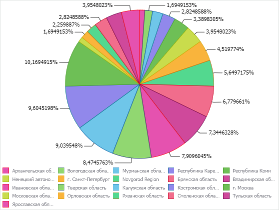
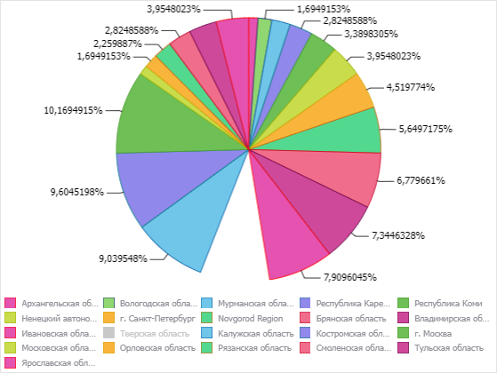

# Визуализация данных в виде диаграмм: Регламентный отчёт, веб-приложение

Визуализация данных в виде диаграмм: Регламентный отчёт, веб-приложение
-

# Визуализация данных в виде диаграмм

Диаграмма представляет собой
 форму графического отображения табличных данных и предназначена для их
 наглядного изображения.

## Структура диаграммы

Диаграмма состоит из набора элементов, каждый из которых обладает
 определенным набором параметров.

Элементы диаграммы:

	- Область диаграммы. Включает
	 в себя все элементы диаграммы.

	- Оси. Служат для упорядочивания
	 данных на диаграмме.

	- Ряды данных. Содержит
	 набор значений, на основе которых строится диаграмма.

	- Подписи данных. Содержат
	 сведения о рядах или отдельных точках данных.

	- Легенда. Содержит названия
	 и маркеры данных на диаграмме.

Диаграмма сохраняет связь с данными, то есть любые изменения данных
 в таблице приведут к перерисовке диаграммы с учетом этих изменений.

## Создание диаграммы

Для создания диаграммы выполните одно из действий:

	- с помощью механизма Drag&Drop:

		- Наведите курсор на нужный источник/срез. Курсор примет вид
		 указателя .

		- Переместите источник/срез в рабочую область. Левая верхняя
		 граница выбранной ячейки будет левой верхней границей таблицы
		 или диаграммы, построенной на основе созданного среза.

Примечание.
 При перемещении источника в рабочую область будет автоматически добавлен
 новый срез.

		- В меню выбора укажите  «Диаграмма>
		 <Тип
		 диаграммы>».

	- с помощью контекстного меню:

		- Выделите пустую ячейку на листе отчёта. Левая верхняя граница
		 выделенной ячейки будет левой верхней границей таблицы или диаграммы,
		 построенной на основе требуемого среза данных.

		- Выполните одно из действий:

			- выполните команду «Добавить > Диаграмму > <Тип диаграммы>» в контекстном меню
			 [источника данных](../Source/UiReport_Source.htm)
			 на панели «Источники».
			 Для источника будет создан новый срез данных, на основе которого
			 на листе отчёта будет сформирована диаграмма;

			- выполните команду «Добавить > Диаграмму > <Тип диаграммы>» в контекстном меню
			 среза данных на панели «Источники»;

			- выполните команду «Добавить диаграмму > <Тип диаграммы>» в контекстном меню
			 таблицы на панели «Источники».

Примечание.
 При добавлении диаграммы через контекстное меню таблицы диаграмма будет
 построена поверх выбранной таблицы.

После выполнения одного из действий:

	- на лист будет добавлена диаграмма выбранного типа;

	- на боковой панели «Источники»
	 добавится диаграмма с наименованием по умолчанию «Диаграмма
	 N», где N - порядковый номер диаграммы;

	- открыта группа параметров «[Исходные
	 данные](UiDiagrams_Report_create_source.htm)» панели параметров.

## Основные операции, доступные для диаграммы

[Изменение типа
 диаграммы](javascript:TextPopup(this))

	Для изменения [типа
	 диаграммы](Type_diagrams/uidiagrams_type_diagrams.htm) выберите тип диаграммы в контекстном меню объекта «Диаграмма» на [боковой
	 панели](../organizational_management/Starting.htm#structure_window) «Источники». Меню
	 содержит пункты, соответствующие различным типам диаграмм.

	Диаграмма будет перестроена в соответствии с выбранным типом.

[Переименование
 диаграммы](javascript:TextPopup(this))

	Для переименования диаграммы выполните команду «Переименовать»
	 контекстного меню объекта «Диаграмма»
	 на [боковой
	 панели](../organizational_management/Starting.htm#structure_window) «Источники».

	После выполнения команды поле с наименование объекта станет активным.
	 Введите в поле новое наименование диаграммы.

[Настройка общих
 свойств диаграммы](javascript:TextPopup(this))

	Для настройки общих свойств диаграммы используйте группу параметров
	 «[Общие настройки](General_Settings.htm)»
	 панели параметров.

[Удаление диаграммы](javascript:TextPopup(this))

	Для удаления диаграммы выполните команду «Удалить»
	 контекстного меню объекта «Диаграмма»
	 на [боковой
	 панели](../organizational_management/Starting.htm#structure_window) «Источники».

	Будет запрошено подтверждение выполняемого действия.

Для работы с диаграммами, как с
 объектами на листе отчёта, смотрите статью «[Работа с объектами
 на листе отчёта](../Objects/UiReport_Objects_Operation.htm)».

## Работа с элементами диаграммы

[Настройка рядов
 данных](javascript:TextPopup(this))

	Для настройки рядов данных используйте группу параметров «[Ряды данных](Data_Series.htm)» боковой панели.

[Настройка групп
 рядов](javascript:TextPopup(this))

	Для настройки групп рядов используйте группу параметров «[Группы рядов](Groups.htm)» боковой панели.

[Настройка
 точки ряда](javascript:TextPopup(this))

	Для настройки точки ряда данных используйте группу параметров «[Формат
	 точки ряда данных](Data_Series_Point.htm)» боковой панели.

[Настройка легенды](javascript:TextPopup(this))

	Для настройки расположения и оформления легенды используйте группу
	 параметров «[Легенда](Legend.htm)»
	 боковой панели.

[Настройка оси
 категорий](javascript:TextPopup(this))

	Для настройки оси категорий диаграммы используйте группу параметров
	 «[Ось категорий (X)](Axes.htm)»
	 боковой панели.

[Настройка оси
 значений](javascript:TextPopup(this))

	Для настройки оси значений диаграммы используйте группу параметров
	 «[Ось значений (Y)](Axes.htm)»
	 боковой панели.

[Настройка дополнительной
 оси значений](javascript:TextPopup(this))

	Для настройки дополнительной оси значений диаграммы используйте
	 группу параметров «[Ось
	 значений дополнительная](Axes.htm)» боковой панели.

[Настройка подписей
 данных](javascript:TextPopup(this))

	Для отображения/скрытия подписей данных используйте группу параметров
	 «[Подписи данных](Data_Labels.htm)»
	 боковой панели.

[Настройка
 линий уровня](javascript:TextPopup(this))

	Для настройки линий уровня используйте группу параметров «[Линии уровня](Level_Lines.htm)» боковой панели.

[Настройка коридоров
 диаграммы](javascript:TextPopup(this))

	Для настройки коридоров диаграммы используйте группу параметров
	 «[Коридоры
	 диаграммы](corridors.htm)» боковой панели.

[Настройка всплывающих
 подсказок](javascript:TextPopup(this))

	Для настройки всплывающих подсказок используйте группу параметров
	 «[Всплывающие
	 подсказки](Tooltips.htm)» боковой панели.

[Настройка перекрытий
 и зазоров](javascript:TextPopup(this))

	Для настройки перекрытий и зазоров используйте группу параметров
	 «[Перекрытия
	 и зазоры](Overlap_and_gap.htm)» боковой панели.

[Настройка области
 построения](javascript:TextPopup(this))

	Для настройки области построения используйте группу параметров «[Область
	 построения](diagram_construction_area.htm)» боковой панели.

## Работа с данными диаграммы

[Активация
 диаграммы](javascript:TextPopup(this))

	Для активации диаграммы выполните действие, заданное в группе параметров
	 «[Свойства
	 объекта](../Objects/UiReport_Objects_StandartProperty.htm#activation)».

[Просмотр подсветки
 ряда данных диаграммы](javascript:TextPopup(this))

	Для отображения цветовой индикации ряда данных диаграммы:

		- [Активируйте
		 диаграмму](UiReport_Diagrams_appointment.htm#diagram_activation).

		- Наведите курсор на ряд данных в легенде или в области данных:

	

	Примечание.
	 При необходимости просмотра информации о ряде данных используйте [всплывающие подсказки](UiReport_Diagrams_appointment.htm#light).

[Просмотр
 всплывающих подсказок ряда данных диаграммы](javascript:TextPopup(this))

	Примечание.
	 Доступно для всех типов диаграмм, кроме [каскадной](Type_diagrams/WaterFall_chart.htm).

	Для просмотра всплывающих подсказок ряда данных:

		- [Активируйте
		 диаграмму](UiReport_Diagrams_appointment.htm#diagram_activation).

		- Наведите курсор на ряд данных в легенде или в области данных.

	Возможные варианты отображения вплывающих подсказок при наведении
	 на ряд данных в области легенды:

		- отображается значение точки ряда данных, если ряд данных
		 состоит из [одной точки ряда](Data_Series_Point.htm):

	

		- отображается наименование ряда данных, если ряд данных состоит
		 из [нескольких точек ряда](Data_Series_Point.htm):

	

	Примечание.
	 Для отображения всплывающих подсказок диаграммы установите флажок
	 «[Подсказки](Tooltips.htm)»
	 и выполните необходимые настройки.

[Детализация
 и обобщение данных рядов](javascript:TextPopup(this))

	Детализация данных - операция, позволяющая переходить по уровням
	 данных: от общих до детализированных. Доступная глубина детализации
	 определяется иерархией измерений источника данных.

	Обобщение - операция обратная детализации, позволяющая переходить
	 от детализированных данных к общим.

	Примечание.
	 Детализация недоступна для рядов диаграммы, соответствующих вычисляемым
	 значениям.

	Для детализации/обобщения данных:

		- [Активируйте
		 диаграмму](UiReport_Diagrams_appointment.htm#diagram_activation).

		- Выполните команду «Детализировать»/«Обобщить» в контекстном меню
		 ряда данных.

	Смените отметку вручную на [панели
	 отметки](../Reports/Visualization.htm#selection_panel), если при детализации/обобщении на выбранном уровне отсутствуют
	 данные.

[Исключение
 и включение рядов из диаграммы с сохранением отметки в измерении](javascript:TextPopup(this))

	Для исключения ряда из диаграммы:

		- [Активируйте
		 диаграмму](UiReport_Diagrams_appointment.htm#diagram_activation).

		- Щёлкните по маркеру ряда в легенде диаграммы. Маркер ряда
		 изменит индикацию. Выбранный ряд не будет отображаться в области
		 построения диаграммы, при этом:

		- ряд будет отображаться в легенде в виде маркера с подписью;

		- для элементов, соответствующих исключенному ряду, будут
		 сохранены отметки в измерении.

	Для включения ряда данных:

		- [Активируйте
		 диаграмму](UiReport_Diagrams_appointment.htm#diagram_activation).

		- Щёлкните по маркеру, исключённого ряда, в легенде диаграммы.

	Например, на диаграмме слева отображаются все ряды, на диаграмме
	 справа был исключён ряд «Тверская
	 обасть»:

	

См. также:

[Визуализация
 данных на листе отчёта](../Reports/Visualization.htm)

		Справочная
		 система на версию 10.9
		 от 18/08/2025,
		 © ООО «ФОРСАЙТ»,
