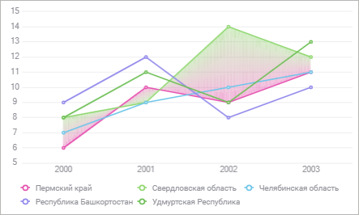
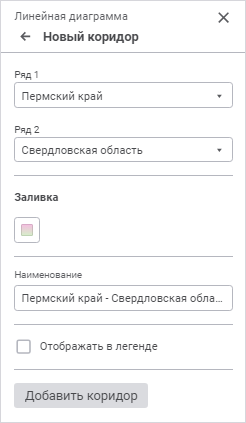

# Коридоры диаграммы: Регламентный отчёт, веб-приложение

Коридоры диаграммы: Регламентный отчёт, веб-приложение
-

# Коридоры диаграммы

Коридор диаграммы - выделенная часть [области
 построения](UiReport_Diagrams_appointment.htm), находящаяся между двумя рядами [линейной
 диаграммы](Type_diagrams/UiDiagrams_lenear.htm). Доступно создание нескольких коридоров.

Пример коридора с заливкой двухцветным градиентом:

Для настройки параметров коридоров линейной диаграммы используйте группу
 параметров «Коридоры диаграммы»
 на панели параметров.

[Для открытия
 группы параметров «Коридоры диаграммы»](javascript:TextPopup(this))

	Для открытия группы параметров «Коридоры
	 диаграммы» выделите [линейную
	 диаграмму](Type_diagrams/UiDiagrams_lenear.htm) и нажмите кнопку 
	 «Параметры» панели инструментов,
	 затем выберите требуемую группу.

Откройте панель настроек коридора, нажав кнопку «Добавить
 коридор» для добавления нового коридора или дважды щёлкнув по уже
 существующему коридору для его редактирования:

Задайте параметры:

	- Ряды. Выберите первый
	 и второй ряды коридора в раскрывающихся списках «Ряд
	 1» и «Ряд 2» соответственно;

	- Заливка. В раскрывающейся
	 палитре выберите способ заливки коридора:

		- Сплошная
		 заливка. Откройте вкладку «Один
		 цвет» и выберите цвет однотонной заливки коридора. При
		 необходимости укажите процент непрозрачности заливки;

		- Двухцветная
		 заливка. По умолчанию. Откройте вкладку «Два
		 цвета» и выберите начальный и конечный цвета двухцветного
		 градиента. При необходимости укажите процент непрозрачности заливки.

Для выбора доступны стандартные и пользовательские цвета. По умолчанию
 палитра содержит только стандартные цвета.

Для создания пользовательского цвета:

	- Нажмите кнопку  «Добавить
	 цвет». Откроется расширенная палитра цветов.

	- Выберите цвет в расширенной палитре цветов, на странице браузера
	 с помощью пипетки или задайте код цвета в формате RGB/HEX.

После выполнения действий пользовательский цвет будет создан и добавлен
 в палитру.

Примечание.
 Максимально возможное количество пользовательских цветов в палитре равно
 23.

Для удаления пользовательского цвета из палитры выполните команду «Удалить» контекстного меню выбранного
 цвета.

	- Наименование. Задайте
	 наименование коридора, которое будет отображаться в легенде;

	- Отображать в легенде.
	 Установите флажок для отображения коридора в легенде.

Нажмите кнопку «Добавить коридор»
 для сохранения настроек нового коридора и добавления его на диаграмму.

Примечание.
 При редактировании уже существующего коридора кнопка «Добавить
 коридор» недоступна. Сохранение изменённых настроек коридора происходит
 автоматически.

Для удаления коридора наведите на него курсор и нажмите кнопку  «Удалить».

См. также:

[Визуализация
 данных в виде диаграмм](UiReport_Diagrams_appointment.htm)

		Справочная
		 система на версию 10.9
		 от 18/08/2025,
		 © ООО «ФОРСАЙТ»,
