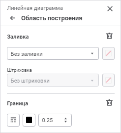

# Область построения: Регламентный отчёт, веб-приложение

Область построения: Регламентный отчёт, веб-приложение
-

# Область построения

Область построения - это часть [области
 диаграммы](UiReport_Diagrams_appointment.htm), на которой располагаются ряды данных.

Для настройки параметров области построения диаграммы используйте группу
 параметров «Область построения»
 на панели параметров.

Примечание.
 Настройка доступна для всех типов диаграмм, кроме [круговой](Type_diagrams/UiDiagrams_round.htm).

[Для открытия
 группы параметров «Область построения»](javascript:TextPopup(this))

	Для открытия группы параметров «Область
	 построения» выделите диаграмму и нажмите кнопку  «Параметры»
	 панели инструментов, затем выберите требуемую группу.

Задайте параметры:

	- [заливка](#fill);

	- [граница](#border).

## Заливка

Для настройки фона области построения выберите тип заливки в раскрывающемся
 списке:

	- Без заливки. По умолчанию.
	 Заливка не используется;

	- Сплошная заливка. Выберите
	 в раскрывающейся палитре цвет однотонной заливки области построения.
	 При необходимости укажите процент непрозрачности заливки;

	- Двухцветная заливка.
	 Выберите в раскрывающейся палитре начальный и конечный цвета двухцветного
	 градиента. При необходимости укажите угол наклона и процент непрозрачности
	 заливки;

	- Чередование цветов.
	 Выберите в раскрывающейся палитре первый и второй цвета, которые будут
	 чередоваться снизу вверх, начиная с первого цвета. При необходимости
	 укажите процент непрозрачности заливки;

	- Заливка со штриховкой.
	 Выполните действия:

		- Выберите цвет однотонной заливки в раскрывающейся палитре.
		 При необходимости укажите процент непрозрачности заливки и цвета
		 штриховки.

		- Выберите образец текстуры в раскрывающемся списке «Штриховка».

		- Выберите цвет штриховки в раскрывающейся палитре.

В раскрывающейся палитре для выбора доступны стандартные и пользовательские
 цвета. По умолчанию палитра содержит только стандартные цвета.

Для создания пользовательского цвета:

	- Нажмите кнопку  «Добавить
	 цвет». Откроется расширенная палитра цветов.

	- Выберите цвет в расширенной палитре цветов, на странице браузера
	 с помощью пипетки или задайте код цвета в формате RGB/HEX.

После выполнения действий пользовательский цвет будет создан и добавлен
 в палитру.

Примечание.
 Максимально возможное количество пользовательских цветов в палитре равно
 23.

Для удаления пользовательского цвета из палитры выполните команду «Удалить» контекстного меню выбранного
 цвета.

Для сброса заданных настроек заливки нажмите кнопку  «Удалить».

## Граница

Для настройки границы области построения задайте:

	- Тип линии. Выберите
	 тип линии из раскрывающегося списка;

	- Цвет линии. Выберите
	 цвет линии в раскрывающейся палитре. Для выбора доступны стандартные
	 и пользовательские цвета. По умолчанию палитра содержит только стандартные
	 цвета.

Для создания пользовательского цвета:

		- Нажмите кнопку  «Добавить
		 цвет». Откроется расширенная палитра цветов.

		- Выберите цвет в расширенной палитре цветов, на странице
		 браузера с помощью пипетки или задайте код цвета в формате RGB/HEX.

После выполнения действий пользовательский
 цвет будет создан и добавлен в палитру.

Примечание.
 Максимально возможное количество пользовательских цветов в палитре равно
 23.

Для удаления пользовательского цвета из палитры
 выполните команду «Удалить» контекстного
 меню выбранного цвета.

	- Толщина линии. Задайте
	 требуемую толщину линии с помощью клавиатуры или редактора чисел.

Для сброса заданных настроек границы нажмите кнопку  «Удалить».

См. также:

[Визуализация
 данных в виде диаграмм](UiReport_Diagrams_appointment.htm)

		Справочная
		 система на версию 10.9
		 от 18/08/2025,
		 © ООО «ФОРСАЙТ»,
