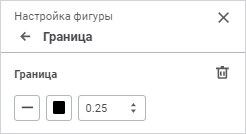

# Настройка границ фигур: Регламентный отчёт, веб-приложение

Настройка границ фигур: Регламентный отчёт, веб-приложение
-

# Настройка границ фигур

Для настройки границ фигур используйте группу параметров «Граница»
 [панели
 параметров](../../organizational_management/Starting.htm#structure_window):

[Для открытия
 группы параметров «Граница»](javascript:TextPopup(this))

	Для открытия на панели параметров группы параметров «Свойства
	 объекта»:

		- Выделите фигуру, относящуюся к типу «Прямоугольники»/«Правильные многоугольники»,
		 на листе отчёта.

		- Нажмите кнопку 
		 «Параметры» панели инструментов.

		- Перейдите на группу параметров «Граница»
		 в открывшейся панели параметров.

Задайте параметры:

	- Стиль. Укажите стиль
	 начертания границы. По умолчанию используются сплошные линии;

	- Цвет. Выберите в раскрывающейся
	 палитре цвет границы.

Для выбора доступны стандартные и пользовательские цвета. По умолчанию
 палитра содержит только стандартные цвета.

Для создания пользовательского цвета:

	- Нажмите кнопку  «Добавить
	 цвет». Откроется расширенная палитра цветов.

	- Выберите цвет в расширенной палитре цветов, на странице браузера
	 с помощью пипетки или задайте код цвета в формате RGB/HEX.

После выполнения действий пользовательский цвет будет создан и добавлен
 в палитру.

Примечание.
 Максимально возможное количество пользовательских цветов в палитре равно
 23.

Для удаления пользовательского цвета из палитры выполните команду «Удалить» контекстного меню выбранного
 цвета.

Для изменения непрозрачности цвета используйте
 бегунок или введите значение в процентах при необходимости.

Для сброса цвета границы нажмите кнопку  «Без цвета».

	- Толщина. Укажите толщину
	 границ. Если толщина равна нулю, то граница не отображается.

Для сброса заданных настроек нажмите кнопку  «Удалить».

См. также:

[Фигуры](Shapes.htm)

		Справочная
		 система на версию 10.9
		 от 18/08/2025,
		 © ООО «ФОРСАЙТ»,
