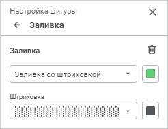

# Настройка заливки фигур: Регламентный отчёт, веб-приложение

Настройка заливки фигур: Регламентный отчёт, веб-приложение
-

# Настройка заливки фигур

Для настройки заливки фигур используйте группу параметров «Заливка»
 [панели
 параметров](../../organizational_management/Starting.htm#structure_window):

[Для открытия
 группы параметров «Заливка»](javascript:TextPopup(this))

	Для открытия на панели параметров группы параметров «Свойства
	 объекта»:

		- Выделите фигуру, относящуюся к типу «Прямоугольники»/«Правильные многоугольники»,
		 на листе отчёта.

		- Нажмите кнопку 
		 «Параметры» панели инструментов.

		- Перейдите на группу параметров «Заливка»
		 в открывшейся панели параметров.

Выберите тип заливки в раскрывающемся списке «Заливка»:

	- Без заливки. Заливка
	 фигуры не будет использоваться;

	- Сплошная заливка. Выберите
	 в раскрывающейся палитре цвет заливки. При необходимости укажите процент
	 непрозрачности заливки;

	- Двухцветная заливка.
	 Укажите в раскрывающихся палитрах начальный и конечный цвета градиента.
	 При необходимости укажите процент непрозрачности заливки;

	- Заливка со штриховкой.
	 Выполните действия:

		- Выберите цвет однотонной заливки в раскрывающейся палитре.
		 При необходимости укажите процент непрозрачности заливки.

		- Выберите образец текстуры в раскрывающемся списке «Штриховка».

		- Выберите цвет штриховки в раскрывающейся палитре. При необходимости
		 укажите процент непрозрачности цвета штриховки.

Если штриховка не выбрана или цвет заливки
 и цвет штриховки совпадают, то фон ячейки однородный.

В раскрывающейся палитре для выбора доступны стандартные и пользовательские
 цвета. По умолчанию палитра содержит только стандартные цвета.

Для создания пользовательского цвета:

	- Нажмите кнопку  «Добавить
	 цвет». Откроется расширенная палитра цветов.

	- Выберите цвет в расширенной палитре цветов, на странице браузера
	 с помощью пипетки или задайте код цвета в формате RGB/HEX.

После выполнения действий пользовательский цвет будет создан и добавлен
 в палитру.

Примечание.
 Максимально возможное количество пользовательских цветов в палитре равно
 23.

Для удаления пользовательского цвета из палитры выполните команду «Удалить» контекстного меню выбранного
 цвета.

Для сброса заданных настроек нажмите кнопку  «Удалить».

См. также:

[Фигуры](Shapes.htm)

		Справочная
		 система на версию 10.9
		 от 18/08/2025,
		 © ООО «ФОРСАЙТ»,
