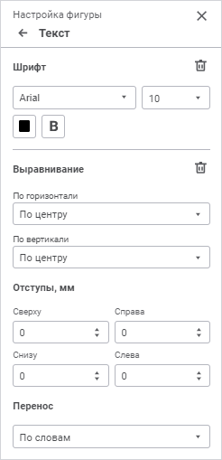

# Настройка текста фигур: Регламентный отчёт, веб-приложение

Настройка текста фигур: Регламентный отчёт, веб-приложение
-

# Настройка текста фигур

Для настройки текста фигур используйте группу параметров «Текст»
 [панели
 параметров](../../organizational_management/Starting.htm#structure_window):

[Для открытия
 группы параметров «Текст»](javascript:TextPopup(this))

	Для открытия на панели параметров группы параметров «Свойства
	 объекта»:

		- Выделите фигуру, относящуюся к типу «Прямоугольники»/«Правильные многоугольники»,
		 на листе отчёта.

		- Нажмите кнопку 
		 «Параметры» панели инструментов.

		- Перейдите на группу параметров «Текст»
		 в открывшейся панели параметров.

Задайте параметры:

[Шрифт](javascript:TextPopup(this))

	Для настройки оформления шрифта выполните необходимые настройки:

		- Шрифт. Выберите
		 один из доступных стилей шрифта в раскрывающемся списке. При необходимости
		 можно загрузить [пользовательские
		 шрифты](Setup.chm::/UiWebSetup/03_Setup_Web/General_for_linux/Loading_Custom_Fonts.htm);

		- Размер шрифта. Выберите
		 требуемый размер шрифта из раскрывающегося списка. Диапазон допустимых
		 значений: [6; 36];

	- Цвет. Выберите цвет
	 шрифта в раскрывающейся палитре. Для выбора доступны стандартные и
	 пользовательские цвета. По умолчанию палитра содержит только стандартные
	 цвета.

Для создания пользовательского цвета:

		- Нажмите кнопку  «Добавить
		 цвет». Откроется расширенная палитра цветов.

		- Выберите цвет в расширенной палитре цветов, на странице
		 браузера с помощью пипетки или задайте код цвета в формате RGB/HEX.

После выполнения действий пользовательский
 цвет будет создан и добавлен в палитру.

Примечание.
 Максимально возможное количество пользовательских цветов в палитре равно
 23.

Для удаления пользовательского цвета из палитры
 выполните команду «Удалить» контекстного
 меню выбранного цвета.

		- Начертание. Выберите
		 начертание шрифта из раскрывающегося списка:

			- B. Жирное начертание;

			- I.
			 Курсивное начертание;

			- U.
			 Подчеркивание текста;

			- S.
			 Зачеркивание текста.

	При нажатой кнопке будет использоваться
	 соответствующий стиль начертания. Доступно использование нескольких
	 стилей одновременно, например, нажатие кнопок «B»
	 и «I»
	 даёт жирное курсивное начертание.

	Для сброса заданных настроек нажмите кнопку 
	 «Удалить».

[Выравнивание](javascript:TextPopup(this))

	Для настройки расположения текста внутри фигур выполните необходимые
	 настройки:

		- Выравнивание. Задайте
		 способ выравнивания значений:

			- По
			 горизонтали. Возможные варианты:

				- По левому краю.
				 Текст прижимается к левой границе фигуры;

				- По центру.
				 Текст размещается на равном расстоянии от левой и правой
				 границ фигуры с учётом заданных отступов;

				- По правому краю.
				 Текст прижимается к правой границе фигуры;

			- По
			 вертикали. Возможные варианты:

				- По верхнему краю.
				 Текст прижимается к верхней границе фигуры;

				- По центру.
				 Текст размещается на равном расстоянии от верхней и нижней
				 границ фигуры с учётом заданных отступов;

				- По нижнему краю.
				 Текст прижимается к нижней границе фигуры;

		- Перенос. Задайте
		 способ переноса текста в фигуре:

			- Не переносить.
			 Перенос производиться не будет. Весь текст располагается в
			 одну строку;

			- По словам. Текст
			 фигуры будет переноситься по словам. Расположение переноса
			 определяется шириной фигуры и отступами.

	Для сброса всех заданных настроек нажмите кнопку 
	 «Удалить».

[Отступы](javascript:TextPopup(this))

	Задайте отступы содержимого от границ фигуры: в каждом поле задайте
	 размер отступа от соответствующей границы фигуры;

[Перенос](javascript:TextPopup(this))

	Задайте способ переноса текста в фгуре:

		- Не переносить. Перенос
		 производиться не будет. Весь текст располагается в одну строку;

		- По словам. Текст
		 ячейки будет переноситься по словам. Расположение переноса определяется
		 шириной фигуры.

См. также:

[Фигуры](Shapes.htm)

		Справочная
		 система на версию 10.9
		 от 18/08/2025,
		 © ООО «ФОРСАЙТ»,
