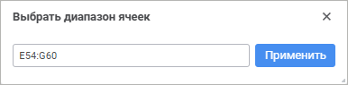

# Работа с объектами на листе отчёта: Регламентный отчёт, веб-приложение

Работа с объектами на листе отчёта: Регламентный отчёт, веб-приложение
-

# Работа с объектами на листе отчёта

При работе с объектами [любого типа](UiReport_Objects.htm)
 на листе отчёта доступны следующие операции:

[Добавление
 объекта](javascript:TextPopup(this))

	Для добавления объекта на лист регламентного отчёта выберите необходимый
	 [тип объекта](UiReport_Objects.htm) в раскрывающемся меню
	 команды «Вставка» [главного
	 меню](../organizational_management/Starting.htm#structure_window) или на вкладке «Вставка»
	 [панели
	 инструментов](../organizational_management/Starting.htm#structure_window).

[Выбор
 нескольких объектов](javascript:TextPopup(this))

	Для выделения нескольких объектов удерживайте зажатой клавишу CTRL.

[Копирование,
 вставка и вырезание объекта](javascript:TextPopup(this))

	При работе с объектами в инструменте «Отчёты»
	 доступны операции копирования, вставки и вырезания:

		- используя сочетание клавиш, выполните действие:

			- для копирования объекта. Выделите объект щелчком мыши
			 и нажмите сочетание клавиш CTRL+C. Доступна возможность копирования
			 одновременно нескольких выделенных объектов для их последующей
			 вставки;

			- для вставки объекта. Выделите ячейку или диапазон ячеек
			 на листе отчёта и нажмите сочетание клавиш CTRL+V. При вставке
			 скопированных групп объектов относительное позиционирование
			 объектов в группе сохраняется. Скопированные объекты вставляются
			 в позицию выделенного диапазона ячеек таким образом, что позиция
			 левого верхнего угла вставляемой области совпадает с левым
			 верхним углом активной ячейки;

			- для вырезания объекта. Выделите объект щелчком мыши
			 и нажмите сочетание клавиш CTRL+X. Объект будет перемещён
			 в буфер обмена;

		- используя контекстное меню, выполните действие:

			- для копирования объекта. Выполните команду  «Копировать»
			 контекстного меню выделенной фигуры. Доступна возможность
			 копирования одновременно нескольких выделенных объектов для
			 их последующей вставки;

			- для вырезания объекта. Выполните команду  «Вырезать»
			 контекстного меню выделенной фигуры. Объект будет перемещён
			 в буфер обмена;

		- используя кнопки вкладки «Главная»
		 панели инструментов:

			- для копирования объекта. Для выделенной фигуры нажмите
			 кнопку  «Копировать»
			 вкладки «Главная»
			 панели инструментов. Доступна возможность копирования одновременно
			 нескольких выделенных объектов для их последующей вставки;

			- для вырезания объекта. Для выделенной фигуры нажмите
			 кнопку  «Вырезать»
			 вкладки «Главная»
			 панели инструментов. Объект будет перемещён в буфер обмена.

[Поворот
 объекта](javascript:TextPopup(this))

	Поворот доступен для фигур и изображений.

	Для поворота выделенных объектов выполните одно из действий:

		- зажмите кнопку  «Повернуть»
		 около выделенного объекта и передвигайте мышь влево или вправо;

	Примечание.
	 Кнопка 
	 «Повернуть» доступна только
	 для одного выделенного объекта.

		- задайте угол поворота в соответствующем поле группы параметров
		 «[Свойства
		 объекта](UiReport_Objects_StandartProperty.htm)» панели параметров.

[Настройка
 свойств объекта](javascript:TextPopup(this))

	Для настройки печати, прозрачности, размеров и положения объекта
	 используйте группу параметров «[Свойства
	 объекта](UiReport_Objects_StandartProperty.htm)» панели параметров.

	Для изменения размеров и положения объектов также можно использовать
	 механизм Drag&Drop:

		- для изменения размеров объекта выделите его, наведите курсор
		 мыши на точку изменения размера, переместите точку с помощью механизма
		 Drag&Drop для получения требуемого размера объекта;

		- для изменения положения одного или нескольких объектов выделите
		 их и переместите с помощью механизма Drag&Drop. Для перемещения
		 одного или нескольких объектов строго по горизонтали или по вертикали
		 дополнительно зажмите клавишу SHIFT.

[Настройка
 порядка расположения объекта](javascript:TextPopup(this))

	Для настройки порядка размещения объекта на листе отчёта выполните
	 команду «Порядок» контекстного
	 меню объекта и выберите вариант размещения:

		-  Переместить
		 вперед. Перемещает объект на листе отчёта на один план
		 вперёд;

		-  Переместить
		 назад. Перемещает объект на листе отчёта на один план назад;

		-  На
		 передний план. Перемещает объект на листе отчёта на передний
		 план;

		-  На
		 задний план. Перемещает объект на листе отчёта на задний
		 план.

[Размещение
 объекта в заданном диапазоне ячеек](javascript:TextPopup(this))

	Для настройки размещения объекта в заданном диапазоне ячеек выполните
	 команду «Положение объекта»
	 контекстного меню объекта и выберите способ размещения:

		- Вписать в выделенный диапазон.
		 Помещает выбранный объект в выделенном диапазоне ячеек;

		- Выбрать диапазон и вписать.
		 Открывает окно «Выбрать диапазон
		 ячеек» для задания диапазона ячеек текущего листа отчёта:

	

	Выделите требуемый диапазон на рабочей
	 области или введите его с помощью клавиатуры в поле. Для размещения
	 объекта в заданном диапазоне нажмите кнопку «Применить».

[Удаление
 объекта](javascript:TextPopup(this))

	Для удаления объекта выделите его и:

		- выполните команду 
		 «Удалить» контекстного
		 меню;

		- нажмите клавишу DELETE.

См. также:

[Работа
 с буфером обмена](UiNav.chm::/02_Navigator/UiNav_ObjectsOperations.htm) | [Вставка
 объектов](UiReport_Objects.htm)

		Справочная
		 система на версию 10.9
		 от 18/08/2025,
		 © ООО «ФОРСАЙТ»,
