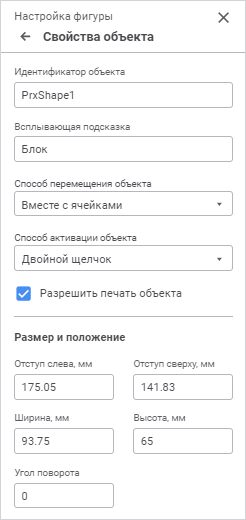

# Стандартные свойства объекта: Регламентный отчёт, веб-приложение

Стандартные свойства объекта: Регламентный отчёт, веб-приложение
-

# Стандартные свойства объекта

Для настройки стандартных свойств объекта используйте группу параметров
 «Свойства объекта» [панели
 параметров](../organizational_management/Starting.htm#structure_window):

[Для открытия
 группы параметров «Свойства объекта»](javascript:TextPopup(this))

	Для открытия на панели параметров группы параметров «Свойства
	 объекта»:

		- Выделите один или несколько объектов на листе отчёта.

		- Выполните одно из действий:

			- нажмите кнопку 
			 «Параметры» панели
			 инструментов, затем перейдите на группу параметров «Свойства объекта» в открывшейся
			 панели параметров;

			- выполните команду «Свойства
			 объекта» контекстного меню.

Задайте параметры:

	- Идентификатора объекта.
	 При необходимости введите новый идентификатор объекта;

	- Всплывающая подсказка.
	 При необходимости введите текст всплывающей подсказки;

	- Способ перемещения объекта.
	 Выберите из раскрывающегося списка способ перемещения объекта:

		- Не перемещать. Объект
		 не изменяет размер и положение;

		- С фиксированным размером.
		 Объект перемещается с фиксированным размером;

		- С фиксированной высотой.
		 Объект перемещается с фиксированной высотой;

		- С фиксированной шириной.
		 Объект перемещается с фиксированной шириной;

		- Свободное перемещение.
		 Объект перемещается свободным образом;

		- Вместе с ячейками.
		 По умолчанию. Объект перемещается вместе с ячейками;

Примечание.
 Если для объекта установлен способ перемещения «Вместе
 с ячейками», то при скрытии ячеек, полностью содержащих объект,
 объект будет скрыт. При отображении ячеек размер и расположение объекта
 восстановятся.

	- Способ
	 активации объекта. Выберите из раскрывающегося списка способ
	 активации объекта:

		- Движение мыши. Активация
		 объекта произойдёт при наведении на него курсора;

		- Выделение объекта.
		 Активация объекта произойдёт при его выделении одинарным щелчком
		 мыши;

		- Двойной щелчок.
		 По умолчанию. Активация объекта произойдёт при двойном щелчке
		 мыши по нему;

		- Не активировать.
		 Активация объекта происходить не будет;

		- При открытии отчета.
		 Активация объекта произойдёт при открытии отчёта;

	- Разрешить печать объекта.
	 По умолчанию флажок установлен и объект выводится на печать при [печати](../Tuning/ParamPage/UiReport_Tuning_ParamPage.htm#print)
	 отчёта. При необходимости снимите флажок для запрета печати объекта;

	- Прозрачность. При необходимости
	 установите флажок для задания прозрачности фона изображения. Доступно
	 только для диаграмм и рисунков;

	- Размер и
	 положение. Задайте настройки размера и положения объекта:

		- Отступ слева, мм.
		 Укажите отступ между левой границей отчёта и левой границей объекта
		 в миллиметрах;

		- Отступ сверху, мм.
		 Укажите отступ между верхней границей отчёта и верхней границей
		 объекта в миллиметрах;

		- Ширина, мм. Укажите
		 ширину объекта в миллиметрах;

		- Высота, мм. Укажите
		 высоту объекта в миллиметрах;

		- Угол поворота. Укажите
		 угол поворота объекта. Доступно только для рисунков и фигур.

См. также:

[Вставка
 объектов](UiReport_Objects.htm)

		Справочная
		 система на версию 10.9
		 от 18/08/2025,
		 © ООО «ФОРСАЙТ»,
