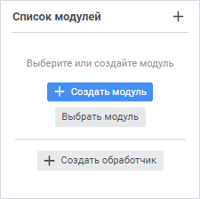
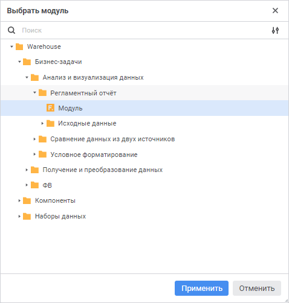
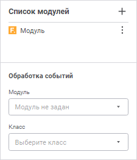

# Модули отчёта и обработка событий

Модули отчёта и обработка событий
-

# Модули отчёта и обработка событий

Для расширения функциональности отчётов используйте:

	- модули, содержащие [пользовательские
	 Fore-функции](../../organizational_management/Function/UiReport_Function.htm), которые могут быть использованы для преобразования
	 данных. Сигнатура указываемого модуля может содержать параметры;

	- обработчик событий - модуль, созданный на языке Fore. Обработчик
	 событий позволяет выполнять заданное действие при каждом возникновении
	 события. Например, при подключении модуля обработки событий появляется
	 возможность: обрабатывать ввод данных «на лету», выполнять дополнительные
	 действия перед и/или после возникновения какого-либо события.

Основное назначение подключения прикладных модулей и обработчиков событий:

	- формирование гиперссылок. Если в качестве их действий необходимо
	 выполнение макросов, содержащихся в подключённых объектах;

	- формирование формул;

	- обработка событий. Для обработки событий необходимо описать
	 класс, наследуемый от класса [ReportEvents](KeReport.chm::/Class/ReportEvents/ReportEvents.htm),
	 и переопределить методы, реализующие необходимые события.

Для отчётов можно настроить обработку событий, происходящих:

	- перед открытием регламентного отчёта;

	- перед и после смены активного листа регламентного отчёта;

	- перед и после вычисления области данных (в том числе, реляционной),
	 регламентного отчёта целиком или его отдельного листа;

	- перед и после печати и экспорта регламентного отчёта;

	- перед и после сохранения изменённых значений областей данных;

	- при изменении значения элемента управления регламентного отчёта;

	- перед сохранением регламентного отчёта и др.

## Работа с модулями отчёта/обработчиком событий

Для работы с модулями отчёта и обработчиком событий используйте панель
 «Список модулей»:

[Для открытия
 панели](javascript:TextPopup(this))

	Выполните одно из действий:

		- выполните команду «Разработка
		 > Модули и обработка событий» в главном меню;

		- нажмите кнопку 
		 «Модули и обработка событий»
		 на [панели
		 вкладок](../../organizational_management/Starting.htm#structure_window).

При работе с модулями отчёта/обработчиком событий доступны следующие
 операции:

[Создание
 модуля/обработчика событий](javascript:TextPopup(this))

	Для создания модуля, реализующего [пользовательские
	 Fore-функции](../../organizational_management/Function/UiReport_Function.htm)/обработку событий отчёта, выполните одно из действий:

		- нажмите кнопку 
		 «Создать модуль»;

		- выполните команду «Создать
		 модуль» в раскрывающемся меню кнопки 
		 «Действия».

	После выполнения одного из действий новый модуль будет создан в
	 навигаторе объектов на уровне регламентного отчёта и открыт в [среде разработки](Developer.chm::/Desktop_Title.htm)
	 для [наполнения
	 кодом](UiDevEnv.chm::/01_Development_Environment/03_Windows_of_Development_Environment/Window_Macros.htm).

[Автоматическое
 создание обработчика событий](javascript:TextPopup(this))

	Для создания модуля, реализующего класс EventsClass с шаблонами
	 обработчиков всех [событий](KeReport.chm::/Class/ReportEvents/ReportEvents.htm)
	 отчёта, выполните одно из действий:

		- нажмите кнопку 
		 «Создать обработчик»;

		- выполните команду «Создать
		 обработчик» в раскрывающемся меню кнопки  «Действия».

	После выполнения одного из действий новый модуль будет создан в
	 навигаторе объектов на уровне отчёта, добавлен в список модулей и
	 открыт в [среде
	 разработки](Developer.chm::/Desktop_Title.htm)
	 для [наполнения
	 кодом](UiDevEnv.chm::/01_Development_Environment/03_Windows_of_Development_Environment/Window_Macros.htm).

[Подключение
 существующего модуля/обработчика событий](javascript:TextPopup(this))

	Для подключения существующего модуля/обработчика событий:

		- Выполните одно из действий:

			- нажмите кнопку «Выбрать
			 модуль»;

			- выполните команду «Выбрать
			 модуль из репозитория» в раскрывающемся меню кнопки
			  «Действия».

	Откроется окно «Выбрать
	 модуль»:

	

Для быстрого выбора объекта в поле для поиска введите его название/идентификатор/ключ,
 в зависимости от настроек отображения. Поиск будет выполняться автоматически
 по мере ввода текста. Список будет содержать объекты, наименования/идентификаторы/ключи
 которых содержат вводимый текст.

Для настройки отображения объектов репозитория в списке нажмите кнопку
  «Отображение объекта» и выберите
 в раскрывающемся меню вариант отображения:

	- Наименование. Объекты
	 отображаются под своими наименованиями. Вариант по умолчанию;

	- Идентификатор. Объекты
	 отображаются под своими идентификаторами;

	- Ключ. Объекты отображаются
	 под своими ключами.

Выбрать можно несколько вариантов. Идентификатор
 и ключ будут указаны в скобках.

		- Выберите модуль в дереве объектов репозитория.

	Для быстрого выбора модуля воспользуйтесь
	 поиском. Введите искомый текст в поле для поиска. Поиск будет выполняться
	 автоматически по мере ввода искомого текста. В списке будут только
	 те модули, наименования/идентификаторы которых содержат вводимый текст.

	Для сброса результатов поиска нажмите
	 кнопку   «Очистить».

	После выполнения действия модуль будет
	 добавлен в список модулей:

	

		- Для обработчика событий задайте параметры в разделе «Обработка событий»:

			- Модуль. Выберите
			 в раскрывающемся списке модуль, который содержит в себе реализацию
			 класса для обработки событий регламентного отчёта, или выполните
			 команду  «Задать
			 обработчик» в раскрывающемся меню кнопки  «Действия»
			 в списке модулей;

			- Класс. Выберите
			 в раскрывающемся списке класс, унаследованный от класса [ReportEvents](KeReport.chm::/Class/ReportEvents/ReportEvents.htm)
			 и содержащий реализацию методов для обработки событий регламентного
			 отчёта. Список классов формируется в зависимости от выбранного
			 модуля. Описание класса-обработчика событий может быть создано
			 [автоматически](#event_handler).

	В классе для обработки событий может
	 содержаться конструктор, который будет вызываться при каждой инициализации
	 класса. Конструктор должен быть без параметров. Если в классе несколько
	 конструкторов без параметров, то будет вызываться самый первый, расположенный
	 в коде выше других.

	Примечание.
	 Инициализация класса-обработчика происходит каждый раз, когда в отчёте
	 выполняется какое-либо действие. При этом может генерироваться как
	 одно событие, так и целая цепочка событий.

	После выполнения действий к регламентному отчёту будет подключён
	 выбранный модуль/обработчик событий.

	Примечание.
	 К отчёту можно подключить только один модуль обработки событий, содержащийся
	 в списке модулей.

[Сброс обработчика
 событий](javascript:TextPopup(this))

	Для сброса подключённого модуля обработки событий выполните одно
	 из действий:

		- выполните команду  «Сбросить обработчик» в раскрывающемся
		 меню кнопки  «Действия»
		 в списке модулей;

		- нажмите кнопку  «Сбросить»
		 в параметре «[Модуль](#connection)».

	После выполнения одного из действий будет сброшен текущий обработчик
	 событий.

[Открытие модуля/обработчика
 событий в среде разработки](javascript:TextPopup(this))

	Для открытия модуля/обработчика событий в среде разработки выполните
	 команду  «Открыть
	 в среде разработки» в раскрывающемся меню кнопки  «Действия»
	 в списке модулей. После чего выбранный модуль будет открыт в [среде разработки](Developer.chm::/Desktop_Title.htm).

[Удаление модуля/обработчика
 событий из списка](javascript:TextPopup(this))

	Для удаления подключённого модуля/обработчика событий из списка
	 модулей выполните команду 
	 «Удалить» в раскрывающемся
	 меню кнопки  «Действия».
	 После чего будет выдан диалог подтверждения выполняемого действия.
	 При положительном ответе выбранный модуль будет удалён из списка модулей.

## Пример обработчика событий

Для выполнения примера создайте модуль. Добавьте ссылки на системные
 сборки: Drawing, Express, Report, Tab:

	Class EventsClass: ReportEvents

	    // Событие, происходящее после вычисления листа отчёта

	    Public Sub OnAfterRecalcSheet(Sheet: IPrxSheet);

	    Var

	        Tab: ITabSheet;

	        Range: ITabRange;

	        Style: ITabCellStyle;

	    Begin

	        // Получим таблицу листа отчёта

	        Tab := Sheet As ITabSheet;

	        // Выберем диапазон ячеек для раскрашивания

	        Range := Tab.Cells(0, 0, 10, 5);

	        // Зададим стиль оформления для выбранного диапазона

	        Style := Range.Style;

	        // Установим закраску фона ячеек выбранного диапазона зелёным цветом

	        Style.BackgroundBrush := New GxSolidBrush.Create(GxColor.FromName("Green"));

	    End Sub OnAfterRecalcSheet(Sheet: IPrxSheet);

	End Class EventsClass;

В результате при наступлении события, происходящего после вычисления
 листа регламентного отчёта, фон диапазона ячеек A0:F10 будет перекрашен
 в зелёный цвет.

См. также:

[Построение
 отчёта](../../CreateReport.htm)

		Справочная
		 система на версию 10.9
		 от 18/08/2025,
		 © ООО «ФОРСАЙТ»,
