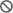
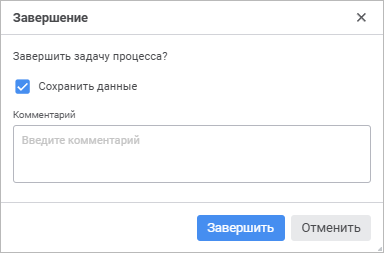

# Ввод и согласование данных в бизнес-процессах

Ввод и согласование данных в бизнес-процессах
-

# Ввод и согласование данных в бизнес-процессах

Для выполнения шагов процесса ввода или согласования данных используйте
 кнопки  «Завершить задачу» и  «Отклонить задачу» вкладки «Главная» [панели
 инструментов](../../organizational_management/Starting.htm#structure_window). Кнопки отображаются только в отчёте, открытом на [просмотр](../../../Desktop/organizational_management/Starting.htm#open),
 и доступны, если для пользователя есть активные шаги на текущем активном
 листе.

Примечание.
 Работа с бизнес-процессами доступна только при установленном расширении
 «[Управление бизнес-процессами](BPM.chm::/Modeling_of_business_processes.htm)».

[Рекомендации
 по работе бизнес-процессов в отчёте](javascript:TextPopup(this))

	При работе с настроенными сегментами доступно отображение подсветки
	 данных в отчёте при выполнении шага в мониторинге процесса. Подсветка
	 отображается, если отметка таблицы отчёта полностью содержит отметку
	 по измерениям соответствующего сегмента.

	Для корректной работы бизнес-процессов в отчёте [отметка
	 по измерениям](BPM.chm::/Desktop/Facility_Agreement/Configuring_the_Authorization_Object.htm) объекта полномочий должна полностью
	 содержаться в [отметке по
	 измерениям](../Visualization.htm#selection) отчёта. Отметка по измерениям отчёта не изменяется
	 при настройке [фильтрации](Work_with_data.htm#filter) данных
	 таблицы.

	Параметры фильтрации влияют только на отображение данных.

	Особенности взаимодействия отчёта с [объектом
	 полномочий](BPM.chm::/Desktop/Facility_Agreement/Create_Authorization_Object.htm):

		- если в объекте полномочий содержится несколько кубов с отметками
		 по измерениям, например: куб А и куб B, то в отчёте должен содержаться
		 хотя бы один источник данных с отметкой, которая одновременно
		 содержится в отметках куба А и куба В;

		- если в нескольких отчётах используются данные из одного объекта
		 полномочий, то результат выполнения/отклонения шагов может быть
		 сохранен во всех отчётах, если они были указанны в [мастере
		 шага](BPM.chm::/Desktop/Process/StepsProcess/CreateStepsProcess.htm). Ввод и согласование данных будут доступны
		 в любом из указанных отчётах.

## Завершение и согласование шага процесса

Для завершения/согласования активного шага процесса:

	- Нажмите кнопку  «Завершить
	 задачу».

Появится окно подтверждения действия:

	- При необходимости задайте в окне настройки:

		- Сохранить данные.
		 Задайте настройки сохранения изменённых данных при завершении/согласовании
		 шага. По умолчанию флажок установлен и данные сохраняются.  Флажок
		 отображается только при наличии в отчёте несохранённых данных;

		- Комментарий. Введите
		 комментарий к завершению/согласованию шага.

	- Нажмите кнопку «Завершить».

В результате активный шаг будет завершён/согласован.

## Отклонение шага процесса

Для отклонения завершённого шага процесса на предыдущий:

	- Нажмите кнопку  «Отклонить
	 задачу». Появится окно подтверждения действия:

	- При необходимости задайте в окне настройки:

		- Сохранить данные.
		 Задайте настройки сохранения изменённых данных при отклонении
		 шага. По умолчанию флажок установлен и данные сохраняются. Флажок
		 отображается при наличии в отчёте несохранённых данных;

		- Выборочное отклонение подпроцессов.
		 Установите флажок для изменения автоматического способа исполнения
		 шага «Вызов подпроцесса»
		 на ручной. В этом случае будет доступен выборочный перезапуск
		 подпроцессов в ручном режиме. По умолчанию флажок снят и шаг процесса
		 отклоняется до ручного шага вместе с подпроцессами автоматического
		 шага. Флажок отображается при наличии в процессе [шага
		 с подпроцессом](bpm.chm::/Web/Process/StepsProcess/Subprocess.htm) и настроенным [групповым
		 вызовом](bpm.chm::/Web/Process/StepsProcess/Subprocess.htm#group_call);

		- Комментарий. Введите
		 пояснение отклонения шага.

	- Нажмите кнопку «Отклонить».

В результате завершённый шаг процесса будет отклонён.

См. также:

[Работа
 с готовым отчётом](Work_witn_report.htm)

		Справочная
		 система на версию 10.9
		 от 18/08/2025,
		 © ООО «ФОРСАЙТ»,
