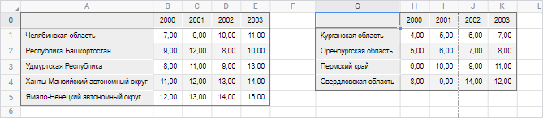
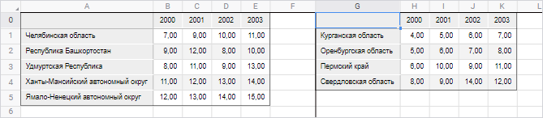

# Настройка разрывов и границ страниц: Регламентный отчёт, веб-приложение

Настройка разрывов и границ страниц: Регламентный отчёт, веб-приложение
-

# Настройка разрывов и границ страниц

Разрывы и границы страницы позволяют настроить отображение данных на
 листе отчёта при его [печати](../../Tuning/ParamPage/UiReport_Tuning_ParamPage.htm#print)
 и/или [экспорте](UiReport_Reports_Operation_Export.htm).

## Границы страницы

Для просмотра границ страниц листа, выводимых при [печати](../../Tuning/ParamPage/UiReport_Tuning_ParamPage.htm#print)
 и/или [экспорте](UiReport_Reports_Operation_Export.htm):

	- нажмите кнопку  «Показать
	 границы» вкладки «Вид»
	 панели инструментов;

	- выполните команду «Разметка
	 страницы >  Показать
	 границы» главного меню.

На активном листе отчёта будут отображены границы страниц в виде пунктирных
 линий.

Границы устанавливаются в зависимости от [параметров
 страницы и полей на странице](../../Tuning/ParamPage/UiReport_Tuning_ParamPage.htm).

## Разрывы страницы

Разрывы страницы позволяют отобразить на одной странице определённые
 данные листа отчёта.

Добавление и удаление разрывов страницы выполняется только в рамках
 активного листа.

[Добавление
 разрыва страницы](javascript:TextPopup(this))

	Для добавления разрыва страницы:

		- Установите курсор мыши в ячейку, которая будет являться
		 левой верхней ячейкой новой границы страницы.

		- Выполните действие:

			- выполните команду «Добавить
			 разрыв» в раскрывающемся меню кнопки  «Разрывы»
			 вкладки «Вид» панели
			 инструментов;

			- выполните команду «Разметка
			 страницы > 
			 Разрывы > 
			 Добавить разрыв» главного меню.

	В результате выполнения действий для активного листа отчёта будут
	 отображены разрывы страницы в виде сплошных линий. При этом будет
	 автоматически будет включено отображение границ страниц.

	На один лист отчёта можно добавить несколько разрывов страницы.

	Примечание.
	 При добавлении пользовательского разрыва страницы [автоматические
	 границы](#borders) будут перемещены.

[Удаление разрыва
 страницы](javascript:TextPopup(this))

	Для удаления разрыва страницы:

		- Установите курсор мыши в ячейку, которая является левой
		 верхней ячейкой границы страницы.

		- Выполните действие:

			- выполните команду  «Удалить разрыв» в раскрывающемся
			 меню кнопки  «Разрывы»
			 вкладки «Вид» панели
			 инструментов;

			- выполните команду «Разметка
			 страницы > 
			 Разрывы > 
			 Удалить разрыв» главного меню.

	В результате выполнения действий текущий разрыв страницы будет удалён.

[Удаление всех
 разрывов страниц на листе](javascript:TextPopup(this))

	Для удаления всех разрывов страниц на листе отчёта:

		- выполните команду  «Сброс
		 разрывов страниц» в раскрывающемся меню кнопки  «Разрывы»
		 вкладки «Вид» панели инструментов;

		- выполните команду «Разметка
		 страницы > 
		 Разрывы > 
		 Сброс разрывов страниц» главного меню.

	Для листа отчёта будут восстановлены автоматические границы страниц,
	 заданные в зависимости от параметров страницы и полей на странице.

## Пример

Рассмотрим пример листа отчёта, для которого включено отображение границ
 страниц:

Автоматическая вертикальная граница, обозначаемая пунктирной линией,
 отображается между столбцами «I» и «J» листа.

Установим для этого листа разрывы страниц таким образом, чтобы вторая
 область данных размещалась при [печати](../../Tuning/ParamPage/UiReport_Tuning_ParamPage.htm#print)
 и/или [экспорте](UiReport_Reports_Operation_Export.htm) на
 отдельной странице. Для этого:

	- Установите курсор мыши в ячейку G0, которая будет являться левой
	 верхней ячейкой границы страницы.

	- Выполните действие:

		- выполните команду «Добавить
		 разрыв» в раскрывающемся меню кнопки  «Разрывы» вкладки «Вид»
		 панели инструментов;

		- выполните команду «Разметка
		 страницы > 
		 Разрывы > 
		 Добавить разрыв» главного меню.

В результате выполнения действий будет добавлен разрыв страницы. Лист
 отчёта примет вид:

При печати и экспорте области данных, размещённые на листе отчёта, будут
 выводиться на отдельных листах.

См. также:

[Настройка
 отчёта под печать](../../Tuning/ParamPage/UiReport_Tuning_ParamPage.htm)

		Справочная
		 система на версию 10.9
		 от 18/08/2025,
		 © ООО «ФОРСАЙТ»,
