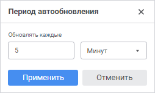

# Обновление отчёта

Обновление отчёта
-

# Обновление отчёта

Обновление данных необходимо после изменения данных в источнике.

В регламентном отчёте доступно:

	- Обновление всего отчёта.
	 Выполните одно из действий:

		- нажмите кнопку  «Обновить»
		 вкладки «Главная» панели
		 инструментов;

		- выполните команду «Обновить
		 все листы» в раскрывающемся меню кнопки  «Обновить» вкладки «Главная»
		 панели инструментов;

		- нажмите клавишу F9. Доступно при редактировании отчёта;

	- Обновление текущего листа.
	 Выполните команду «Обновить лист»
	 в раскрывающемся меню кнопки  «Обновить»
	 вкладки «Главная» панели инструментов;

	- Переоткрытие источников данных.
	 Выполните команду «Переоткрыть источники
	 данных» в раскрывающемся меню кнопки  «Обновить» вкладки «Главная»
	 панели инструментов. При переоткрытии источников данных происходит
	 очистка кеша источников и их вложенных объектов;

	- Автоматическое обновление всего
	 регламентного отчёта. Используйте кнопку  «Автообновление» вкладки «Главная»
	 панели инструментов для настройки автообновления отчёта.

При обновлении обновляются источники данных и данные в отчёте, заново
 вычисляются формулы. Все настройки обновления данных сохраняются вместе
 с регламентным отчётом.

## Автоматическое обновление

Автоматическое обновление позволяет обновлять данные с заданной периодичностью.

[Для
 периодического обновления данных](javascript:TextPopup(this))

	Для включения переодического обновления данных отчёта нажмите кнопку
	  «Автообновление» вкладки «Главная»
	 панели инструментов. Будет включено автоматическое обновление каждые
	 5 минут.

	Для изменения периода автоматического обновления выполните команду
	 «Задать период» в раскрывающемся
	 меню кнопки  «Автообновление».
	 Будет открыт диалог «Период автообновления»:

	

	В диалоге задайте период обновления данных в регламентном отчёте
	 и нажмите кнопку «Применить».
	 Обновление может выполняться каждые N
	 секунд, минут или часов.

	Примечание.
	 Если для регламентного отчёта уже настраивался период обновления,
	 то его можно выбрать в раскрывающемся меню кнопки  «Автообновление».

	Обновление регламентного отчёта будет выполняться раз в заданный
	 период времени.

[Для
 отключения автоматического обновления](javascript:TextPopup(this))

	Для отключения периодического обновления данных:

		- отожмите кнопку  «Автообновление»;

		- снимите флажок напротив заданного интервала обновления в
		 раскрывающемся меню кнопки  «Автообновление».

	Автоматическое обновление регламентного отчёта будет отключено.

См. также:

[Работа
 с готовым отчётом](Work_witn_report.htm)

		Справочная
		 система на версию 10.9
		 от 18/08/2025,
		 © ООО «ФОРСАЙТ»,
