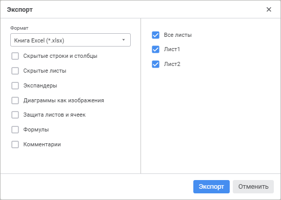
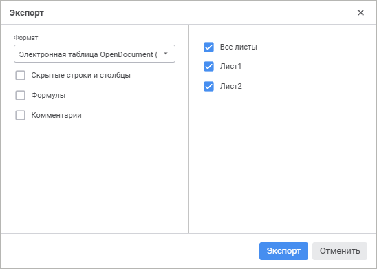
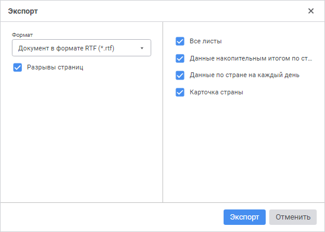
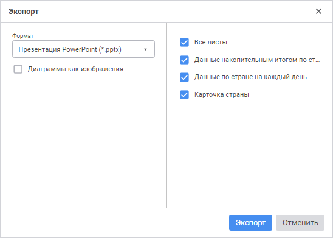

# Экспорт отчёта: Регламентный отчёт, веб-приложение

Экспорт отчёта: Регламентный отчёт, веб-приложение
-

# Экспорт отчёта

Для экспорта отчёта целиком во внешние форматы:

	- Выполните команду «Файл >
	  Экспорт» главного меню.

	- Выберите формат:

		- книга Excel 97-2003 (*.xls);

		- книга Excel (*.xlsx);

		- электронная таблица OpenDocument (*.ods);

		- документ PDF (*.pdf);

		- документ в формате RTF (*.rtf);

		- презентация PowerPoint (*.pptx);

		- веб-страница (*.html);

		- веб-страница, архив в одном файле (*.mht);

		- изображение (*.png).

После выбора формата внешнего файла будет открыт диалог для задания
 параметров экспорта. Порядок работы с диалогом зависит от используемого
 браузера.

Для разных форматов экспорта вид данного окна меняется, но всегда присутствуют
 следующие настройки:

	- Формат. При необходимости
	 измените формат экспорта, выбрав новый формат из раскрывающегося списка;

	- Все листы. Установите
	 данный флажок для экспорта всего отчёта;

	- Листы отчёта. Отметьте
	 флажками листы отчёта, которые будут экспортироваться. В данном списке
	 отсутствуют скрытые листы.

Примечание.
 При экспорте в форматы XLS и XLSX в списке листов присутствуют скрытые
 листы, если в диалоге «[Экспорт](#export_to_excel)»
 установлен флажок «Скрытые листы».

## Особенности экспорта

При экспорте отчётов в файлы различных форматов учитывайте следующие
 особенности:

		 XLS, XLSX
		 ODS
		 PDF
		 RTF
		 HTML, MHT
		 PNG
		 PPTX

		 Гиперссылки
		 

		 

		 

		 

		 

		 

		 

		 Сноски, подключенные с помощью языка Fore
		 

		 

		 

		 

		 

		 

		 

		 Колонтитулы
		 

		 

		 

		 

		 

		 

		 

Условные обозначения:

 - экспорт отчёта доступен;

 - экспорт отчёта недоступен.

В зависимости от настроек регламентного отчёта можно выделить следующие
 особенности экспорта:

	- если для ячеек снят флажок «Выводить на печать», то при
	 экспорте в XLS, XLSX, PDF не будут экспортироваться: текст, пиктограммы
	 и гиперссылки, содержащиеся в такой ячейке, а также настройки ее фона;

	- отчёт в форматах PDF и PNG после экспорта будет выглядеть
	 так же, как отчёт при просмотре перед [печатью](../../Tuning/ParamPage/UiReport_Tuning_ParamPage.htm);

	- при экспорте в XLS, XLSX или ODS [гиперссылки](../../Table/Attribute/Format.htm#hyperlink)
	 экспортируются в отчёт для действий «Открыть
	 ссылку», «Открыть лист отчёта»
	 и «Показать диапазон ячеек»
	 с сохранением настроек параметра «Отдельный
	 текст», если переключатель активен. Для действия «Открыть
	 лист отчёта» гиперссылка экспортируется как текст, если лист
	 отчёта, на который осуществляется переход при нажатии на гиперссылку,
	 не включен в экспорт;

	- [сноски](UiAnalyticalArea.chm::/TableView/Table_footnotes.htm):

		- при экспорте в формат RTF нумерация сносок в документе будет
		 упорядочена по листам: от первого к последнему;

		- при экспорте в XLS или XLSX по умолчанию сноски не экспортируются.
		 Номера сносок экспортируются, если с помощью Fore
		 заданы соответствующие настройки. Текст сносок не экспортируется.
		 Формат ячеек, содержащих сноски, будет изменён на текстовый. В
		 связи с этим:

			- вид диаграммы может отличаться от вида в исходном отчёте;

			- формулы, для которых были заданы сноски, будут отображаться
			 в виде текста;

			- не будут рассчитаны формулы, которые ссылаются на ячейки
			 со сносками;

	- [колонтитулы](../../Tuning/ParamPage/Footers_params.htm),
	 настроенные в отчёте, экспортируются во все форматы, кроме HTML и
	 ODS:

	-

		- в результирующем файле форматов XLS и XLSX с колонтитулами
		 можно работать средствами Microsoft Excel (диалог «Параметры
		 страницы», вкладка «Колонтитулы»);

		- если были настроены колонтитулы для чётных, нечётных и первой
		 страниц, то после экспорта в форматы ODS и XLS (версии ниже 2007)
		 для колонтитулов на первой странице будут применены настройки,
		 заданные для колонтитулов на нечётных страницах;

		- если при экспорте в формат RTF секции колонтитула в
		 отчёте содержали изображения, то:

		-

			- при наличии пустых секций соседние секции растягиваются
			 на место пустых;

			- при пустой центральной секции и непустых боковых секциях
			 растягивается изображение, расположенное в правой секции.

[Экспорт
 в файл формата XLS и XLSX](javascript:TextPopup(this))

	При сохранении отчёта в файл формата XLS и XLSX окно «Экспорт»
	 выглядит следующим образом:

	

	Задайте параметры:

		- Скрытые строки и столбцы.
		 При установленном флажке скрытые области, если они имеются, будут
		 экспортироваться, с ними можно будет работать средствами Microsoft
		 Excel;

		- Скрытые листы. При
		 установленном флажке в списке листов доступны для отметки скрытые
		 листы отчёта. При экспорте отчёта целиком скрытые листы также
		 будут экспортированы;

		- Цветовая палитра. При
		 установленном флажке, в случае использования оригинальных цветов,
		 появляется возможность заменить палитру, используемую в Microsoft
		 Excel, на палитру, используемую в «Форсайт. Аналитическая платформа».
		 При снятии флажка будет подобран наиболее подходящий цвет из палитры
		 Microsoft Excel, палитра не будет изменена;

	Примечание.
	 Параметр доступен только при экспорте в формат XLS.

		- Экспандеры. По умолчанию
		 флажок снят. При установленном флажке экспортируются отображаемые
		 экспандеры в текущем виде регламентного отчёта. Если экспандеры
		 свернуты, то экспортируются все вложенные элементы регламентного
		 отчёта и содержащиеся в нем свернутые\развернутые экспандеры.
		 Экспандеры доступны для работы средствами Microsoft Excel;

	Примечание.
	 Параметр доступен только при экспорте в формат XLSX. Экспортируются
	 экспандеры только для элементов иерархии [таблиц](../../Table/UiReport_tables_appointment.htm).

		- Диаграммы как изображения.
		 При установленном флажке диаграммы экспортируются как изображения
		 в формате EMF. Если флажок снят, работа с ними осуществляется
		 как с диаграммами средствами Microsoft Excel. Типы диаграмм, с
		 которыми доступна работа средствами Microsoft Excel: [гистограмма](../../Diagrams/Type_diagrams/UiDiagrams_Bar.htm),
		 [диаграмма
		 с областями](../../Diagrams/Type_diagrams/uidiagrams_area.htm), [круговая](../../Diagrams/Type_diagrams/UiDiagrams_round.htm),
		 [линейная](../../Diagrams/Type_diagrams/UiDiagrams_lenear.htm),
		 [смешанная](../../Diagrams/Type_diagrams/UiDiagrams_mixed_diagram.htm),
		 [точечная](../../Diagrams/Type_diagrams/UiDiagrams_scatter.htm),
		 [каскадная](../../Diagrams/Type_diagrams/WaterFall_chart.htm),
		 [пузырьковая](../../Diagrams/Type_diagrams/Bubble_Chart.htm),
		 [лепестковая](../../Diagrams/Type_diagrams/uidiagrams_petalous.htm),
		 [биржевая](../../Diagrams/Type_diagrams/UiDiagrams_birg.htm);

	Примечание.
	 При экспорте [каскадной
	 диаграммы](../../Diagrams/Type_diagrams/WaterFall_chart.htm) в формат XLSX вид диаграммы будет отличаться от исходного
	 из-за несоответствия настроек продукта «Форсайт. Аналитическая платформа»
	 с Microsoft Excel.

		- Защита листов и ячеек.
		 При установленном флажке будет экспортироваться защита листов
		 и ячеек;

		- Формулы. При установленном
		 флажке будут экспортироваться формулы, расположенные на листе
		 отчёта. Если флажок снят, экспортируются только значения.

	Примечание.
	 Не экспортируются формулы с использованием оператора OR.

	Если в Excel [функция](../../organizational_management/Function/UiReport_Function.htm)
	 не поддерживается, то в ячейке с формулой будет отображаться текстовое
	 или числовое значение.

	Если экспортируемый отчёт содержит [формулы](../../organizational_management/Function/UiReport_Function.htm),
	 имеющие ссылки на другие листы отчёта, которые не были включены в
	 экспорт, то в качестве результата вычисления таких формул будет указана
	 ошибка вычисления;

		- Комментарии. При
		 установленном флажке будут экспортироваться комментарии, расположенные
		 на листе отчёта. В офисном приложении комментарии будут отображаться
		 как примечания.

	Примечание.
	 Параметр доступен только при экспорте в формат XLSX.

	Особенности экспорта диаграммы:

		- если [диапазон
		 наименований рядов (точек)](../../Diagrams/UiDiagrams_Report_create_source.htm) задан в виде открытого диапазона
		 (весь столбец или строка), то после экспорта в качестве наименования
		 ряда (точки) будет задана ячейка, находящаяся на пересечении диапазона
		 данных и диапазона наименований рядов (точек);

		- типы заливки рядов данных в результирующем файле и в регламентном
		 отчёте могут не совпадать;

		- если при настройке вида отображения линейной или смешанной
		 диаграммы, содержащей линейные ряды, установлен флажок «[Инвертировать](../../Diagrams/General_Settings.htm#view)»,
		 то диаграмма будет экспортироваться как изображение;

		- если при настройке вида отображения диаграммы установлен
		 флажок «[Масштабировать
		 ось категорий](../../Diagrams/General_Settings.htm#view)», то диаграмма будет экспортироваться
		 как изображение;

		- если диаграмма построена на данных, расположенных на другом
		 листе, и при экспорте отчёта не выбран лист с данными, то диаграмма
		 будет экспортироваться как изображение.

	Особенности экспорта формул:

		- при расчёте формул с функциями Irr,
		 TBillEq, TBillPrice,
		 TBillYield в экспортированных
		 файлах возникает ошибка в связи с особенностями их реализации
		 в документах Microsoft Excel;

		- результаты расчёта формул с функцией Rand
		 отличаются в экспортированных файлах от соответствующих значений
		 в отчёте в связи с особенностями их реализации в документах Microsoft
		 Excel;

		- результаты расчёта формул с функциями GetSelectionEl,
		 GetSelection, JarqueBeraStat,
		 NormsDist, OddlPrice,
		 OddlYield, RedemptionYield,
		 RndPermutation, RndSample, Slope,
		 Sum, TimeValue
		 экспортируются в виде текста.

	Условное форматирование ячеек экспортируется со следующими ограничениями:

		- поддерживается только в Microsoft Excel 2007 и выше;

		- некоторые обозначения в результирующем файле могут
		 не совпадать с обозначениями в регламентном отчёте.

	При экспорте существуют следующие ограничения на количество строк
	 и столбцов:

		- XLS. Максимальное
		 число столбцов - 256, максимальное число строк - 65536;

		- XLSX. Максимальное
		 число столбцов - 16385, максимальное число строк - 1048576.

[Экспорт
 в файл формата ODS](javascript:TextPopup(this))

	При сохранении отчёта в файл формата ODS окно «Экспорт»
	 выглядит следующим образом:

	

	Задайте параметры:

		- Скрытые строки и столбцы.
		 При установленном флажке скрытые области, если они имеются, будут
		 экспортироваться, с ними можно будет работать средствами OpenOffice
		 или LibreOffice;

		- Формулы. При установленном
		 флажке будут экспортироваться формулы, расположенные на листе
		 отчёта. По умолчанию флажок снят и экспортируются только значения
		 формул;

		- Комментарии. При
		 установленном флажке будут экспортироваться комментарии, расположенные
		 на листе отчёта. В офисном приложении комментарии будут отображаться
		 как примечания.

	Особенности экспорта формул:

		- функция PercentRank
		 экспортируется без учёта параметра Significance;

		- функции OddfPrice,
		 OddfYield возвращают ошибочные
		 результаты в связи с их некорректной реализацией в документах
		 OpenOffice;

		- при расчёте формул с функциями NormsInv,
		 Irr, Prob,
		 TBillEq, TBillYield
		 в экспортированных файлах возникает ошибка в связи с особенностями
		 их реализации в документах OpenOffice;

		- результаты расчёта формул с функциями MDuration,
		 PercentRank, Price,
		 Rand, RndPermutation,
		 RndSample, TBillPrice,
		 YieldF отличаются в экспортированных
		 файлах от соответствующих значений в отчёте в связи с особенностями
		 их реализации в документах OpenOffice;

		- результаты расчёта формул с функциями Aggregate,
		 GetSelectionEl, GetSelection, JarqueBeraStat,
		 NormInv, NormsDist,
		 OddfPrice, OddlPrice,
		 OddfYield, OddlYield,
		 RedemptionYield, RndPermutation, RndSample,
		 Slope, Sum,
		 TimeValue экспортируются
		 в виде текста.

	При экспорте в данный формат не будут экспортированы скрытые страницы.

	Объекты листа (диаграммы, карты и другие) экспортируются как изображения.

	При экспорте существуют следующие ограничения на количество строк
	 и столбцов:

		- максимальное число столбцов - 1024;

		- максимальное число строк - 1048576.

	Примечание.
	 ODS-файл с результатами экспорта отчёта рекомендуется открывать с
	 помощью пакетов OpenOffice или LibreOffice. При попытке открыть файл
	 с помощью Microsoft Excel могут возникнуть искажения внешнего вида
	 отчёта.

[Экспорт
 в файл формата PDF](javascript:TextPopup(this))

	В результирующем файле формата PDF отчёт будет выглядеть так же,
	 как регламентный отчёт, открытый на [предварительный
	 просмотр](../../Tuning/ParamPage/UiReport_Tuning_ParamPage.htm) перед печатью.

	Если карты, диаграммы и фигуры, расположенные на листе отчёта, не
	 содержат неподдерживаемых для экспорта в файл формата PDF настроек
	 (штриховых линий, альфа-канала), то они экспортируются в PDF в виде
	 векторного изображения; в противном случае - в виде битового изображения.

	При экспорте в данный формат необходимо помнить, что:

		- текстура ячеек в результирующем файле и в регламентном отчёте
		 может различаться;

		- отображение в легенде обозначений рядов данных диаграммы
		 в результирующем файле и в регламентном отчёте может различаться;

		- отображение в легенде названий рядов данных может быть неполным;

		- отображение символов китайского или арабского языка может
		 быть неполным или некорректным;

		- не поддерживается экспорт листа отчёта при снятом флажке
		 «[Печатать
		 лист вместе с отчётом](../../Tuning/ParamPage/Print_params.htm#print_sheet)» в настройках параметров печати.

[Экспорт
 в файл формата RTF](javascript:TextPopup(this))

	При сохранении отчёта в файл формата RTF окно «Экспорт»
	 выглядит следующим образом:

	

	Используйте флажок «Разрывы страниц»
	 для настройки экспорта разрывов страниц между листами отчёта. По умолчанию
	 флажок установлен и разрывы страниц экспортируются.

	При экспорте в данный формат необходимо помнить, что:

		- параметры шрифта и межстрочного интервала в результирующем
		 файле и в регламентном отчёте могут различаться;

		- карты и диаграммы экспортируются в формат RTF в виде метафайлов;

		- не поддерживается экспорт верхнего и нижнего отступов ячейки;

		- не поддерживается экспорт поворота текста ячейки;

		- не поддерживается экспорт листа отчёта при снятом флажке
		 «[Печатать
		 лист вместе с отчётом](../../Tuning/ParamPage/Print_params.htm#print_sheet)» в настройках параметров печати.

[Экспорт
 в файл формата PPTX](javascript:TextPopup(this))

	При сохранении отчёта в файл формата PPTX окно «Экспорт»
	 выглядит следующим образом:

	

	Установите флажок «Диаграммы как
	 изображения» для экспорта диаграмм в виде изображений в формате
	 EMF. По умолчанию флажок снят и работа с диаграммами осуществляется
	 как с диаграммами средствами Microsoft PowerPoint.

	Примечание.
	 Все типы диаграмм регламентного отчёта экспортируются в виде интерактивных
	 объектов, кроме вторичной гистограммы, точечной диаграммы и вторичной
	 круговой диаграммы.

	При экспорте в данный формат необходимо помнить, что:

		- некоторые обозначения в результирующем файле могут
		 не совпадать с обозначениями в регламентном отчёте;

		- если регламентный отчёт содержит оформление ячеек, то будет
		 выгружен только один тип оформления со следующим приоритетом:

			- Изображение.

			- Условное форматирование.

			- Заливка ячейки.

[Экспорт
 в файл формата HTML и MHT](javascript:TextPopup(this))

	При сохранении отчёта в файл формата HTML или MHT окно «Экспорт»
	 выглядит следующим образом:

	

	Установите флажок «Автоматический
	 подбор высоты ячеек» для автоматического подбора высоты ячеек
	 в соответствии с содержащейся в них информацией.

	Примечание.
	 Высота строк и ширина столбцов в результирующем файле будет больше
	 по сравнению с размерами в исходном отчёте, даже если при экспорте
	 был установлен флажок «Автоматический
	 подбор высоты ячеек». Это особенность работы браузеров с текстом.

	При экспорте в данный формат необходимо помнить, что:

		- учитывается установленный масштаб отображения данных на
		 листах отчёта;

		- текстуры ячеек в результирующем файле и в регламентном отчёте
		 могут различаться;

		- не поддерживается экспорт поворота текста ячейки;

		- не поддерживается экспорт параметров переноса текста в ячейках;

		- не поддерживается экспорт диагональных границ ячеек;

		- не поддерживается экспорт средней и двойной сплошных границ
		 ячеек: данные границы будут заменены на тонкую сплошную.

	Примечание.
	 В регламентном отчёте можно применять следующие сплошные границы ячеек:
	 тонкая, средняя, толстая, двойная.

См. также:

[Работа
 с готовым отчётом](Work_witn_report.htm)

		Справочная
		 система на версию 10.9
		 от 18/08/2025,
		 © ООО «ФОРСАЙТ»,
