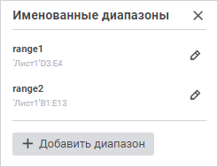
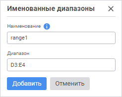
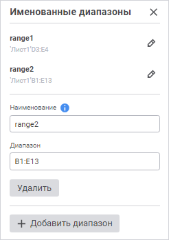

# Добавление именованного диапазона: Регламентный отчёт, веб-приложение

Добавление именованного диапазона: Регламентный отчёт, веб-приложение
-

# Добавление именованного диапазона

Именованные диапазоны используются для быстрого поиска необходимого
 диапазона ячеек, а также при создании формул.

Для создания именованного диапазона:

	- выполните команду «Данные >
	 Именованные диапазоны» главного меню;

	- выполните команду «Настроить
	 именованные диапазоны» в раскрывающемся списке строки адреса.

Отобразится панель «Именованные диапазоны»:

## Работа с именованными диапазонами

При работе с именованными диапазонами доступны операции:

[Добавление именованного
 диапазона](javascript:TextPopup(this))

	Для добавления нового именованного диапазона:

		- Нажмите кнопку  «Добавить диапазон» на панели
		 «Именованные диапазоны».
		 Отобразятся поля настроек нового именованного диапазона:

	

		- Задайте настройки именованного диапазона:

			- Наименование.
			 Введите наименование диапазона. Наименование может состоять
			 из букв латинского алфавита, цифр и символа подчеркивания;

	Примечание.
	 В качестве имени диапазона не могут быть использованы комбинации букв
	 и цифр в форматах A1 и R1C1, так как они воспринимаются как [стили
	 ссылок](../../organizational_management/Function/UiReport_Function.htm#reference_styles). При указании имени диапазона в одном из указанных форматов
	 и нажатии кнопки «Добавить»
	 отобразится соответствующая ошибка.

			- Диапазон. Укажите
			 диапазон одним из способов:

				- введите диапазон в поле. В качестве диапазона могут
				 использоваться комбинации букв и цифр в форматах A1 и
				 R1C1;

				- установите курсор в поле, после чего выделите диапазон
				 на листе отчёта.

		- Нажмите кнопку «Добавить».

	Диапазон будет добавлен в список именованных диапазонов.

[Редактирование
 именованного диапазона](javascript:TextPopup(this))

	Для редактирования именованного диапазона:

		- Нажмите кнопку  «Редактировать
		 диапазон» на панели «Именованные
		 диапазоны». Отобразятся поля настроек выбранного именованного
		 диапазона:

	

		- Измените требуемые настройки диапазона.

	Именованный диапазон будет отредактирован.

[Удаление именованного
 диапазона](javascript:TextPopup(this))

	Для удаления именованного диапазона:

		- Нажмите кнопку  «Редактировать
		 диапазон» на панели «Именованные
		 диапазоны». Отобразятся поля настроек выбранного именованного
		 диапазона:

	

		- Нажмите кнопку «Удалить».

	После подтверждения действия именованный диапазон будет удалён.

В процессе работы с отчётом список именованных диапазонов отображается
 в раскрывающемся списке строки адреса:

При выборе одного из именованных диапазонов в списке происходит выделение
 данного диапазона на листе отчёта.

См. также:

[Работа
 с данными на листе отчёта](../../Table/DataReport.htm)

		Справочная
		 система на версию 10.9
		 от 18/08/2025,
		 © ООО «ФОРСАЙТ»,
