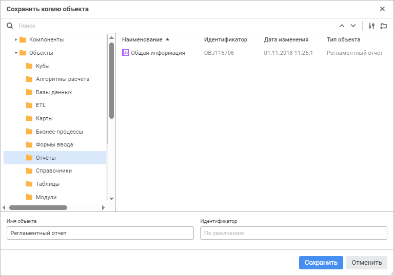

# Создание копии отчёта: Регламентный отчёт, веб-приложение

Создание копии отчёта: Регламентный отчёт, веб-приложение
-

# Создание копии отчёта

Для создания копии отчёта, открытого в [режиме
 редактирования](../../organizational_management/Starting.htm#open), выполните команду «Сохранить
 как» в раскрывающемся меню кнопки «Сохранить»
 [главного
 меню](../../organizational_management/Starting.htm#structure_window). Будет открыто окно «Сохранить
 копию объекта»:

Для сохранения копии отчёта:

	- Выберите расположение сохраняемого отчёта в дереве объектов.

	- Создайте новую папку. Для создания новой папки нажмите кнопку
	  «Создать папку», появится новый объект
	 «Папка». Задайте её наименование.

	- Найдите существующий отчёт для выбора местоположения сохранения
	 копии или для использования его названия. Для быстрого выбора существующего
	 отчёта в поле для поиска введите его название/идентификатор/ключ в
	 зависимости от выбранных вариантов поиска объекта и нажмите клавишу
	 ENTER. Передвигайтесь между результатами поиска с помощью кнопки  «Найти предыдущее»,
	 кнопки  «Найти
	 далее» или клавиши ENTER для перемещения к следующему результату.

Для настройки поиска нажмите кнопку  «Параметры поиска» и выберите в раскрывающемся
 меню:

		- вариант поиска объекта:

			- Искать по наименованию.
			 Вариант по умолчанию;

			- Искать по идентификаторам;

			- Искать по ключам;

		- учитывать регистр;

		- только слова целиком.

	- Укажите следующие параметры:

		- Имя объекта. Введите
		 наименование копии отчёта. По умолчанию установлено наименование
		 текущего отчёта;

Примечание.
 При пустом поле наименование копии отчёта устанавливается по умолчанию.

		- Идентификатор. Введите
		 уникальный идентификатор копии отчёта. Идентификатор может состоять
		 только из букв латинского алфавита, цифр и знака «_» и не должен
		 начинаться с цифр.

Примечание.
 При пустом поле идентификатор копии отчёта устанавливается автоматически.

При создании копии отчёта в репозитории создаётся новый отчёт, который
 сразу же открывается на редактирование. Если объект с идентификатором,
 указанным в окне «Сохранить копию объекта»,
 уже существует, то при попытке создания копии отчёта появится окно подтверждения
 действия. Подтвердите действие для замены существующего объекта копией
 отчёта.

См. также:

[Построение
 отчёта](../../CreateReport.htm)

		Справочная
		 система на версию 10.9
		 от 18/08/2025,
		 © ООО «ФОРСАЙТ»,
