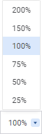

# Настройка внешнего вида: Регламентный отчёт, веб-приложение

Настройка внешнего вида: Регламентный отчёт, веб-приложение
-

# Настройка внешнего вида

Для настройки внешнего вида готового отчёта предназначена настройка
 вида отображения.

Закончив настройку внешнего вида отчёта, перейдите к шагу, если требуется:

	- [Использование интерактивных элементов
	 для управления отметкой](Controls.htm);

	- [Выполнение операций с данными в
	 таблице](Work_with_data.htm);

	- [Экспорт отчёта](UiReport_Reports_Operation_Export.htm);

	- [Настройка
	 отчёта под печать](../../Tuning/ParamPage/UiReport_Tuning_ParamPage.htm).

## Настройка вида отображения отчёта

Для настройки вида отображения отчёта доступны следующие настройки:

[Изменение
 масштаба](javascript:TextPopup(this))

	Для изменения масштаба листа:

		- выберите одно из фиксированных значений масштаба с помощью
		 кнопки 
		 «Выбрать», расположенной
		 рядом с текущим значением масштаба:

	

		- измените текущее значение масштаба на произвольное:

	

	Для изменения масштаба всего отчёта используйте средства браузера.

[Изменение размеров
 строк/столбцов](javascript:TextPopup(this))

	Изменение размеров строк/столбцов можно производить несколькими
	 способами:

		- Ручное изменение размеров.
		 Для ручного изменения размеров выполните следующие действия:

			- для столбца.
			 Подведите указатель мыши к правой границе столбца в области
			 заголовка, щёлкните по границе и, удерживая её, перетащите
			 на требуемое расстояние. Актуальная ширина столбца отобразится
			 во всплывающей подсказке;

			- для строки.
			 Подведите указатель мыши к нижней границе строки в области
			 заголовка, щёлкните по границе и, удерживая её, перетащите
			 на требуемое расстояние. Актуальная высота строки отобразится
			 во всплывающей подсказке;

		- Быстрая подгонка размеров.
		 Для быстрой подгонки размера по содержимому строки/столбца выполните
		 действие:

			- выполните команду  «Подогнать
			 высоту строки»/ «Подогнать ширину столбца»
			  контекстного меню выделенной ячейки или заголовка строки/столбца;

			- нажмите кнопку  «Подогнать
			 высоту строки»/ «Подогнать ширину столбца»
			 вкладки «Вид» панели
			 инструментов;

			- выполните команду «Вид > Подогнать
			 высоту строки»/«Вид
			 > Подогнать ширину
			 столбца» главного меню для выделенной ячейки или заголовка
			 строки/столбца;

			- дважды щёлкните по правой
			 границе заголовка столбца/по нижней границе заголовка строки.

	Каждый из вышеперечисленных способов изменения размеров строк/столбцов
	 может быть применён как к одной строке/столбцу, так и к группе строк/столбцов.
	 Изменённый размер применится для каждой строки/столбца из группы.

См. также:

[Работа
 с готовым отчётом](Work_witn_report.htm)

		Справочная
		 система на версию 10.9
		 от 18/08/2025,
		 © ООО «ФОРСАЙТ»,
