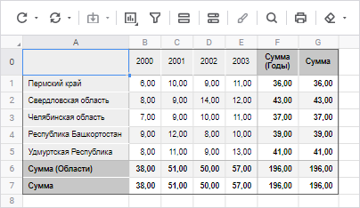
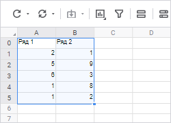
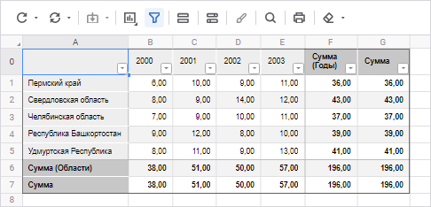
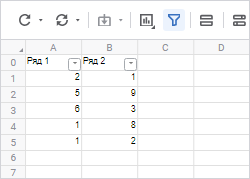
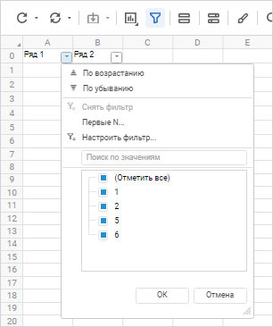
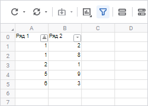
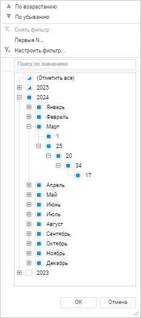
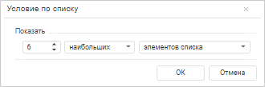
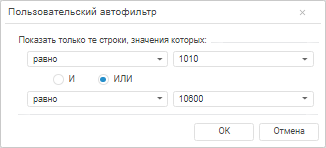

# Работа с данными в таблице

Работа с данными в таблице
-

# Работа с данными в таблице

В режиме просмотра доступны операции с данными в таблице:

	- [сортировка и фильтрация](Work_with_data.htm#filter);

	- [редактирование и сохранение](Work_with_data.htm#edit);

	- [детализация и обобщение](../../Table/Work/Drill_down.htm);

	- [исключение данных
	 из таблицы](../../Table/Work/Delete_data.htm);

	- [поиск и замена](../../Table/Work/Search.htm);

	- [использование буфера обмена](../../Table/Work/Insert.htm);

	- [прикрепление вложений
	 к ячейкам](../../Table/Work/Attachments.htm);

	- [расчёт базовых агрегатов](status_string.htm);

	- [просмотр описания формул](formula_description.htm);

	- [добавление комментариев
	 к ячейкам](../../Table/Work/Comment.htm);

	- [просмотр истории
	 изменений значений в ячейке](../../Table/Work/Change_history.htm).

## Сортировка и фильтрация

Сортировка и фильтрация данных в столбцах доступна как на листе отчёта,
 так и в таблице данных.

Для листа отчёта сортировка и фильтрация данных в столбцах осуществляется
 при помощи кнопки  «Настройка
 фильтрации» в заголовках столбцов. Для таблицы с помощью кнопки
 кнопки 
 «Настройка фильтрации» настраивается
 фильтрация.

[Отображение
 кнопки](javascript:TextPopup(this))

		- Выделите:

			- любую ячейку, принадлежащую
			 в таблице:

	

			- диапазон на листе, для которого
			 необходимо выполнить сортировку или фильтрацию:

	

	Примечание.
	 Первая непустая строка выделенного диапазона считается строкой, содержащей
	 заголовки столбцов. Сортировка и фильтрация значений в каждом столбце
	 начинается со второй непустой строки выделенного диапазона.

		- Нажмите кнопку  «Фильтр» вкладки «Главная»
		 панели инструментов. Кнопка  «Настройка фильтрации» отобразится:

			- для всех столбцов таблицы:

	

			-  для всех столбцов выделенного диапазона на листе:

	

	Примечание.
	 На одном листе отчёта доступен только один фильтр. Если на листе отчёта
	 уже включён фильтр, то выделение нового диапазона и нажатие кнопки
	  «Фильтр»
	 скроют кнопку  «Настройка фильтрации» для первого
	 диапазона.

[Скрытие
 кнопки](javascript:TextPopup(this))

	Переведите кнопку  «Фильтр» вкладки «Главная»
	 панели инструментов в ненажатое состояние. Кнопка  «Настройка фильтрации» будет скрыта
	 для всех столбцов:

		- на листе отчёта, настроенная сортировка и фильтрация для
		 диапазона данных на листе будут отменены;

		-  в таблице, настроенная фильтрация данных будет отменена.

### Сортировка

Сортировка диапазона позволяет быстро отсортировать выделенный диапазон
 листа регламентного отчёта.

[Сортировки
 данных на листе отчёта](javascript:TextPopup(this))

	Для сортировки данных на листе отчёта:

		- Нажмите кнопку  «Настройка
		 фильтрации» в заголовке столбца.

		-  Выберите способ сортировки:

			- . По возрастанию;

			- . По убыванию.

	

	При установленной сортировке направление сортировки отображается
	 в заголовке соответствующего столбца.

	

	Значения выделенного диапазона будут отсортированы по первому столбцу.

Сортировка данных в таблице доступна, если она была [настроена
 при редактировании](../../Table/Attribute/Layout.htm#sort).

### Фильтрация

Фильтрация - способ поиска подмножества
 данных и работы с ним в списке. В отфильтрованном списке отображаются
 только те строки, которые удовлетворяют условиям отбора, заданным для
 данного столбца. Строки, неудовлетворяющие условиям фильтрации, будут
 скрыты.

В регламентном отчёте можно настроить фильтрацию для:

	- данных в таблице;

	- диапазона листа.

На листе отчёта одновременно может быть настроена только фильтрация
 одного диапазона или одной таблицы.

Для фильтрации диапазона данных на листе отчёта или таблицы:

	- Выделите диапазон данных на листе отчёта или ячейку таблицы.

	- Нажмите кнопку 
	 «Фильтрация» панели инструментов.
	 У заголовков диапазона ячеек или заголовков шапки таблицы отобразятся
	 кнопки  «Настройка фильтрации».

	- Нажмите кнопку  «Настройка фильтрации» или активируйте
	 ячейку заголовка столбца и нажмите сочетание клавиш ALT+стрелка вниз:

Для столбцов, содержащих значения типа «Дата», в фильтре будет выполнена
 агрегация дат в виде иерархии Год - Месяц - День - Час - Минута - Секунда:

	- Укажите необходимые значения в списке или настройте способ фильтрации.
	 Доступны следующие стандартные операции автофильтра:

		- Снять фильтр. Операция
		 предназначена для отображения всех строк;

		- Первые
		 N. Операция предназначена для вывода указанного количества
		 элементов списка. Количество элементов задается либо явно, либо
		 в процентах от общего количества фильтруемых элементов:

В данном окне можно установить следующие
 параметры:

			- Количество строк.
			 Поле ввода, с помощью которого можно определить количество
			 отображаемых строк;

			- Признак. Определяет
			 какие элементы будут отображаться - наибольшие или наименьшие;

			- Условие выбора.
			 Определяет каким образом задается количество элементов - явно
			 или в процентах от количества элементов;

Примечание.
 Данный фильтр будет недоступен, если в фильтруемых строках отсутствуют
 числовые значения.

		- Настроить
		 фильтр. Операция, предназначенная для определения условий
		 фильтрации в окне «Пользовательский
		 автофильтр»:

В данном окне можно установить следующие
 параметры:

			- Условие выбора.
			 Раскрывающийся список, определяющий условие для отображения
			 элементов (равно, не равно...);

			- Значение. Раскрывающийся
			 список, определяющий значение условия для отображения элементов.
			 Данный список элементов содержит все значения диапазона автофильтра,
			 отсортированные без учета регистра. Регистр учитывается только
			 при совпадении значений;

			- Условия фильтрации.
			 Переключатель, определяющий порядок использования двух условий
			 одновременно. Предусмотрено два варианта использования сочетаний
			 условий:

				- «И». При
				 установке переключателя будут отображаться строки, удовлетворяющие
				 обоим условиям;

				- «ИЛИ». При
				 установке переключателя будут отображаться строки, удовлетворяющие
				 хотя бы одному из двух условий.

	- Установите флажок около элемента, по которому будет выполняться
	 фильтрация. Доступна множественная отметка.

Примечание.
 Для столбцов, содержащих значения типа «Дата»,
 доступна возможность выбора как элементов, так и уровней иерархии.

Для быстрого выбора элемента фильтрации воспользуйтесь
 поиском. Введите текст в поле для поиска. Поиск будет выполняться автоматически
 по мере ввода текста. В списке будут только те элементы, значения которых
 содержат вводимый текст.

В результате применения фильтрации в таблице/столбцах будут отображаться
 все элементы отмеченные в списке, сформированном из всех значений фильтруемых
 строк. У столбцов, для которых настроена фильтрация, кнопка примет вид:
 .

Для выключения фильтрации у столбца выполните команду «Снять
 фильтр» раскрывающегося списка кнопки  «Настройка фильтрации».

При использовании автофильтра диапазона данных на листе отчёта или табличного
 визуализатора:

	- вставка значения из одной ячейки в диапазон ячеек применяется
	 только к видимым строкам/столбцам;

	- вставка диапазона значений применяется ко всем видимым строкам/столбцам.
	 Вставляемый диапазон значений расширяется с учётом размера области
	 копирования, в том числе на скрытые строки/столбцы;

	- [перемещение диапазона
	 значений в буфер обмена](../../Table/Work/Insert.htm) применяется ко всем строкам/столбцам независимо
	 от их видимости при фильтрации. [Копирование
	 диапазона значений в буфер обмена](../../Table/Work/Insert.htm) применяется только к видимым
	 строкам/столбцам;

	- удаление данных применяется только к видимым строкам/столбцам.

Поведение будет одинаковым для всего диапазона данных независимо от
 расположения фильтра.

## Редактирование и сохранение

Для редактирования содержимого ячеек:

	- выделите ячейку на листе отчёта и введите необходимые данные;

	- дважды щёлкните по выбранной ячейке.

При использовании [фильтрации](Work_with_data.htm#filter)
 диапазона данных на листе отчёта или таблицы очистка данных применяется
 только к видимым строкам/столбцам.

Невозможно редактирование значений, которые нельзя записать в источник:

	- вычисляемые элементы;

	- итоги по строкам, по столбцам;

	- агреигрованные данные.

Для визуализации отсутствия возможности редактирования ячеек доступно
 включение отображения пиктограмм.
 Для получения подробной информации обратитесь к статье «[Отображение
 пиктограмм в ячейках](UiAnalyticalArea.chm::/TableView/Formatting/Cells_icons.htm)».

### Особенности отображения значений в агрегированных
 ячейках

Если в качестве источника данных использован куб с настроенной агрегацией,
 установленным флажком «[Не агрегировать разные единицы измерения](uinavobj.chm::/Cube/CreateCube/Master_Standart/UiMd_Cube_CreateCube_Master_Standart_7.htm#no_agr)»,
 и при этом отмечены элементы с разными единицами измерений, то в агрегированой
 ячейке вместо значения будет выведен символ «-». Для изменения символа
 или вывода текста используйте свойство [IPivot.UnmatchedUnitsText](kepivot.chm::/Interface/IPivot/IPivot.UnmatchedUnitsText.htm).

Символ также отображается при [расчёте
 итоговых значений](totals.htm#symbol), [агрегации
 фиксированных измерений](../../Table/Attribute/Format_Data.htm#symbol).

При включении [отображения
 пиктограмм](UiAnalyticalArea.chm::/TableView/Formatting/Cells_icons.htm) для вычисляемых ячеек в агрегированой ячейке
 одновременно будет выведено оба символа. По умолчанию «=-».

### Сохранение измененных данных в источник

Доступно сохранение данных:

	- отчёта;

	- листа.

[Сохранение данных
 отчёта](javascript:TextPopup(this))

	Для сохранения данных отчёта:

		- нажмите кнопку  «Сохранить данные> Сохранить данные
		 отчёта» вкладки «Главная»
		 или «Данные» панели инструментов;

		- выполните команду «Данные
		 > Сохранить данные > Сохранить данные отчёта» главного
		 меню.

	В результате будут сохранены измененный данные всех таблиц отчёта.

	Сохранение измененных данных отчёта доступно, если хотя бы в одной
	 таблице отчёта:

		- есть измененные значения;

		- установлен флажок «[Сохранять
		 данные в источник](../../Table/Attribute/Parameters.htm#save)»;

		- есть измененные значения и установлен флажок «Сохранять
		 данные в источник».

[Сохранение данных
 листа](javascript:TextPopup(this))

	Для сохранения данных листа:

		- нажмите кнопку  «Сохранить данные > Сохранить данные
		 листа» вкладки «Главная»
		 или «Данные» панели инструментов;

		- выполните команду «Данные
		 > Сохранить данные > Сохранить данные листа» главного
		 меню.

	В результате будут сохранены измененные данные всех таблиц активного
	 листа.

	Сохранение измененных данных листа доступно, если хотя бы в одной
	 таблице листа:

		- есть изменённые значения;

		- установлен флажок «[Сохранять
		 данные в источник](../../Table/Attribute/Parameters.htm#save)»;

		- есть изменённые значения и установлен флажок «Сохранять
		 данные в источник».

[Отмена изменения
 данных отчёта и листа](javascript:TextPopup(this))

	Для отмены изменений данных отчёта нажмите кнопку:

		-  «Отменить
		 изменения» вкладки «Главная»
		 или «Данные» панели инструментов;

		-  «Отменить
		 изменения > Отчёта» вкладки «Главная»
		 или «Данные» панели инструментов.

	В результате будут отменены изменения данных всех таблиц отчёта.

	Для отмены изменений данных листа нажмите кнопку  «Отменить изменения > Листа» вкладки
	 «Главная» или «Данные»
	 панели инструментов. В результате будут отменены изменения данных
	 всех таблиц активного листа.

	Отмена изменения данных доступна, если хотя бы в одной таблице есть
	 изменённые значения.

Сохранение изменённых данных возможно в следующие виды источников: стандартный
 куб, представление-куб, виртуальный куб, переменные моделирования.

При [сохранении отчёта](../../CreateReport.htm#save), если
 изменённые данные не были сохранены будет предложено сохранить их. При
 подтверждении сохранения будет выполнено сохранение данных отчёта.

См. также:

[Работа
 с готовым отчётом](Work_witn_report.htm)

		Справочная
		 система на версию 10.9
		 от 18/08/2025,
		 © ООО «ФОРСАЙТ»,
